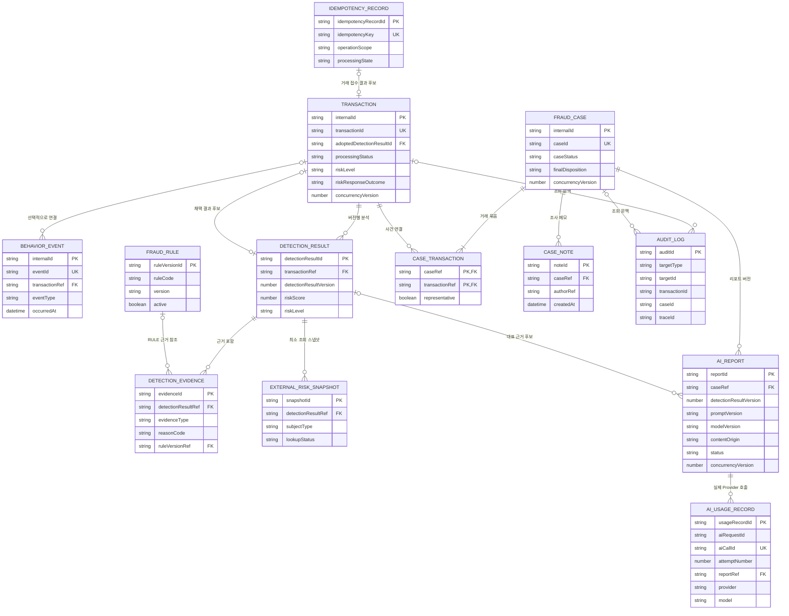

# FinGuardOps 핵심 도메인 ERD

## 1. 문서 목적

이 문서는 FinGuardOps의 거래 접수부터 행동 이벤트, Rule·ML 탐지, 위험 대응, 사건 조사, 감사, AI 리포트와 AI 사용량·비용 기록까지의 업무 데이터를 관계형 논리 모델로 연결한다.

단순히 테이블 후보를 나열하는 것이 아니라 다음 설계 질문에 답하는 것을 목적으로 한다.

- 어떤 업무 데이터를 영속화해야 하는가
- 각 엔티티가 어떤 데이터와 정합성의 책임을 가지는가
- 엔티티 사이의 관계와 Cardinality는 무엇인가
- 거래 처리 상태, 위험 등급, 위험 대응 결과를 어떻게 분리하는가
- 사건 진행 상태와 최종 판정을 어떻게 분리하는가
- 재분석과 리포트 재생성을 어떤 버전으로 추적하는가
- 중복 거래·이벤트·탐지 결과·사건·AI 리포트·AI 사용량 기록을 어떻게 방지하는가
- 감사 가능성과 동시성 충돌 탐지를 어떤 데이터로 지원하는가
- 고객·계좌·기기·IP 등 민감 정보 저장을 어떻게 최소화하는가
- 후속 JPA, API와 마이그레이션 설계에서 무엇을 결정해야 하는가

이 문서는 구현 완료 내역이 아니다. 현재 백엔드는 Health Check 범위만 구현되어 있으며, 아래 엔티티와 관계는 후속 구현을 위한 논리 설계 및 후보이다.

## 2. 설계 범위와 제외 범위

### 2.1 설계 범위

핵심 설계 범위는 다음과 같다.

- 거래·행동: `Transaction`, `BehaviorEvent`
- 탐지: `DetectionResult`, `DetectionEvidence`, `FraudRule` 또는 `RuleVersion`, `ExternalRiskSnapshot`
- 사건: `FraudCase`, `CaseTransaction`, `CaseNote`, `AuditLog`
- AI 운영: `AiReport`, `AiUsageRecord`

`ExternalRiskSnapshot`은 외부 위험계좌·IP·기기 근거의 재현과 장애·fallback 실험을 위해 초기 핵심 엔티티에 포함하는 방향을 권장한다. 다만 구체적인 속성, 보존 기간과 보호 방식은 후속 설계에서 확정한다.

다음 엔티티는 필요성과 대안을 비교하는 후보이며 필수 구현 대상으로 확정하지 않는다.

- API 요청 처리 상태와 완료 응답 재사용을 관리하는 `IdempotencyRecord`
- 테스트·Mock 시나리오를 위한 최소 `Customer`·`Account` 참조 엔티티

### 2.2 제외 범위

이 문서에서는 다음 사항을 확정하지 않는다.

- JPA Entity, 연관관계 매핑과 Java Enum
- PostgreSQL DDL, 구체적인 DB 타입과 제약조건 문법
- Flyway·Liquibase 마이그레이션
- REST API 경로, 요청·응답 DTO와 상태 코드
- Kafka 이벤트 스키마, Topic, Partition과 Consumer 구조
- Redis Key의 구현 형식과 TTL
- 낙관적 락 또는 비관적 락의 선택
- 암호화·해시 알고리즘, 키 관리 방식과 보존 기간
- 고객 원장·계좌 원장, 실제 잔액과 실제 소유권 관리
- 실제 거래 승인·추가 인증·보류·차단과 고객 제재
- Rule 점수·가중치, 위험 등급 임계값과 ML 모델 성능 기준
- AI 비용 계산 공식, Provider 가격표 반영과 통화 환산 방식
- 운영 장애·배포 이력용 `ServiceIncident`·`DeploymentRecord`

## 3. 기존 요구사항·상태 전이·아키텍처와의 관계

이 논리 모델은 다음 문서를 기준으로 한다.

- `README.md`
- `docs/00-overview/fds-service-scope.md`
- `docs/01-requirements/fds-user-scenarios.md`
- `docs/01-requirements/platform-operation-requirements.md`
- `docs/01-requirements/fds-screen-wireframes.md`
- `docs/01-requirements/platform-screen-wireframes.md`
- `docs/01-requirements/transaction-state-transition.md`
- `docs/01-requirements/case-state-transition.md`
- `docs/01-requirements/ai-report-state-transition.md`
- `docs/02-architecture/system-architecture.md`
- `docs/07-decisions/ADR-001-finguardops-positioning.md`
- `docs/07-decisions/ADR-002-rename-repository-to-finguardops.md`

전용 상태 전이 문서를 상태 모델의 우선 기준으로 사용한다. 따라서 거래에는 처리 상태, 위험 등급과 위험 대응 결과를 별도 속성으로 두고, 사건에는 `caseStatus`와 `finalDisposition`을 별도 속성으로 둔다. AI 리포트 상태도 거래·사건 상태와 독립적으로 관리한다.

시스템 아키텍처의 데이터 소유권은 다음과 같이 반영한다.

```text
FastAPI
→ Feature·Rule·ML·AI 리포트 계산

Spring Boot
→ 결과 검증·업무 정책 적용·상태 전이·멱등성·동시성·감사 관리

PostgreSQL
→ 검증된 영속 업무 데이터의 원본

Redis
→ 원본에서 다시 만들거나 조회할 수 있는 정확 일치 캐시 후보
```

FastAPI나 LLM Provider가 반환한 값은 그 자체로 업무 원본이 아니다. Spring Boot가 요청과 버전을 검증하고 PostgreSQL에 연결해 저장한 결과가 감사 가능한 FinGuardOps 기록이 된다.

### 3.1 확인된 문서 표현 차이

다음 차이는 이 문서에서 기존 문서를 수정하지 않고 후속 정비 대상으로 기록한다.

- `docs/00-overview/fds-service-scope.md`와 `docs/01-requirements/fds-user-scenarios.md`에는 `LOAN_DISBURSED`가 행동 이벤트처럼 표현된 부분이 있다. 현재 기준에서는 행동 이벤트로 확정하지 않고, 대출 실행을 나타내는 금융거래 또는 Mock 이벤트 후보로 둔다.
- 초기 `docs/01-requirements/functional-requirements.md`의 `정상·주의·위험` 분류는 현재 위험 등급 기준으로 사용하지 않는다. 전용 거래 상태 전이 문서의 `LOW`, `MEDIUM`, `HIGH`, `CRITICAL`을 사용한다.
- 초기 서비스 범위 문서에는 사건 진행 상태와 최종 판정이 하나의 목록에 섞여 있는 예시가 있으나, 같은 문서의 후속 설명과 전용 사건 상태 전이 문서에 따라 두 개념을 분리한다.
- README의 일부 로드맵·현재 상태 표현은 상태 전이와 아키텍처 문서가 이미 존재하는 현재 저장소 상태를 완전히 반영하지 않는다. 이 문서에서 README를 수정하지 않고 후속 문서 정비 항목으로 남긴다.

## 4. 데이터 모델링 원칙

### 4.1 상태와 결과를 분리한다

처리 단계, 위험 평가와 업무 대응은 서로 다른 질문에 답한다.

```text
transactionProcessingStatus
= 지금 거래 처리가 어느 단계인가

riskLevel
= 탐지 결과의 위험 수준은 무엇인가

riskResponseOutcome
= 해당 위험 수준에 어떤 Mock 대응을 적용했는가
```

사건도 같은 원칙을 적용한다.

```text
caseStatus
≠ finalDisposition
```

`caseStatus`는 현재 조사 진행 단계이고 `finalDisposition`은 조사 결과이다. 조사 중에는 `finalDisposition`이 `null`일 수 있다.

### 4.2 현재값과 이력을 구분한다

목록 조회에 필요한 현재 상태는 주요 엔티티에 유지하되, 주요 변경의 이전 값·변경 후 값·사유는 `AuditLog`에 추가 기록한다. 감사 로그만을 현재 상태 조회의 원본으로 사용하거나, 현재 행만 남기고 과거 근거를 덮어쓰는 양극단을 피한다.

### 4.3 재처리와 새 분석을 구분한다

Timeout이나 응답 유실에 따른 동일 요청 재시도는 기존 결과를 재사용하거나 같은 실행으로 식별한다. 입력, Rule, Feature 또는 모델 조건이 변경된 실제 재분석은 새 `DetectionResult` 버전으로 저장한다.

AI 리포트도 동일 요청의 재시도와 새로운 버전 조건의 재생성을 구분한다. 새 결과가 필요하더라도 기존 완료 결과를 이력 없이 덮어쓰는 방식을 전제로 하지 않는다.

### 4.4 불변 근거를 보존한다

과거 탐지 결과가 참조한 Rule 버전, 외부 위험정보 요약과 AI 리포트의 생성 조건은 이후 설정이 변경되어도 당시 판단을 설명할 수 있어야 한다. 과거 버전을 물리 삭제하거나 현재 설정으로 치환하지 않는다.

### 4.5 업무 원본과 캐시·관측 데이터를 구분한다

PostgreSQL에 저장하는 거래·탐지·사건·감사·AI 사용량은 업무 원본 후보이다. Redis의 정확 일치 캐시와 Observability 시계열은 조회·관측을 보조하지만 업무 원본을 대신하지 않는다.

### 4.6 민감 정보는 참조값과 최소 요약으로 제한한다

고객·계좌·기기·IP의 원문을 도메인 전체에 복제하지 않는다. 연결용 외부 참조값, 화면 표시용 마스킹 값과 탐지에 필요한 최소 위험 신호를 구분한다.

## 5. 데이터 영역

### 5.1 거래·행동 영역

거래 접수와 처리 결과, 거래 전후 행동 타임라인을 보존한다. 동일 요청의 중복 처리는 `transactionId`와 멱등성 정책으로 통제하고, 행동 이벤트는 독립 `eventId`로 중복을 구분한다.

### 5.2 탐지 영역

한 거래에 대해 여러 분석 버전을 보존하고, 각 분석 결과에 Rule·ML·외부 위험정보·행동 패턴 근거를 연결한다. 탐지 결과는 점수와 위험 등급의 계산 결과이며 거래 상태나 사건 최종 판정이 아니다.

### 5.3 사건 영역

하나의 사건에 여러 거래를 연결하고 담당자의 조사 메모, 진행 상태, 최종 판정과 변경 이력을 관리한다. 사건 생성 재시도나 연관 거래 추가가 중복 사건과 중복 연결을 만들지 않아야 한다.

### 5.4 AI 운영 영역

사건별 AI 리포트 상태와 본문을 모델 호출 단위의 사용량·비용 기록과 분리한다. 한 리포트 생성 과정에서 여러 모델 호출, 재시도 또는 fallback 전 단계가 발생할 수 있으므로 `AiReport 1 → AiUsageRecord N` 관계를 사용한다.

## 6. 핵심 엔티티 개요

| 엔티티 | 책임 | 분류 |
| --- | --- | --- |
| `Transaction` | 거래 접수, 현재 처리 상태, 위험 등급과 적용된 Mock 대응의 현재값 | 핵심 |
| `BehaviorEvent` | 거래 전후 고객 행동과 보안 관련 사건의 시간 순서 기록 | 핵심 |
| `DetectionResult` | 특정 거래의 버전별 분석 결과와 실행 상태 보존 | 핵심 |
| `DetectionEvidence` | DetectionResult를 설명하는 개별 Rule·ML·외부·행동 근거 | 핵심 |
| `FraudRule` 또는 `RuleVersion` | 실행 가능한 Rule의 정의·가중치·버전·활성 상태 보존 | 핵심 |
| `FraudCase` | 연관 거래 조사의 현재 상태와 최종 판정 관리 | 핵심 |
| `CaseTransaction` | 사건과 거래의 다대다 관계 및 연결 문맥 관리 | 핵심 |
| `CaseNote` | 담당자의 조사 메모와 작성 정보 보존 | 핵심 |
| `AuditLog` | 주요 변경의 주체·시각·이전값·변경값·사유 보존 | 핵심 |
| `AiReport` | 사건별 AI 리포트 요청 조건, 상태, 결과와 버전 관리 | 핵심 |
| `AiUsageRecord` | 실제 Provider·모델 호출별 토큰·지연·비용·오류 기록 | 핵심 |
| `ExternalRiskSnapshot` | 탐지 당시 외부 위험정보와 조회·캐시·fallback 상태의 최소 스냅샷 | 초기 핵심 권장 |
| `IdempotencyRecord` | 요청의 처리 중·완료·실패와 완료 응답 재사용 정보 | 후보 |
| 최소 `Customer`·`Account` 참조 엔티티 | 테스트·Mock 관계의 외래 키 정합성 보조 | 후보 |

`ModelExecution`, `CostPolicy`, `ServiceIncident`, `DeploymentRecord`, 알림, 배포와 사용자 인증 전체 모델은 이번 핵심 ERD에 추가하지 않는다.

## 7. 엔티티별 책임과 속성 후보

속성명은 논리 이름 후보이다. 구체적인 DB 컬럼명, 타입과 null 제약은 후속 설계에서 확정한다.

### 7.1 Transaction

`Transaction`은 FinGuardOps가 접수한 금융거래의 식별, 금액·시각과 현재 업무 처리 결과를 소유한다. Rule·ML 상세 근거는 `DetectionResult`와 `DetectionEvidence`에 분리하고, 사건 조사 상태는 `FraudCase`에 분리한다.

| 속성 후보 | 의미와 설계 이유 |
| --- | --- |
| 내부 식별자 | 외래 키 연결을 위한 내부 식별자 후보 |
| `transactionId` | 외부 요청, 로그, 추적과 사용자 조회에 사용하는 업무 식별자 |
| `transactionType` | 계좌이체, 오픈뱅킹 이체, ATM 인출 등 거래 유형 |
| `amount` | 거래 금액. 0 또는 음수 허용 여부는 후속 정책 필요 |
| `currencyCode` | 다중 통화 가능성을 구분하는 후보. 초기 단일 통화라도 금액 의미를 고정하는 데 유용 |
| `occurredAt` | 실제 거래 요청 또는 발생 시각 |
| `externalCustomerRef` | 고객 원문 대신 사용하는 외부 연결 참조값 |
| `senderAccountRef` | 발신 계좌 원문 대신 사용하는 외부 연결 참조값 |
| `recipientAccountRef` | 수신 계좌 원문 대신 사용하는 외부 연결 참조값. ATM 인출 등에는 없을 수 있음 |
| 발신·수신 마스킹 표시값 후보 | 화면 표시가 필요할 때 연결용 참조값과 분리해 보관하는 후보 |
| `processingStatus` | 거래 처리 단계 |
| `riskLevel` | 현재 채택된 탐지 결과의 위험 등급 |
| `riskResponseOutcome` | 승인, 승인 후 모니터링, 추가 인증 요구, 보류 등 Mock 대응 결과 |
| `adoptedDetectionResultId` 후보 | 현재 위험 등급과 대응의 기준으로 채택한 DetectionResult를 직접 식별하는 논리 참조 후보 |
| `createdAt`, `updatedAt` | 생성·마지막 변경 시각 |
| `concurrencyVersion` 후보 | 상태 변경 경합을 탐지하기 위한 버전 값 |

`currentDetectionResultVersion`만 저장하는 방식보다 `adoptedDetectionResultId`로 채택 결과를 직접 가리키는 방안을 우선 검토한다. 버전 번호는 같은 거래 안에서만 유일하기 때문에 식별자 참조가 채택된 결과를 더 명확하게 표현한다.

다음 정합성 원칙이 필요하다.

- `adoptedDetectionResultId`는 반드시 해당 Transaction에 속한 DetectionResult를 참조한다.
- `Transaction.riskLevel`은 채택된 DetectionResult의 위험 등급을 현재값으로 반영한 조회용 업무 스냅샷이다.
- `Transaction.riskResponseOutcome`은 채택된 분석 결과에 Spring Boot가 승인된 정책을 적용한 업무 대응이다.
- 탐지 결과 채택, Transaction의 `riskLevel`·`riskResponseOutcome` 현재값 변경과 AuditLog 기록은 하나의 업무 정합성 경계에서 처리해야 한다.
- 구체적인 외래 키, 트랜잭션 코드와 DB 제약은 후속 설계에서 확정한다.

거래 처리 상태는 다음 전용 상태 전이 기준을 따른다.

```text
RECEIVED
VALIDATION_FAILED
ANALYZING
ANALYZED
APPROVED
ADDITIONAL_AUTH_REQUIRED
HELD
FAILED
```

위험 등급은 다음 값이다.

```text
LOW
MEDIUM
HIGH
CRITICAL
```

위험 대응 결과는 상태와 별도이다. 예를 들어 MEDIUM 거래는 다음처럼 표현할 수 있다.

```text
processingStatus = APPROVED
riskLevel = MEDIUM
riskResponseOutcome = 승인 후 모니터링
```

`MONITORING`을 거래 처리 상태로 다시 추가하거나 `BLOCKED`를 실제 차단 상태로 확정하지 않는다.

### 7.2 BehaviorEvent

`BehaviorEvent`는 거래 전후에 발생한 고객 행동과 보안 관련 신호의 시간 순서를 보존한다. 행동 자체가 거래 없이 먼저 발생할 수 있으므로 `Transaction`과의 관계는 선택적이다.

지원 행동 이벤트는 다음 목록을 기준으로 한다.

```text
LOGIN
LOGIN_FAILED
DEVICE_REGISTERED
PASSWORD_CHANGED
OTP_REISSUED
BENEFICIARY_REGISTERED
TRANSFER_LIMIT_CHANGED
TRANSFER_REQUESTED
ATM_WITHDRAWAL_REQUESTED
```

`LOAN_DISBURSED`는 이 목록에 포함하지 않는다. 대출 실행을 나타내는 금융거래 또는 별도 Mock 이벤트로 표현할 필요가 있는지는 사용자 결정 사항이다.

| 속성 후보 | 의미와 설계 이유 |
| --- | --- |
| 내부 식별자 | 관계 연결을 위한 내부 식별자 후보 |
| `eventId` | 중복 수신과 재처리를 구분하는 업무 식별자 |
| `externalCustomerRef` | 외부 고객 연결 참조값 |
| 관련 거래 내부 식별자 또는 `transactionId` | 거래와 연결되는 이벤트에만 사용하는 선택 참조 |
| `eventType` | 지원 행동 이벤트 유형 |
| `occurredAt` | 행동이 실제 발생한 시각 |
| `deviceRef` | 기기 원문 대신 사용하는 참조값 후보 |
| IP·지역 요약 후보 | 원문 IP가 아닌 국가·지역, 해외 여부, 위험 여부 등 최소 신호 후보 |
| 공통 결과·채널 후보 | 성공 여부, 발생 채널 등 여러 이벤트에 공통인 제한된 속성 |
| 유형별 상세 후보 | 한도 변경 전후 값, 수취인 등록 참조 등 이벤트별 상세 |
| `createdAt` | 수집·저장 시각 |

이벤트 상세 모델은 다음 대안을 비교해야 한다.

| 방식 | 장점 | 단점 |
| --- | --- | --- |
| 모든 상세를 하나의 JSON 후보에 저장 | 이벤트 유형 추가가 쉽고 초기 구현이 단순함 | 필수값 검증, 검색, 인덱싱과 민감정보 통제가 어려움 |
| 유형별 전용 상세 구조 | 타입별 정합성과 조회가 명확함 | 엔티티·테이블 수와 구현 복잡도가 증가함 |
| 공통 속성 + 제한된 확장 상세 | 공통 검색을 유지하면서 일부 변화에 대응 가능 | 공통/확장 경계를 정하고 허용 필드를 통제해야 함 |

초기 권장안은 고객 참조, 유형, 발생 시각, 기기 참조 등 공통 조회 속성을 명시적으로 두고, 실제 Rule에 필요한 제한된 유형별 상세만 추가하는 방식이다. 무제한 JSON 저장은 권장하지 않으며 구체 구조는 후속 설계에서 승인한다.

### 7.3 DetectionResult

`DetectionResult`는 특정 거래에 대한 분석 결과의 버전별 기록이다.

```text
Transaction 1
→ DetectionResult N
```

| 속성 후보 | 의미와 설계 이유 |
| --- | --- |
| 탐지 결과 내부 식별자 | 근거와 AI 리포트 연결을 위한 식별자 |
| 거래 내부 식별자 또는 `transactionId` | 분석 대상 거래 |
| `detectionResultVersion` | 같은 거래의 재분석 결과 순서 또는 버전 |
| `riskScore` | 승인된 점수 통합 정책의 결과 |
| `riskLevel` | 해당 분석 버전에서 계산된 위험 등급 |
| `ruleScore` | Rule 결과의 기여 점수 |
| `mlScore` | ML 결과의 기여 점수. ML 미사용 시 null 가능 후보 |
| `modelVersion` | 사용한 ML 모델 또는 분석 모델 버전 후보 |
| `featureVersion` | Feature 정의·계산 방식 버전 후보 |
| `analysisStatus` | 요청·진행·완료·실패를 구분하기 위한 분석 상태 후보 |
| `analysisStartedAt`, `analysisCompletedAt` | 분석 수행 구간 |
| `traceId` 후보 | 서비스 간 분석 호출 추적 |
| `createdAt` | 결과 저장 시각 |

핵심 중복 방지 후보는 다음과 같다.

```text
transactionId + detectionResultVersion
→ Unique 후보
```

동일 버전의 재전송은 새 결과를 추가하지 않아야 한다. 입력이나 분석 조건이 달라진 정당한 재분석은 새 버전을 사용한다. 버전 생성 주체, 연속 번호인지 불변 식별자인지, 실패한 시도가 버전을 소비하는지는 후속 설계에서 결정한다.

### 7.4 DetectionEvidence

`DetectionEvidence`는 하나의 탐지 결과를 설명하는 개별 근거이다.

```text
DetectionResult 1
→ DetectionEvidence N
```

근거 유형 후보는 다음과 같다.

```text
RULE
ML
EXTERNAL_RISK
BEHAVIOR_PATTERN
```

| 속성 후보 | 의미와 설계 이유 |
| --- | --- |
| 근거 식별자 | 개별 근거 식별 |
| 탐지 결과 식별자 | 소속 DetectionResult |
| `evidenceType` | Rule·ML·외부 위험정보·행동 패턴 구분 |
| `reasonCode` | 시스템과 화면에서 사용하는 설명 가능한 코드 |
| `displayDescription` | 민감정보를 제외한 담당자 표시 설명 |
| `scoreContribution` | 최종 점수에 대한 기여도 후보 |
| Rule 버전 참조 | RULE 근거가 사용한 정확한 Rule 버전 |
| ExternalRiskSnapshot 참조 후보 | 외부 위험 근거가 사용한 최소 스냅샷 |
| `observationSummary` | 필요한 관측값 또는 Feature의 제한된 요약 |
| `evidenceOccurredAt` | 근거가 관측되거나 확정된 시각 |
| `sortOrder` | 화면에서 근거를 안정적으로 정렬하는 후보 |
| `createdAt` | 근거 저장 시각 |

Feature 전체 벡터, 원문 행동 로그, 실제 계좌번호, 원문 IP와 LLM 입력 전체를 근거에 무제한 저장하지 않는다. 재현에 필요한 Feature 버전과 제한된 요약을 저장하고, 상세 Feature 보존이 필요하면 별도 보안·보존 설계를 거쳐야 한다.

### 7.5 FraudRule과 Rule 버전

Rule은 다음 정보를 표현할 수 있어야 한다.

- Rule ID 또는 `ruleCode`
- 이름과 설명
- 조건
- 가중치
- 버전
- 활성 상태
- 적용 시작일
- 필요 시 적용 종료일 후보

#### 방안 A: 행 단위 버전 관리

`FraudRule` 한 엔티티에서 버전별 행을 저장한다.

```text
ruleCode + version
→ Unique 후보
```

각 행은 한 번 사용된 뒤 조건·가중치를 덮어쓰지 않는 불변 버전으로 취급한다. 새 Rule 변경은 새 버전 행으로 추가한다.

#### 방안 B: RuleDefinition과 RuleVersion 분리

`RuleDefinition`은 `ruleCode`, 이름 등 논리 Rule의 정체성을 소유하고, `RuleVersion`은 조건·가중치·적용 기간과 버전을 소유한다.

| 비교 기준 | 방안 A: 단일 엔티티 버전 행 | 방안 B: 정의·버전 분리 |
| --- | --- | --- |
| 구현 복잡도 | 낮음 | 엔티티와 관계가 하나 늘어남 |
| 과거 버전 추적 | 불변 행 원칙을 지키면 가능 | 정의와 버전 관계가 더 명시적 |
| 활성 버전 조회 | 활성 플래그·적용 기간 조건 필요 | 정의별 활성 버전 관계를 명확히 만들 수 있음 |
| Rule 변경 이력 | 이름·설명 중복 가능 | 공통 정의와 버전 변경을 구분하기 쉬움 |
| 탐지 근거 연결 | `ruleCode + version` 행 또는 내부 ID 참조 | 특정 RuleVersion FK가 명확함 |
| 초기 개인 프로젝트 범위 | 단순하고 적합 | 장기 확장에는 유리하지만 초기 복잡도 증가 |

초기 권장안은 8~10개 Rule을 대상으로 방안 A를 우선 검토하는 것이다. 단, 각 버전 행을 불변으로 유지하고 `DetectionEvidence`가 사용한 특정 행을 참조해야 한다. Rule이 증가하거나 정의 수준의 메타데이터와 승인 이력이 필요해지면 방안 B로 분리할 수 있다. 최종 모델은 사용자 승인 사항이다.

어느 방식을 선택해도 과거 탐지 근거가 참조한 Rule 버전을 물리 삭제하거나 현재 버전으로 치환해서는 안 된다.

### 7.6 ExternalRiskSnapshot

`ExternalRiskSnapshot`은 위험계좌·IP·기기 조회의 원본 전체가 아니라 탐지 시점에 실제 사용한 최소 정보를 보존한다. 외부 위험 근거의 재현과 External Risk 장애·캐시·fallback 실험을 지원하므로 초기 핵심 엔티티로 포함하는 방향을 권장한다.

저장 목적은 다음과 같다.

- 탐지 시점의 외부 위험정보를 재현한다.
- 외부 데이터가 변경·정정된 뒤에도 당시 판단 근거를 감사할 수 있다.
- 조회 성공, 캐시 사용, 조회 불가와 fallback 결과를 구분한다.

속성 후보는 다음과 같다.

- 스냅샷 식별자
- 대상 유형과 비식별 대상 참조값
- 외부 위험 유형과 일치 여부
- 외부 Reason Code 또는 제한된 설명
- 제공자 기준 시각과 유효 기준 후보
- 조회 시각
- 조회 결과 상태
- 캐시 사용 여부와 캐시 기준 시각
- fallback 또는 조회 불가 사유
- 관련 `transactionId`, DetectionResult와 `traceId`

외부 Provider 응답 원문 전체, 실제 계좌번호·IP·기기 식별자 원문과 불필요한 Provider 데이터는 저장하지 않는다. 조회 상태, 일치 결과, Reason Code, 기준 시각, 캐시·fallback 정보와 `traceId` 등 감사와 장애 재현에 필요한 최소 스냅샷만 저장한다. 구체적인 속성, 보존 기간과 암호화 방식은 후속 설계에서 사용자 승인으로 확정한다.

### 7.7 FraudCase

`FraudCase`는 하나 이상의 거래를 묶어 조사하는 업무 단위이다. 거래 위험 대응과 별개로 담당자의 조사 진행 상태와 최종 판정을 소유한다.

| 속성 후보 | 의미와 설계 이유 |
| --- | --- |
| 내부 식별자 | 관계 연결을 위한 내부 식별자 |
| `caseId` | 화면·로그·추적에 사용하는 업무 식별자 |
| `caseStatus` | 현재 조사 진행 단계 |
| `finalDisposition` | 담당자의 최종 조사 결과. 조사 중 null 가능 |
| `representativeRiskLevel` | 사건 대기열용 대표 위험 등급 후보 |
| 대표 탐지 사유 후보 | 목록에서 표시할 대표 Reason Code 또는 요약 |
| `assigneeRef` | 담당자 원문 프로필이 아닌 참조값 후보 |
| `createdAt` | 사건 생성 시각 |
| `reviewStartedAt` | 최초 검토 시작 시각 후보 |
| `closedAt` | 종료 시각 |
| `lastChangedAt` | 목록 정렬과 충돌 안내에 사용하는 마지막 변경 시각 |
| `concurrencyVersion` 후보 | 동시 수정 충돌 탐지 |

사건 상태는 다음 값이다.

```text
OPEN
IN_REVIEW
ADDITIONAL_INFORMATION_REQUIRED
CLOSED
```

최종 판정은 다음 값이다.

```text
NORMAL
FALSE_POSITIVE
CONFIRMED_FRAUD
```

```text
caseStatus
≠ finalDisposition
```

조사 중에는 `finalDisposition = null`일 수 있다. `CLOSED`일 때 최종 판정을 필수로 할지, 행정 종료 같은 예외를 허용할지는 사용자 결정 사항이다.

대표 위험 등급은 연결 거래 중 최고 등급, 대표 거래 등급 또는 사건 분석 결과 중 무엇을 사용할지 확정되지 않았다. 계산 규칙과 갱신 시점을 후속 설계에서 결정해야 한다.

### 7.8 CaseTransaction

`CaseTransaction`은 사건과 거래의 다대다 관계를 표현하는 중간 엔티티이다.

```text
FraudCase N
↕
CaseTransaction
↕
Transaction N
```

속성 후보는 다음과 같다.

- 사건 식별자
- 거래 식별자
- 대표 거래 여부
- 연결 사유 또는 Reason Code 후보
- 연결 시각
- 연결 주체 후보

핵심 중복 방지 후보는 다음과 같다.

```text
caseId + transactionId
→ Unique 후보
```

대표 거래 여부는 사건 목록과 AI 리포트 근거 선택에 유용할 수 있다. 다만 사건당 대표 거래를 정확히 하나로 강제할지, 대표 거래 없이 복수 거래를 동등하게 다룰지는 사용자 결정 사항이다.

한 거래가 여러 사건에 연결될 수 있는지는 병합·분리 정책과 관련된다. 현재 ERD는 다대다 가능성을 보존하지만, 같은 의심 흐름에서 중복 사건을 허용한다는 뜻은 아니다.

하나의 Transaction이 과거 여러 `CLOSED` 사건과 연결될 가능성은 유지하되, 동일 Transaction은 `OPEN`, `IN_REVIEW`, `ADDITIONAL_INFORMATION_REQUIRED` 상태의 사건 중 최대 하나에만 동시에 연결될 수 있다는 업무 규칙을 권장한다.

현재 `caseStatus`는 FraudCase에 있고 거래 연결은 CaseTransaction에 있으므로, CaseTransaction 한 테이블만 대상으로 하는 단순 Partial Unique Index는 다른 테이블의 상태 조건을 직접 평가하기 어렵다. 구현 후보는 다음과 같다.

| 방안 | 방식 | 장점 | 고려사항 |
| --- | --- | --- | --- |
| A | Spring Boot 업무 트랜잭션에서 기존 활성 사건을 조회·검증하고 동시성 제어 | 현재 데이터 모델을 중복하지 않고 업무 규칙을 Service 경계에서 명확히 검증 | 동시 요청 경합을 막을 잠금·버전·격리 전략 필요 |
| B | CaseTransaction에 활성 연결 상태를 중복 저장하고 같은 테이블의 Partial Unique Index 사용 | 단일 테이블의 DB 보조 제약을 검토할 수 있음 | FraudCase 상태와 중복 값의 동기화 정합성 추가 필요 |
| C | 별도 활성 사건 연결 관계 사용 | 현재 활성 연결을 명시적으로 분리하고 과거 연결과 구분 가능 | 새로운 관계와 수명주기 관리 복잡도 증가 |
| D | DB Trigger 또는 별도 DB 제약 사용 | DB 수준에서 교차 테이블 규칙을 강제할 가능성 | DB 종속성, 테스트와 마이그레이션 복잡도 증가 |

초기 권장안은 방안 A인 Spring Boot 업무 트랜잭션 검증과 동시성 제어이다. DB 보조 제약의 필요성과 구체 방식은 실제 경합 테스트를 근거로 후속 JPA·마이그레이션 설계에서 결정한다.

### 7.9 CaseNote

`CaseNote`는 담당자가 사건 조사 과정에서 작성한 메모를 보존한다.

속성 후보는 다음과 같다.

- `noteId`
- `caseId`
- `authorRef`
- `content`
- `createdAt`
- `correctionOfNoteId` 후보

초기 구현은 append-only를 기본으로 하는 방향을 권장한다.

- 기존 메모를 직접 수정하거나 물리 삭제하지 않는다.
- 정정이 필요하면 `correctionOfNoteId`로 원 메모를 참조하는 새로운 정정 메모를 추가한다.
- 수정 시각, 수정됨 상태와 삭제됨 상태는 향후 수정·논리 삭제 정책이 승인될 경우에만 추가하는 후보이며 초기 append-only 범위에는 포함하지 않는다.
- 향후 수정 또는 논리 삭제 기능이 실제로 필요해지면 별도의 메모 이력 모델을 검토한다.

메모에는 불필요한 고객·계좌 원문이나 인증정보를 기록하지 않는다. append-only를 최종 정책으로 확정할지, 향후 정정 관계와 논리 삭제를 어떻게 표현할지는 감사 가능성을 고려해 사용자가 승인한다.

### 7.10 AuditLog

`AuditLog`는 업무 원본의 현재값을 대신하지 않고 주요 변경과 거부·중복 처리 결과를 감사 가능하게 남긴다.

지원 정보는 다음과 같다.

- 변경 주체
- 변경 시각
- 대상 유형
- 대상 식별자
- 변경 작업
- 이전 값
- 변경 후 값
- 변경 사유
- 관련 `transactionId`
- 관련 `caseId`
- `traceId`
- 필요 시 `eventId`, `aiRequestId`와 멱등 처리 식별 정보 후보

이전 값과 변경 후 값은 민감 원문 전체 복제를 피하고 감사에 필요한 변경 필드와 마스킹·축약 값을 저장해야 한다. 구체적인 구조화 형식은 후속 설계에서 결정한다.

#### 범용 대상 참조

```text
targetType + targetId
```

새 감사 대상 추가가 쉽고 단일 조회 모델을 유지할 수 있지만, DB 외래 키만으로 모든 대상의 존재를 보장하기 어렵다.

#### 명시적인 외래 키

각 주요 엔티티를 nullable 외래 키로 직접 참조하면 참조 무결성과 조회가 명확하지만, 감사 대상이 늘 때마다 스키마가 확장되고 다수의 선택 외래 키가 생긴다.

| 비교 기준 | 범용 대상 참조 | 명시적 외래 키 |
| --- | --- | --- |
| 참조 무결성 | 애플리케이션 검증 필요 | DB 관계로 보조 가능 |
| 확장성 | 높음 | 대상 추가마다 변경 필요 |
| 조회 편의성 | 대상별 해석 필요 | 주요 대상 조인이 명확 |
| 구현 복잡도 | 쓰기는 단순, 검증 책임 증가 | 관계와 null 조합 관리 필요 |

권장 후보는 `targetType + targetId`를 주 대상으로 사용하면서, 실제 화면과 장애 추적에서 자주 사용하는 `transactionId`, `caseId`, `traceId`를 조회 문맥으로 병행하는 방식이다. 이 병행 값에 명시적 외래 키를 적용할지 단순 참조값으로 둘지는 사용자 승인 사항이다.

감사 로그는 임의 수정·삭제를 전제로 하지 않는다. 정정이 필요하면 기존 행을 덮어쓰기보다 추가 정정 기록을 남기는 방향을 검토한다.

### 7.11 AiReport

`AiReport`는 사건에 대한 AI 리포트 생성 요청의 조건, 현재 상태와 최종 내용을 소유한다. 실제 모델 호출별 사용량은 `AiUsageRecord`에 분리한다.

| 속성 후보 | 의미와 설계 이유 |
| --- | --- |
| 리포트 내부 식별자 | 리포트와 호출 기록 연결 |
| `caseId` | 리포트 대상 사건 |
| 근거 DetectionResult 식별자 후보 | 대표 탐지 결과를 사용하는 경우의 참조 후보 |
| `detectionResultVersion` | 현재 정확 일치 원칙에 포함되는 탐지 결과 버전 |
| `status` | 리포트 생성 상태 |
| `reportContent` | 검증된 정상 또는 템플릿 fallback 리포트 |
| `promptVersion` | 생성 지침 버전 |
| `modelVersion` | 정확 일치 조건에 사용된 모델 버전 |
| `contentOrigin` 또는 `resultSource` 후보 | `LLM`, `TEMPLATE_FALLBACK`으로 리포트 콘텐츠가 실제 생성된 방식을 구분하는 후보 |
| `fallbackUsed` | 템플릿 fallback 결과 여부 |
| `generationStartedAt`, `generationCompletedAt` | 생성 실행 구간 |
| `failureReasonCode`, `failureSummary` 후보 | 민감 원문을 제외한 실패 분류와 요약 |
| `createdAt`, `updatedAt` | 생성·마지막 변경 시각 |
| `concurrencyVersion` 후보 | 정상 응답·Timeout·fallback 경합 탐지 |

상태는 다음 값을 유지한다.

```text
PENDING
GENERATING
COMPLETED
FALLBACK_COMPLETED
FAILED
```

`FALLBACK_COMPLETED`는 정상 LLM 결과인 `COMPLETED`와 구분한다. `FAILED`는 리포트 생성 실패이며 거래·탐지·사건 전체 실패가 아니다.

AiReport의 콘텐츠 생성 방식과 정확 일치 캐시 적중은 서로 다른 개념이다. 캐시는 새 콘텐츠를 생성하지 않고 이미 존재하는 AiReport를 조회·재사용하는 실행 방식이므로 콘텐츠 출처 값에 포함하지 않는다.

콘텐츠 생성 방식의 속성명은 다음처럼 비교한다.

| 방식 | 장점 | 고려사항 |
| --- | --- | --- |
| `contentOrigin` | 리포트 본문이 실제로 생성된 방식을 나타낸다는 의미가 명확함 | 기존 `resultSource` 후보와 명칭 선택 필요 |
| `resultSource` | 일반적인 결과 출처 표현으로 사용할 수 있음 | 캐시 같은 조회 경로를 값에 혼합하지 않도록 의미를 제한해야 함 |

두 이름 중 어느 것을 사용하더라도 값 후보는 `LLM`, `TEMPLATE_FALLBACK`으로 제한하는 방향을 권장한다. 정확 일치 캐시 적중 시 기존 AiReport의 콘텐츠 출처를 변경하지 않는다.

캐시 적중 처리의 초기 권장 방향은 다음과 같다.

- 정확 일치 조건의 기존 AiReport를 반환하고 새로운 중복 AiReport를 생성하지 않는다.
- 캐시 적중은 별도 요청 이력, AuditLog, 운영 메트릭 또는 향후 이벤트에 기록하는 후보로 둔다.
- 실제 Provider 호출이 없으므로 AiUsageRecord를 생성하지 않는다.
- 구체적인 요청 이력 엔티티는 이번 ERD에 추가하지 않는다.

속성명, 캐시 요청 이력과 메트릭 기록 위치는 후속 API·메트릭 설계에서 확정한다.

현재 정확 일치 원칙은 다음과 같다.

```text
caseId
+ detectionResultVersion
+ promptVersion
+ modelVersion
```

이 조합이 모두 같은 완료 결과나 진행 중 요청이 있으면 새 리포트를 중복 생성하지 않는 것이 원칙이다. Reason Code가 같다는 이유로 다른 사건의 리포트를 재사용하지 않는다.

다만 한 사건에 여러 거래와 여러 DetectionResult가 연결되면 `detectionResultVersion` 하나만으로 사건 전체의 분석 근거를 유일하게 식별하기 어려울 수 있다. 현재 키를 임의로 교체하지 않고 다음 대안을 사용자 결정 사항으로 남긴다.

- 사건의 대표 DetectionResult를 지정하고 그 버전을 정확 일치 기준에 사용하는 방식
- 사건에 사용된 DetectionResult 집합을 별도 관계로 연결하는 방식
- 해당 집합의 변경을 나타내는 `detectionResultSetVersion` 후보
- 리포트 입력 전체를 불변 스냅샷으로 식별하는 `caseAnalysisSnapshotVersion` 후보

복수 거래 사건의 권장 확장 방향은 불변 `caseAnalysisSnapshotVersion`이다. 이 버전은 최소한 다음 입력 집합의 변경을 표현해야 한다.

- 사건에 연결된 거래 집합
- 각 거래의 `adoptedDetectionResultId`가 가리키는 채택 DetectionResult
- AI 입력에 포함한 행동 타임라인의 범위
- 사용한 ExternalRiskSnapshot 집합
- AI 리포트 입력 축약 규칙

두 정확 일치 기준은 다음처럼 비교한다.

#### 현재 단일·대표 결과 기준

```text
caseId
+ detectionResultVersion
+ promptVersion
+ modelVersion
```

초기 단일 거래 사건이나 대표 DetectionResult를 명확히 지정한 사건에는 단순하다. 그러나 복수 거래 사건의 전체 입력 변경을 하나의 `detectionResultVersion`으로 설명하기 어렵다.

#### 복수 거래 사건 확장 권장안

```text
caseId
+ caseAnalysisSnapshotVersion
+ promptVersion
+ modelVersion
```

사건 입력 집합을 불변 버전으로 고정해 거래 추가, 채택 DetectionResult 변경과 입력 축약 규칙 변경을 함께 추적할 수 있다. 반면 스냅샷 생성 시점, 구성 관계와 보존 방식이 추가로 필요하다.

기존 네 요소의 정확 일치 원칙을 삭제하거나 즉시 교체하지 않는다. 단일·대표 결과 기준과 복수 거래 확장안 중 어느 계약을 적용할지 AI 리포트 API·DB 상세 설계 전에 사용자가 승인해야 한다.

리포트 재생성 시 기존 완료·fallback 결과를 보존할지, 최신 결과 표시 기준과 새 생성 실패 시 기존 결과 노출 여부도 사용자 결정 사항이다.

### 7.12 AiUsageRecord

`AiUsageRecord`는 실제 LLM Provider 호출 한 번의 사용량·지연·결과를 기록한다. 한 리포트 생성 과정에서는 최초 모델, 승인된 재시도, 다른 모델 라우팅과 실패한 호출이 각각 비용을 발생시킬 수 있다.

```text
AiReport 1
→ AiUsageRecord N
```

속성 후보는 다음과 같다.

- 내부 사용량 기록 식별자
- `aiRequestId`: 하나의 AI 리포트 생성 요청 식별자 후보
- `aiCallId` 또는 `providerCallId`: 개별 Provider 호출 식별자 후보
- `attemptNumber`: 같은 생성 요청 안의 호출 순서 후보
- 리포트 식별자
- Provider
- 실제 호출 모델과 모델 버전
- 입력 토큰
- 출력 토큰
- 예상 또는 계산 비용
- 비용 통화 후보
- 가격 기준 시각 또는 가격 기준 식별 정보 후보
- 지연시간
- 호출 결과
- 오류 유형
- 라우팅 순서
- 라우팅 사유 후보
- 해당 호출이 템플릿 fallback으로 이어졌는지 여부 후보
- 호출 시각
- `traceId`

`aiRequestId`가 하나의 AI 리포트 생성 요청을 식별한다면 한 요청 아래 여러 Provider 호출이 존재할 수 있으므로 단독 Unique로 사용할 수 없다. 개별 호출의 중복 방지 후보는 다음 중 하나이다.

```text
aiCallId
→ Unique 후보
```

또는:

```text
aiRequestId + attemptNumber
→ Unique 후보
```

`aiCallId`와 `providerCallId` 중 어떤 이름을 사용할지, 식별자를 내부 호출 전에 생성할지 Provider 응답 식별자와 연결할지, `attemptNumber`의 시작값과 재시도 단위를 어떻게 정의할지는 후속 설계에서 결정한다.

다음 기록 원칙을 권장한다.

- 실제 Provider 호출이 발생한 경우에만 `AiUsageRecord`를 생성한다.
- 실패한 Provider 호출도 토큰 또는 비용이 발생했거나 호출 사실을 운영상 추적해야 하면 `AiUsageRecord`에 기록한다.
- 정확 일치 캐시 적중으로 Provider 호출이 없었다면 토큰·비용이 0인 가상 `AiUsageRecord`를 만들지 않는다.
- 캐시 적중률은 별도 생성 요청 이력, AuditLog, 운영 메트릭 또는 향후 이벤트로 집계하며 AiReport의 콘텐츠 생성 방식과 분리한다.
- 템플릿 fallback 결과와 정상 LLM 결과를 `AiReport`의 상태와 결과 출처로 구분한다.

구체적인 메트릭·요청 이력·이벤트 구현은 후속 설계에서 확정한다.

비용 계산 공식, 가격표 버전 관리, 확정 비용과 예상 비용의 구분 및 환율 반영 방식은 이 문서에서 확정하지 않는다.

### 7.13 IdempotencyRecord 후보

#### 방안 A: Transaction에 멱등성 키 직접 저장

거래 접수에 한정하면 구조가 단순하고 추가 엔티티가 필요 없다. 그러나 거래 외 사건 상태 변경이나 AI 리포트 요청으로 재사용하기 어렵고, 처리 중 요청과 완료 응답 재사용 정보를 확장하기 어렵다.

#### 방안 B: 별도 IdempotencyRecord

요청 종류, 멱등성 키, 요청 지문 후보, 처리 상태, 연결된 결과 식별자, 완료 응답 요약 후보와 만료 시각 후보를 별도 관리한다.

| 비교 기준 | Transaction 직접 저장 | 별도 IdempotencyRecord |
| --- | --- | --- |
| 거래 외 API 재사용 | 어려움 | 요청 범위로 확장 가능 |
| 처리 중 요청 표현 | 거래 상태와 결합됨 | 요청 처리 상태를 독립 표현 가능 |
| 완료 응답 재사용 | 별도 속성 추가 필요 | 완료 결과 참조·응답 요약 후보 관리 가능 |
| 만료 정책 | 거래 보존과 결합됨 | 멱등성 기록 보존을 별도로 결정 가능 |
| 초기 구현 복잡도 | 낮음 | 엔티티와 원자적 선점 로직 필요 |

권장 후보는 방안 B이다. 거래 접수 외 상태 변경과 AI 리포트 요청에도 같은 원칙을 재사용하고, 동시에 도착한 요청 중 하나만 최초 처리를 획득하도록 표현하기 쉽기 때문이다. 초기에는 적용 대상 작업을 제한해 복잡도를 통제할 수 있다.

멱등성 키가 시스템 전체에서 전역 Unique인지, 요청 작업·클라이언트 범위와 조합해 Unique인지, 요청 본문이 다른 동일 키를 어떻게 거부할지와 보존·만료 정책은 사용자 결정 사항이다.

### 7.14 최소 Customer·Account 참조 엔티티 후보

#### 방안 A: 외부 참조값만 저장

`Transaction`과 `BehaviorEvent`에 외부 고객·계좌 참조값과 필요한 마스킹 표시값만 저장한다.

#### 방안 B: 최소 참조 엔티티 생성

테스트와 Mock 시나리오를 위해 내부 참조 식별자, 외부 참조값, 마스킹 표시값과 최소 관계만 가진 `CustomerReference`, `AccountReference` 후보를 둔다.

| 비교 기준 | 외부 참조값만 저장 | 최소 참조 엔티티 |
| --- | --- | --- |
| FDS 조회·시나리오 구현 | 직접 필터 가능하나 관계 중복 가능 | 고객·계좌 관계와 Mock 데이터 구성이 편리 |
| 개인정보 최소화 | 범위가 가장 작음 | 최소 속성 통제가 필요 |
| 업무 범위 확대 위험 | 낮음 | 원장 기능으로 확장될 위험 |
| 외래 키 정합성 | 외부 시스템에 의존 | 저장소 내부 관계를 보조할 수 있음 |
| Mock 데이터 생성 | 참조값 규칙 필요 | 재사용 가능한 Mock 관계 생성 가능 |

초기 권장안은 방안 A이다. FinGuardOps는 코어 뱅킹이 아니며 고객·계좌 원장 전체 기능을 소유하지 않는다. 반복 Mock 시나리오에서 내부 관계 정합성이 실제로 필요해질 때만 방안 B를 검토한다. 방안 B를 선택해도 잔액, 실명, 인증정보와 전체 계좌 상태를 추가하지 않는다.

## 8. 엔티티 관계와 Cardinality

| 관계 | Cardinality | 설명 |
| --- | --- | --- |
| Transaction–BehaviorEvent | Transaction 1 : BehaviorEvent 0..N, 이벤트의 거래 참조는 0..1 | 행동은 거래 없이 발생할 수 있고 하나의 거래 전후에 여러 행동이 연결될 수 있음 |
| Transaction–DetectionResult | 1 : 0..N | 한 거래를 여러 버전으로 재분석할 수 있음 |
| Transaction–채택 DetectionResult | Transaction 1 : DetectionResult 0..1 후보 | `adoptedDetectionResultId`가 같은 거래에 속한 현재 채택 결과를 가리키는 부분 관계 |
| DetectionResult–DetectionEvidence | 1 : 0..N | 하나의 결과에 여러 설명 근거가 존재 |
| FraudRule/RuleVersion–DetectionEvidence | Rule 버전 1 : Evidence 0..N, Evidence 참조는 0..1 | RULE 유형 근거만 특정 Rule 버전을 참조 |
| DetectionResult–ExternalRiskSnapshot | 1 : 0..N | 분석 당시 여러 계좌·IP·기기 조회 결과의 최소 스냅샷을 사용할 수 있음 |
| FraudCase–CaseTransaction | 1 : 1..N 후보 | 사건은 하나 이상의 거래를 조사하는 것을 기본으로 함 |
| Transaction–CaseTransaction | 1 : 0..N | 한 거래가 사건에 연결되지 않거나 정책상 여러 사건에 연결될 수 있음 |
| FraudCase–CaseNote | 1 : 0..N | 사건 조사 중 여러 메모 작성 가능 |
| FraudCase–AiReport | 1 : 0..N | 사건에 버전 조건이 다른 여러 리포트가 존재할 수 있음 |
| AiReport–AiUsageRecord | 1 : 0..N | 정확 일치 캐시 적중이면 0건이며, 실제 생성 과정은 성공·실패한 Provider 호출 여러 건을 가질 수 있음 |
| DetectionResult–AiReport | 대표 결과 사용 시 1 : 0..N 후보 | 다중 결과 집합 모델은 미확정 |
| Transaction/FraudCase–AuditLog | 각 대상 1 : 0..N 조회 문맥 | 범용 대상 참조와 자주 쓰는 식별자를 병행하는 후보 |
| IdempotencyRecord–Transaction | 요청 1 : 결과 0..1 후보 | 처리 중에는 거래 결과가 없을 수 있음 |

`FraudCase–CaseTransaction`을 1..N으로 표현하는 것은 사건이 거래 조사 단위라는 업무 의미를 반영한다. 사건 생성과 첫 거래 연결을 같은 정합성 경계에서 보장할지, 일시적으로 거래가 없는 사건을 허용할지는 후속 트랜잭션 설계에서 확정한다.

Transaction–CaseTransaction의 1:N 관계는 과거 사건 연결을 포함한다. 현재 활성 사건 연결은 Transaction당 최대 하나라는 별도 업무 규칙을 적용하며, 구현 방식은 후속 설계에서 결정한다.

## 9. Mermaid ERD

다음 그림은 핵심 식별자와 관계 중심의 논리 ERD이다. 구체적인 PostgreSQL 타입이나 JPA 매핑을 의미하지 않는다. `ExternalRiskSnapshot`은 초기 핵심 권장 방향이며 `IdempotencyRecord`는 후보이다. Transaction과 채택 DetectionResult의 관계는 논리 후보이고, `AiReport`와 `DetectionResult`의 관계는 대표 탐지 결과를 사용하는 대안만 표시하며 다중 결과 집합 방식은 미확정이다.



## 10. 상태·판정 모델

### 10.1 Transaction 상태 모델

거래 처리 상태, 위험 등급과 위험 대응 결과는 세 속성으로 분리한다.

| 질문 | 속성 | 예 |
| --- | --- | --- |
| 현재 처리 단계는 무엇인가 | `processingStatus` | `ANALYZING`, `APPROVED`, `HELD` |
| 탐지된 위험 수준은 무엇인가 | `riskLevel` | `LOW`, `MEDIUM`, `HIGH`, `CRITICAL` |
| 어떤 Mock 대응을 적용했는가 | `riskResponseOutcome` | 승인, 승인 후 모니터링, 추가 인증 요구, 보류 |

`riskLevel`과 `riskResponseOutcome` 현재값은 `adoptedDetectionResultId`로 식별한 채택 결과 및 Spring Boot의 정책 적용 결과와 일치해야 한다. 채택 결과가 없는 처리 단계에서는 이 값들의 null 허용 여부를 후속 상태별 제약으로 결정한다.

상태별 시각 후보는 다음과 같다.

- 모든 저장된 거래: 생성 시각
- 분석을 시작한 거래: 분석 시작 시각은 DetectionResult에 기록
- 완료된 탐지 결과: 분석 완료 시각
- 최종 대응이 반영된 거래: 마지막 변경 시각과 감사 로그
- 실패 거래: 실패 단계·사유 후보와 실패 시각 후보

구체적인 필수값과 null 규칙은 상태 전이 및 API 트랜잭션 경계를 함께 설계한 뒤 확정한다.

### 10.2 FraudCase 상태·판정 모델

```text
caseStatus
= OPEN | IN_REVIEW | ADDITIONAL_INFORMATION_REQUIRED | CLOSED

finalDisposition
= NORMAL | FALSE_POSITIVE | CONFIRMED_FRAUD | null
```

최소 정합성 후보는 다음과 같다.

- `OPEN`, `IN_REVIEW`, `ADDITIONAL_INFORMATION_REQUIRED`에서는 `finalDisposition`이 null일 수 있다.
- `CLOSED`이면 `closedAt`이 필요하다는 후보를 검토한다.
- `CLOSED`에서 최종 판정을 필수로 할지는 확정하지 않는다.
- 최종 판정을 변경할 때 기존 값을 AuditLog 없이 덮어쓰지 않는다.
- `CLOSED` 재개와 판정 정정은 별도 사용자 승인 정책이 필요하다.

### 10.3 AiReport 상태 모델

리포트 상태는 거래·사건 상태와 독립적이다.

```text
PENDING
→ GENERATING
→ COMPLETED
   또는 FALLBACK_COMPLETED
   또는 FAILED
```

상태별 시각 후보는 다음과 같다.

- `PENDING`: 요청 생성 시각
- `GENERATING`: 생성 시작 시각
- `COMPLETED`, `FALLBACK_COMPLETED`, `FAILED`: 생성 완료 또는 최종 종료 시각

AI 리포트가 `FAILED`여도 Transaction이나 FraudCase를 실패 상태로 변경하지 않는다.

## 11. 버전 관리

### 11.1 DetectionResult 버전

같은 거래의 재분석은 `detectionResultVersion`으로 구분한다. 동일 요청 재시도는 같은 버전을 중복 저장하지 않고, 분석 입력이나 승인된 분석 조건이 변경된 경우에만 새 버전을 발급한다.

각 버전은 다음 조건을 재현할 수 있어야 한다.

- 사용한 Rule 버전
- 모델 버전
- Feature 버전
- 외부 위험정보 스냅샷 또는 최소 조회 상태
- 분석 시작·완료 시각
- 위험 점수·등급과 근거

### 11.2 Rule 버전

초기 권장 후보인 행 단위 모델에서는 `ruleCode + version`을 논리 버전으로 사용한다. 사용된 행의 조건·가중치·적용 정보를 덮어쓰지 않고 새 버전을 추가한다.

활성 상태 변경 자체의 감사가 필요한지, 같은 `ruleCode`에 동시에 하나의 활성 버전만 허용할지, 적용 기간이 겹칠 수 있는지는 후속 설계에서 결정한다.

### 11.3 AiReport 버전 조건

AiReport는 별도의 단순 증가 버전만으로 재생성 조건을 대신하지 않는다. 다음 정확 일치 조건을 보존한다.

```text
caseId
+ detectionResultVersion
+ promptVersion
+ modelVersion
```

현재 단일·대표 결과 기준은 유지한다. 복수 거래 사건에는 연결 거래, 각 거래의 채택 DetectionResult, 행동 타임라인 범위, ExternalRiskSnapshot과 입력 축약 규칙을 묶은 불변 `caseAnalysisSnapshotVersion`을 확장 권장안으로 검토한다. 기존 기준과 확장안의 적용 범위는 AI 리포트 API·DB 상세 설계 전에 사용자 승인으로 확정한다.

### 11.4 동시성 버전

업무 내용 버전과 동시성 충돌 탐지용 `concurrencyVersion`은 목적이 다르다.

- `detectionResultVersion`, Rule `version`, `promptVersion`, `modelVersion`: 어떤 계산·생성 조건을 사용했는지 설명
- `concurrencyVersion`: 사용자가 읽은 이후 다른 쓰기가 발생했는지 탐지

두 종류를 하나의 속성으로 합치지 않는다.

## 12. 식별자와 Unique Constraint 후보

다음은 논리 Unique 후보이며 실제 제약 문법과 이름은 후속 마이그레이션 설계에서 확정한다.

| 대상 | Unique 후보 | 방지하려는 중복 |
| --- | --- | --- |
| Transaction | `transactionId` | 동일 업무 거래 중복 저장 |
| BehaviorEvent | `eventId` | 동일 행동 이벤트 중복 수신·재처리 |
| DetectionResult | `transactionId + detectionResultVersion` | 같은 거래·버전의 탐지 결과 중복 |
| FraudRule | `ruleCode + ruleVersion` | 같은 Rule 버전 중복 |
| FraudCase | `caseId` | 사건 업무 식별자 중복 |
| CaseTransaction | `caseId + transactionId` | 같은 사건에 같은 거래 중복 연결 |
| AiReport | `caseId + detectionResultVersion + promptVersion + modelVersion` | 정확 일치 리포트 중복 생성 |
| AiUsageRecord | `aiCallId` 또는 `aiRequestId + attemptNumber` | 같은 Provider 호출의 사용량·비용 중복 |
| IdempotencyRecord | `idempotencyKey` 또는 `operationScope + idempotencyKey` | 동일 요청의 중복 처리 |

추가 정합성 후보는 다음과 같다.

- 거래 금액은 일반적으로 0보다 커야 하지만, 0원 검증·정정 거래나 취소 표현이 필요한지 확인한 뒤 확정한다.
- `recipientAccountRef`는 거래 유형에 따라 선택값일 수 있다.
- 완료된 DetectionResult에는 위험 점수·등급과 완료 시각이 필요하다는 후보를 검토한다.
- `CLOSED` 사건의 `closedAt` 필수 여부와 `finalDisposition` 필수 여부를 분리해 결정한다.
- 과거 Rule 버전과 이를 참조하는 DetectionEvidence는 물리 삭제하지 않는다.
- `FALLBACK_COMPLETED` 리포트는 `fallbackUsed = true` 및 fallback 사유가 필요하다는 후보를 검토한다.
- `FAILED` 리포트는 실패 분류와 종료 시각이 필요하다는 후보를 검토한다.

사건 중복은 단일 Unique Constraint만으로 완전히 해결하기 어렵다. 한 사건에 여러 거래가 있고 같은 거래가 과거 여러 사건에 연결될 수 있기 때문이다. 사건 생성 기준, 의심 흐름 병합·분리 정책과 트랜잭션 경계를 함께 결정해야 한다.

추가 업무 제약 후보로, 동일 Transaction은 `OPEN`, `IN_REVIEW`, `ADDITIONAL_INFORMATION_REQUIRED` 상태의 사건 중 최대 하나에만 연결할 수 있다. `CLOSED` 사건 연결은 과거 이력으로 유지할 수 있다. `caseStatus`와 거래 연결이 서로 다른 테이블에 있으므로 CaseTransaction에 대한 단순 Partial Unique Index만으로 이 조건을 직접 보장하기 어렵다. 초기에는 Spring Boot 업무 트랜잭션의 활성 사건 조회·검증과 동시성 제어를 권장하며, 중복 상태 저장, 별도 활성 관계 또는 DB Trigger·보조 제약은 후속 설계에서 비교한다.

## 13. 멱등성·중복 방지

### 13.1 거래 접수

1. 요청의 멱등성 키와 `transactionId`를 확인한다.
2. 동일 키의 처리 중 요청이 있으면 두 번째 실행이 새 거래를 만들지 않도록 한다.
3. 완료된 동일 요청이면 승인된 기존 결과를 반환하는 방안을 검토한다.
4. 동일 키에 요청 내용이 다르면 재사용으로 처리하지 않고 거부 정책을 적용해야 한다.

요청 내용 비교를 위한 지문을 저장할지, 응답 전체가 아닌 결과 식별자·응답 요약만 저장할지는 후속 보안·API 설계에서 결정한다.

### 13.2 행동 이벤트

`eventId`를 기준으로 동일 이벤트의 중복 저장을 막는다. 같은 유형과 시각이 비슷하다는 이유만으로 다른 행동을 중복으로 간주하지 않는다.

### 13.3 탐지 결과

`transactionId + detectionResultVersion`으로 동일 결과를 식별한다. Timeout 뒤 늦게 도착한 응답과 재시도 응답이 같은 버전을 각각 확정하지 못하도록 한다. 실제 새 분석에는 새 버전을 사용한다.

### 13.4 사건

HIGH·CRITICAL 거래 처리의 재시도와 중복 이벤트가 새 사건을 중복 생성하지 않아야 한다. 최소한 다음을 함께 적용한다.

- 사건 생성 전에 해당 거래의 기존 `CaseTransaction` 연결을 확인
- 사건 생성과 최초 거래 연결의 정합성 경계 검토
- `caseId + transactionId` 중복 연결 방지
- 동일 의심 흐름의 병합·분리 정책
- 중복 생성 시도와 기존 사건 연결 결과의 감사 기록

동일 거래의 과거 사건 연결 수를 하나로 제한하지 않는다. 대신 사건 생성·연결 시 해당 거래에 이미 활성 사건이 있는지 확인하고, 있으면 승인된 병합·분리 정책에 따라 기존 사건 연결 또는 새 사건 생성 거부를 결정해야 한다. 동시 실행에서도 둘 이상의 활성 사건이 확정되지 않아야 한다.

### 13.5 AI 리포트와 사용량

생성 시작 전에 정확 일치 조건의 진행 중 또는 완료 결과를 확인한다. 동시에 도착한 요청 중 하나만 생성 실행을 획득해야 한다.

LLM 정상 응답, Timeout 처리와 fallback이 경합하더라도 하나의 최종 상태만 유효해야 한다. 늦은 응답이 `FALLBACK_COMPLETED`나 `FAILED` 결과를 이력 없이 덮어쓰지 않는다.

모든 실제 Provider 호출은 성공·실패 여부와 관계없이 비용 집계에서 누락되지 않아야 하며, 재처리로 같은 `aiCallId` 또는 `aiRequestId + attemptNumber`의 사용량을 중복 저장하지 않아야 한다.

정확 일치 캐시 적중은 기존 AiReport를 반환하고 별도 요청 이력, AuditLog, 운영 메트릭 또는 향후 이벤트 후보로 남긴다. 기존 AiReport의 콘텐츠 생성 방식을 변경하거나 중복 AiReport·가상 AiUsageRecord를 생성하지 않는다.

## 14. 동시성 고려사항

이 문서는 락 방식을 선택하지 않고 충돌 탐지에 필요한 데이터 후보만 정의한다.

### 14.1 Transaction

동일 거래의 분석 완료, Timeout 처리와 위험 대응 적용이 동시에 실행될 수 있다. `concurrencyVersion` 또는 현재 상태 검증에 필요한 값이 있어야 하며, 이전 상태를 읽은 실행이 더 최신 결과를 역행시켜서는 안 된다. `adoptedDetectionResultId` 변경, 위험 등급·대응 현재값 반영과 AuditLog 기록은 일부만 성공하지 않도록 같은 업무 정합성 경계에서 처리해야 한다.

### 14.2 FraudCase

대표적인 충돌은 다음과 같다.

```text
분석 담당자 A가 사건 조회
→ 분석 담당자 B가 먼저 상태 변경
→ A가 이전 화면 기준으로 저장
```

`concurrencyVersion`과 `lastChangedAt` 후보를 통해 A의 요청이 조회 이후 변경된 사건을 조용히 덮어쓰지 않도록 해야 한다. 충돌 시 최신값 재조회, 입력 보존, 사용자 병합 또는 재입력 중 어떤 UX를 적용할지는 API·화면 설계에서 결정한다.

연관 거래 추가와 사건 종료가 경합하는 경우 종료 허용 여부와 재검토 조건도 별도 정책이 필요하다.

### 14.3 AiReport

정상 LLM 응답, Timeout, fallback 완료와 재생성 요청이 경합할 수 있다. `concurrencyVersion`, 현재 상태, 요청의 버전 조합과 `aiRequestId`를 함께 검증할 수 있어야 한다.

### 14.4 FraudRule

행 단위 불변 버전 모델을 선택하면 사용된 버전 내용은 수정하지 않는다. 다만 활성 버전 변경이나 새 버전 등록이 동시에 발생할 수 있으므로 활성 상태와 적용 기간을 변경할 때 충돌 검증 정보가 필요할 수 있다.

낙관적 락과 비관적 락 중 어느 방식을 사용할지, 충돌 시 자동 재시도 여부와 트랜잭션 격리 수준은 후속 설계에서 확정한다.

## 15. 감사 로그

감사 대상은 최소한 다음을 포함한다.

- 거래 접수, 검증 결과와 처리 상태 변경
- 위험 점수·등급 확정과 사용한 DetectionResult 버전
- 위험 대응 결과 적용
- 사건 생성과 기존 사건 연결
- 사건 담당자 변경 후보
- `caseStatus`와 `finalDisposition` 변경·거부 시도
- 조사 메모의 생성과 승인된 수정·삭제 후보
- Rule 버전 생성, 활성 상태와 적용 기간 변경
- AI 리포트 요청, 상태 변경, 재시도, 재생성과 fallback
- 캐시 적중·미적중과 중복 요청 처리 결과
- 외부 위험정보 조회 상태, 캐시 사용과 복구 후 근거 변경
- 동시성 충돌, 허용되지 않은 상태 전이와 멱등 처리 결과

감사 기록의 기본 구조 후보는 다음과 같다.

```text
actor
+ changedAt
+ targetType
+ targetId
+ action
+ beforeValueSummary
+ afterValueSummary
+ reason
+ transactionId?
+ caseId?
+ traceId?
```

감사 로그에는 실제 계좌번호, 비밀번호, OTP, 인증 토큰, 원문 IP, 전체 프롬프트와 LLM 입출력 등 민감정보를 기록하지 않는다.

감사 로그의 추가만 허용할지, 기술적 오류 정정 시 어떤 절차를 사용할지, 접근 권한과 보존 기간은 후속 감사·보안 설계에서 확정한다.

## 16. 개인정보·민감정보 처리

### 16.1 고객·계좌

- 실제 고객번호·계좌번호 원문 저장을 기본 전제로 하지 않는다.
- 연결용 외부 참조값과 화면 표시용 마스킹 값을 구분한다.
- 참조값 자체에도 불필요한 의미나 개인정보를 포함하지 않는다.
- 고객·계좌 원장, 잔액과 실명 정보를 FinGuardOps가 소유하지 않는다.

### 16.2 기기·IP·지역

- 기기는 외부 `deviceRef`, 신규 여부와 위험 신호 등 필요한 최소 정보만 저장한다.
- IP 원문이 필요한지 먼저 검토하고, 국가·지역·해외 여부·위험 여부 같은 축약 신호로 충분한지 비교한다.
- 여러 계좌 접근 분석을 위해 기기·IP 연결성이 필요하더라도 보존 기간과 접근 범위를 별도 설계한다.

### 16.3 DetectionEvidence와 ExternalRiskSnapshot

- Feature 전체 원문과 외부 Provider 응답 전체를 저장하지 않는다.
- 재현에 필요한 Reason Code, 제한된 관측값, 버전과 기준 시각을 저장한다.
- 외부 위험 대상은 비식별 참조값으로 연결한다.

### 16.4 LLM 입력과 AiReport

- 사건 설명에 불필요한 고객·계좌·기기·IP 원문을 LLM에 전달하지 않는다.
- 입력 거래·행동 이벤트 수를 제한하고 구조화된 최소 요약을 사용한다.
- 리포트 본문에도 불필요한 개인정보가 포함되지 않도록 출력 검증이 필요하다.
- 프롬프트와 LLM 원문 입출력을 감사 로그에 무분별하게 복제하지 않는다.

암호화·해시 알고리즘, 키 관리, 접근 제어, 마스킹 규칙과 보존 기간은 후속 보안 설계에서 사용자 승인으로 확정한다.

## 17. 조회 패턴과 인덱스 후보

이 절은 화면 요구사항을 지원할 논리적 검색 키를 정리한다. 실제 인덱스 이름, 컬럼 순서, 단일·복합 여부와 DDL은 확정하지 않는다.

### 17.1 거래 조회

주요 검색·정렬 조건은 다음과 같다.

- 거래 발생 시각
- 거래 유형
- 위험 등급
- 거래 처리 상태
- 외부 고객 참조값
- 발신·수신 계좌 참조값
- `transactionId`
- 사건 연결 여부

발생 시각 범위와 위험 등급·상태를 함께 사용하는 목록 조회, 고객·계좌별 최근 거래 조회와 `transactionId` 단건 조회를 우선 검증한다. 사건 연결 여부는 CaseTransaction 존재 조건의 조회 비용을 측정한 뒤 보조 플래그 중복 저장 필요성을 판단한다.

### 17.2 사건 대기열

주요 조건은 다음과 같다.

- 사건 상태
- 최종 판정
- 대표 위험 등급
- 담당자 참조값
- 생성 시각
- 마지막 변경 시각
- `caseId`
- 관련 `transactionId`

진행 중 사건을 상태·위험 등급·마지막 변경 시각으로 조회하는 패턴과 담당자별 대기열을 우선 검증한다.

### 17.3 행동 이벤트

주요 조건은 다음과 같다.

- 외부 고객 참조값
- 이벤트 유형
- 발생 시각
- 관련 `transactionId`
- 기기 참조값 후보

고객별 시간순 행동 타임라인과 특정 시간 창의 이벤트 유형 조회가 중심이다.

### 17.4 탐지와 Rule

주요 조건은 다음과 같다.

- `transactionId + detectionResultVersion`
- DetectionResult별 근거 정렬
- `ruleCode + version`
- 활성 Rule과 적용 시각 후보
- Reason Code와 근거 유형

### 17.5 AI 운영

주요 조건은 다음과 같다.

- 모델과 모델 버전
- Provider
- 호출 시각
- 호출 결과와 오류 유형
- fallback 여부
- AiReport 결과 출처 또는 별도 요청·메트릭 기준의 캐시 적중 여부 후보
- `caseId`
- `aiRequestId`
- 비용 집계 구간

사건당 비용은 FraudCase → AiReport → AiUsageRecord 관계로 집계한다. 거래 1,000건당 비용은 같은 시간 구간의 거래량과 AI 사용량을 비교하되 비용 계산 기준은 별도 설계한다.

### 17.6 감사 로그

주요 조건은 다음과 같다.

- 변경 시각
- 변경 주체
- 대상 유형과 대상 식별자
- `transactionId`
- `caseId`
- 변경 작업
- `traceId`

검색 식별자와 시각 범위를 함께 사용하는 조회를 기준으로 검증한다.

## 18. 삭제·보존 정책 후보

이 문서는 구체적인 보존 기간을 확정하지 않지만 데이터 성격별 원칙을 구분한다.

| 데이터 | 삭제·보존 방향 후보 |
| --- | --- |
| Transaction·BehaviorEvent | 조사·감사·개인정보 최소화 요구를 함께 고려해 기간 결정 |
| DetectionResult·DetectionEvidence | 사건과 판정 근거가 남아 있는 동안 버전 보존 필요 |
| FraudRule/RuleVersion | 과거 근거가 참조하는 버전은 물리 삭제 방지 |
| ExternalRiskSnapshot | 외부 원문이 아닌 최소 스냅샷만 필요한 기간 보존 |
| FraudCase·CaseTransaction | 사건 이력과 병합·분리 정책을 고려해 보존 |
| CaseNote | 수정·논리 삭제·정정 메모 정책과 감사 원문 보존 여부 결정 |
| AuditLog | 임의 수정·삭제를 전제로 하지 않으며 별도 접근·보존 정책 필요 |
| AiReport | 재생성 시 이전 결과 보존 여부와 개인정보 포함 가능성 함께 검토 |
| AiUsageRecord | 비용 검증과 운영 분석 기간에 맞춰 보존 |
| IdempotencyRecord | 업무 원본보다 짧을 수 있으나 재전송 가능 기간과 응답 재사용 정책에 맞춰 결정 |

법적·규제 보존 기간을 이 개인 프로젝트 문서에서 임의로 확정하지 않는다. 만료 후 물리 삭제, 비식별화 또는 집계만 보존할지와 사건·감사 참조가 있는 데이터의 삭제 제한을 후속 보안·운영 설계에서 결정한다.

## 19. 사용자 결정 필요 항목

다음 항목은 이 논리 ERD의 권장안이 아니라 사용자 승인으로 확정해야 한다.

### 거래·행동

- 거래 유형별 금액 0·음수 허용 여부와 통화 지원 범위
- 거래 상태별 필수 시각과 실패 사유 구조
- `adoptedDetectionResultId`의 같은 Transaction 소속을 외래 키·DB 제약·애플리케이션 검증 중 어디까지 보장할지
- 최종 상태에서 재분석·정정 시 현재 거래 상태를 변경할지 새 이력으로 남길지
- `LOAN_DISBURSED`를 금융거래, 별도 Mock 이벤트 또는 다른 개념으로 분류할지
- BehaviorEvent 공통 속성과 유형별 상세의 최종 모델
- 기기·IP·지역 데이터의 최소 저장 범위

### 탐지·Rule·외부 위험정보

- DetectionResult 버전 생성 규칙과 실패 시도 표현
- Feature 요약 보존 범위와 Feature 버전 관리 방식
- Rule 행 단위 버전 모델 또는 RuleDefinition·RuleVersion 분리 모델
- 동시에 허용할 활성 Rule 버전 수와 적용 기간 중복 정책
- 과거 Rule 버전 비활성화·삭제 정책
- ExternalRiskSnapshot의 구체 속성, 보존 기간, 참조 범위와 암호화 방식
- 외부 위험정보 정정 후 기존 탐지·사건 근거 갱신 방식

### 사건

- `CLOSED`일 때 `finalDisposition` 필수 여부
- `OPEN`·`ADDITIONAL_INFORMATION_REQUIRED`에서 직접 종료 허용 여부
- `CLOSED` 사건 재개와 최종 판정 정정 정책
- 담당자 없는 `IN_REVIEW` 허용 여부와 담당자 배정 방식
- 대표 거래와 대표 위험 등급 선정 규칙
- 동일 거래의 여러 과거 사건 연결 허용 범위
- 동일 거래의 중복 활성 사건을 Spring Boot 트랜잭션 검증, CaseTransaction 중복 상태와 보조 인덱스, 별도 활성 관계 또는 DB Trigger·제약 중 어떤 방식으로 방지할지
- 사건 병합·분리 및 동일 의심 흐름의 중복 방지 기준
- CaseNote append-only 초기 권장안을 최종 정책으로 채택할지와 향후 정정 관계·논리 삭제·이력 모델

### AI 리포트·비용

- 다중 거래 사건에서 정확 일치 조건의 `detectionResultVersion` 의미
- 대표 DetectionResult 방식
- DetectionResult 집합 연결 방식
- `detectionResultSetVersion` 후보
- 불변 `caseAnalysisSnapshotVersion` 후보와 스냅샷에 포함할 거래·채택 결과·행동·외부 위험정보·축약 규칙 범위
- 현재 단일·대표 결과 정확 일치 기준과 복수 거래 사건 확장 기준의 적용 범위
- 콘텐츠 생성 방식 속성명을 `contentOrigin` 또는 의미를 제한한 `resultSource` 중 무엇으로 정할지
- 정확 일치 캐시 적중 시 기존 AiReport 반환 외에 별도 요청 이력, AuditLog, 운영 메트릭 또는 향후 이벤트 중 무엇을 기록할지
- 리포트 재생성 시 기존 완료·fallback 결과 보존과 최신 버전 노출 정책
- `FALLBACK_COMPLETED` 이후 정상 LLM 재생성 허용 여부
- `aiRequestId`의 생성 요청 단위와 `aiCallId`·`providerCallId`·`attemptNumber`의 개별 호출 식별 방식
- 캐시 적중 요청·적중률을 AiReport, 별도 요청 이력 또는 메트릭 중 어디에 기록할지
- 비용의 예상·확정 구분, 가격 기준과 통화 환산 방식

### 멱등성·동시성·감사

- 별도 IdempotencyRecord 도입 여부와 우선 적용 API
- 멱등성 키의 전역 또는 작업 범위 Unique 정책
- 처리 상태, 요청 지문, 완료 응답 저장 범위와 만료 정책
- Transaction, FraudCase, AiReport와 Rule의 충돌 탐지 방식
- 충돌 후 자동 재시도, 사용자 재입력 또는 병합 정책
- AuditLog의 범용 대상 참조와 명시적 외래 키 적용 범위
- 감사 로그 접근 권한, 정정 절차와 보존 기간

### 고객·계좌와 문서 정비

- 외부 참조값만 사용할지 최소 Customer·Account 참조 엔티티가 필요한지
- 연결용 참조값과 마스킹 표시값의 생성·갱신 주체
- `LOAN_DISBURSED`, 레거시 위험 분류와 사건 상태 혼합 예시를 기존 문서에서 언제 정비할지
- README 로드맵·현재 상태를 실제 문서 진행 상황에 맞춰 언제 갱신할지

## 20. 후속 JPA·API·마이그레이션 설계 항목

### 20.1 JPA 상세 설계

- 논리 도메인명 `Transaction`에 대응하는 Java Entity 이름으로 `FinancialTransaction` 후보 검토
- 엔티티와 Aggregate 경계
- 내부 식별자와 업무 식별자의 타입·생성 전략
- 연관관계 방향, 지연 로딩과 조회 전용 Projection
- 상태·버전 속성의 Enum 및 null 정책
- 생성·수정 시각과 작성 주체 관리
- 동시성 버전 적용 대상
- 불변 Rule·DetectionResult·감사 이력의 수정 통제

### 20.2 API 계약

- 거래 접수의 멱등성 키와 요청 충돌 응답
- BehaviorEvent 수집과 중복 응답
- 탐지 요청·결과 버전과 Timeout 후 조회 계약
- 사건 생성·연결, 상태·판정·메모 변경과 동시성 충돌 응답
- AI 리포트 요청·상태 조회·정확 일치 결과 반환·재생성 계약
- 단일·대표 결과 기준과 `caseAnalysisSnapshotVersion` 확장 기준의 API 적용 범위
- LLM·템플릿 fallback 콘텐츠 생성 방식, 캐시 적중 실행 이력과 실제 Provider 호출 이력의 응답 경계
- 공통 `transactionId`, `caseId`, `eventId`, `aiRequestId`, `traceId` 생성·전파
- 외부 참조값과 마스킹 데이터 노출 범위

구체적인 경로, DTO와 상태 코드는 API 기준 문서에서 사용자 승인 후 확정한다. `FinancialTransaction`과 `financial_transaction`도 이름 후보일 뿐 이번 문서에서 Java 클래스나 물리 테이블 이름으로 확정하지 않는다.

### 20.3 마이그레이션·DB 제약 설계

- 논리 도메인명 `Transaction`에 대응하는 PostgreSQL 테이블 이름으로 `financial_transaction` 후보 검토
- 이 문서의 Unique 후보를 실제 제약으로 적용할 범위
- `adoptedDetectionResultId`가 같은 Transaction의 DetectionResult만 참조하도록 보장하는 방식
- 교차 테이블 상태 조건의 한계를 고려한 활성 사건 검증, 중복 상태·별도 활성 관계·DB Trigger와 보조 제약 비교
- 외래 키와 삭제 제한
- 상태별 필수값을 애플리케이션과 DB 중 어디까지 검증할지
- Rule 버전과 탐지 근거의 불변성 보조
- AiReport 정확 일치 키와 다중 DetectionResult 근거 모델
- 시간 범위·목록·집계 조회를 위한 인덱스 순서
- 데이터 보존·비식별화·파티셔닝 필요 여부

DDL과 마이그레이션 파일은 별도 승인 작업에서 작성한다.

### 20.4 트랜잭션·동시성 설계

- 거래 접수와 IdempotencyRecord 선점 경계
- DetectionResult 채택, `adoptedDetectionResultId` 변경, Transaction 위험 등급·대응 현재값 반영과 AuditLog 기록 경계
- HIGH·CRITICAL 상태 변경, 사건 생성과 CaseTransaction 연결 경계
- 사건 상태·최종 판정과 AuditLog 기록 경계
- AiReport 상태, 본문과 AiUsageRecord 저장의 부분 실패 처리
- 늦은 응답, 재시도와 fallback 경합 처리

락 방식과 격리 수준은 실제 충돌·부하 테스트 근거로 결정한다.

### 20.5 캐시·이벤트 후속 설계

- PostgreSQL 영속 결과와 Redis 정확 일치 캐시의 기준 관계
- 캐시 적중·미적중·무효화·복구 이력과 별도 요청 이력·AuditLog·운영 메트릭·향후 이벤트의 집계 경계
- 실제 Provider 호출이 없는 캐시 적중과 AiUsageRecord 생성의 분리
- Kafka 도입 전후에도 유지할 업무 멱등성
- 향후 이벤트 식별자, 순서, 중복, 재처리와 DLQ 정책

Redis Key 구현 형식과 Kafka 이벤트 스키마는 이 문서에서 확정하지 않는다.

### 20.6 보안·운영 설계

- 고객·계좌·기기·IP 참조값의 보호 방식
- 화면 마스킹과 접근 권한
- LLM 입력 최소화·출력 개인정보 검증
- 감사·리포트·사용량 데이터의 보존 및 삭제
- 비용 계산 기준, 가격표 기준 시각과 환율
- 업무 데이터와 로그·메트릭·트레이스의 식별자 연결

후속 상세 설계는 Spring Boot가 거래·사건 상태와 업무 정합성의 최종 소유자이고 PostgreSQL이 영속 업무 원본이라는 현재 아키텍처 결정을 유지해야 한다. 이 책임을 변경할 필요가 생기면 구현 전에 사용자 승인과 ADR 검토가 필요하다.
