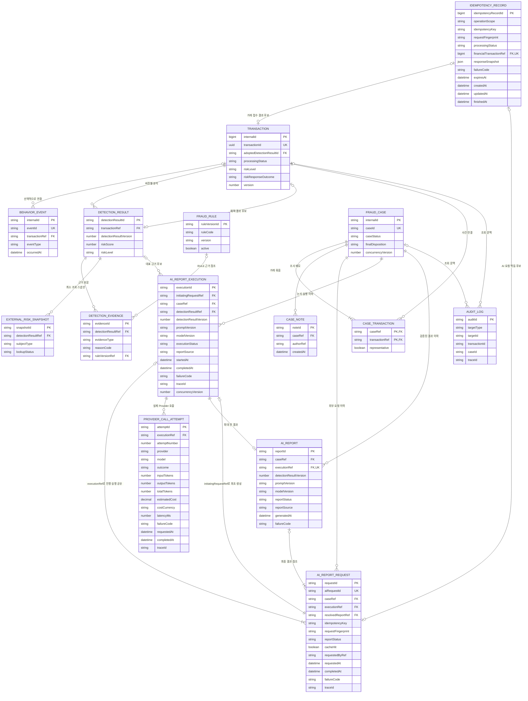

# FinGuardOps 핵심 도메인 ERD

## 1. 문서 목적

이 문서는 FinGuardOps의 거래 접수부터 행동 이벤트, Rule·ML 탐지, 위험 대응, 사건 조사, 감사, AI 리포트와 AI 사용량·비용 기록까지의 업무 데이터를 관계형 논리 모델로 연결한다.

단순히 테이블 후보를 나열하는 것이 아니라 다음 설계 질문에 답하는 것을 목적으로 한다.

- 어떤 업무 데이터를 영속화해야 하는가
- 각 엔티티가 어떤 데이터와 정합성의 책임을 가지는가
- 엔티티 사이의 관계와 Cardinality는 무엇인가
- 거래 처리 상태, 위험 등급, 위험 대응 결과를 어떻게 분리하는가
- 사건 진행 상태와 최종 판정을 어떻게 분리하는가
- 재분석과 리포트 재생성을 어떤 버전으로 추적하는가
- 중복 거래·이벤트·탐지 결과·사건·AI 리포트·AI 사용량 기록을 어떻게 방지하는가
- 감사 가능성과 동시성 충돌 탐지를 어떤 데이터로 지원하는가
- 고객·계좌·기기·IP 등 민감 정보 저장을 어떻게 최소화하는가
- 후속 JPA, API와 마이그레이션 설계에서 무엇을 결정해야 하는가

이 문서는 구현 완료 내역이 아니다. 현재 백엔드는 Health Check, 거래 접수·조회, 거래 멱등성과 행동 이벤트 접수를 구현했으며 거래·멱등·행동 이벤트는 PostgreSQL 애플리케이션 연동과 Flyway 스키마가 구현되어 있다. 운영 PostgreSQL 배포 환경과 아래의 탐지·Rule·사건·감사·AI 운영 엔티티는 아직 구현되지 않았다.

## 2. 설계 범위와 제외 범위

### 2.1 설계 범위

핵심 설계 범위는 다음과 같다.

- 거래·행동: `Transaction`, `BehaviorEvent`
- 탐지: `DetectionResult`, `DetectionEvidence`, `FraudRule` 또는 `RuleVersion`, `ExternalRiskSnapshot`
- 사건: `FraudCase`, `CaseTransaction`, `CaseNote`, `AuditLog`
- AI 운영: `AiReportRequest`, `AiReportExecution`, `ProviderCallAttempt`, `AiReport`

`ExternalRiskSnapshot`은 외부 위험계좌·IP·기기 근거의 재현과 장애·fallback 실험을 위해 초기 핵심 엔티티에 포함하는 방향을 권장한다. 다만 구체적인 속성, 보존 기간과 보호 방식은 후속 설계에서 확정한다.

다음 엔티티는 필요성과 적용 범위를 구분해 관리한다.

- API 요청 처리 상태와 완료 응답 재사용을 관리하는 `IdempotencyRecord`. 거래 접수에는 채택되었고 다른 API의 공통 적용 범위는 후보
- 테스트·Mock 시나리오를 위한 최소 `Customer`·`Account` 참조 엔티티

### 2.2 제외 범위

거래 접수 물리 계약에서 확정한 범위를 제외하고, 이 문서에서는 다음 사항을 확정하지 않는다.

- JPA Entity, 연관관계 매핑과 Java Enum
- Java·Python·프론트엔드 구현 코드
- 거래 접수 외 PostgreSQL DDL, 구체적인 DB 타입과 제약조건 문법
- 실제 Flyway·Liquibase 마이그레이션 파일
- REST API 경로, 요청·응답 DTO와 상태 코드
- Kafka 이벤트 스키마, Topic, Partition과 Consumer 구조
- Redis Key의 구현 형식과 TTL
- Worker와 Scheduler 구현
- 거래 접수 외 동시성 제어의 낙관적 락 또는 비관적 락 선택
- 암호화·해시 알고리즘, 키 관리 방식과 보존 기간
- 고객 원장·계좌 원장, 실제 잔액과 실제 소유권 관리
- 실제 거래 승인·추가 인증·보류·차단과 고객 제재
- Rule v1 이외의 점수·가중치·위험 등급 통합 정책과 ML 모델 성능 기준. Rule v1은 [`../01-requirements/rule-v1-detection-contract.md`](../01-requirements/rule-v1-detection-contract.md)를 따른다.
- AI 비용 계산 공식, Provider 가격표 반영과 통화 환산 방식
- 실제 Provider·모델 선정, Prompt 전문과 Provider 요청·응답 원문 저장
- 인증·인가 구현
- AI 이력의 구체적인 보존 기간
- `caseAnalysisSnapshotVersion`의 현재 도입
- 운영 장애·배포 이력용 `ServiceIncident`·`DeploymentRecord`

## 3. 기존 요구사항·상태 전이·아키텍처와의 관계

이 논리 모델은 다음 문서를 기준으로 한다.

- `README.md`
- `docs/00-overview/project-summary.md`
- `docs/00-overview/fds-service-scope.md`
- `docs/01-requirements/fds-user-scenarios.md`
- `docs/01-requirements/rule-v1-detection-contract.md`
- `docs/01-requirements/platform-operation-requirements.md`
- `docs/01-requirements/fds-screen-wireframes.md`
- `docs/01-requirements/platform-screen-wireframes.md`
- `docs/01-requirements/transaction-state-transition.md`
- `docs/01-requirements/case-state-transition.md`
- `docs/01-requirements/ai-report-state-transition.md`
- `docs/02-architecture/system-architecture.md`
- `docs/03-api/api-conventions.md`
- `docs/03-api/transaction-detection-api.md`
- `docs/03-api/case-audit-api.md`
- `docs/03-api/ai-report-usage-api.md`
- `docs/07-decisions/ADR-001-finguardops-positioning.md`
- `docs/07-decisions/ADR-002-rename-repository-to-finguardops.md`
- `docs/07-decisions/ADR-003-transaction-processing-boundary.md`
- `docs/07-decisions/ADR-004-idempotency-response-snapshot-transition.md`

전용 상태 전이 문서를 상태 모델의 우선 기준으로 사용한다. 따라서 거래에는 처리 상태, 위험 등급과 위험 대응 결과를 별도 속성으로 두고, 사건에는 `caseStatus`와 `finalDisposition`을 별도 속성으로 둔다. AI 리포트 상태도 거래·사건 상태와 독립적으로 관리한다.

시스템 아키텍처의 데이터 소유권은 다음과 같이 반영한다.

```text
FastAPI
→ Feature·Rule·ML·AI 리포트 계산

Spring Boot
→ 결과 검증·업무 정책 적용·상태 전이·멱등성·동시성·감사 관리

PostgreSQL
→ 검증된 영속 업무 데이터의 원본

Redis
→ 원본에서 다시 만들거나 조회할 수 있는 정확 일치 캐시 후보
```

FastAPI나 LLM Provider가 반환한 값은 그 자체로 업무 원본이 아니다. Spring Boot가 요청과 버전을 검증하고 PostgreSQL에 연결해 저장한 결과가 감사 가능한 FinGuardOps 기록이 된다.

### 3.1 최신 문서 정합성

구현 전 문서 정비에서 다음 기준을 상태 전이·API 계약과 통일했다.

- `LOAN_DISBURSED`는 행동 이벤트가 아니라 대출 실행 사실을 나타내는 Mock 금융거래 유형이다.
- 위험 등급은 `LOW`, `MEDIUM`, `HIGH`, `CRITICAL`을 사용한다.
- 사건 진행 상태인 `caseStatus`와 최종 판정인 `finalDisposition`을 분리한다.
- AI 외부 요청은 `aiRequestId`, 실제 논리 실행은 `executionId`로 식별하고 진행 중 실행 공유는 `executionShared`로 표현한다.
- 완료된 정확 일치 캐시 요청은 새 `AiReportRequest` 이력을 만들되 새 실행·Provider 호출·가상 사용량을 만들지 않는다.
- AI 자동 재시도는 Timeout과 연결 실패에만 최대 1회 적용하고 출력 검증 실패와 비일시적 Provider 오류는 템플릿 fallback으로 전환한다.
- 거래 접수의 공식 물리 DB 계약은 `docs/04-database/transaction-intake-schema.md`이며, 이 논리 모델의 거래·멱등 후보 중 해당 범위를 구체화한다.
- 멱등 Snapshot은 최초 명령의 업무 결과를 재현하고 최신 거래·탐지 상태는 별도 조회 API가 제공한다. legacy와 최종 동기 응답 전환은 ADR-004를 따른다.

## 4. 데이터 모델링 원칙

### 4.1 상태와 결과를 분리한다

처리 단계, 위험 평가와 업무 대응은 서로 다른 질문에 답한다.

```text
transactionProcessingStatus
= 지금 거래 처리가 어느 단계인가

riskLevel
= 탐지 결과의 위험 수준은 무엇인가

riskResponseOutcome
= 해당 위험 수준에 어떤 Mock 대응을 적용했는가
```

사건도 같은 원칙을 적용한다.

```text
caseStatus
≠ finalDisposition
```

`caseStatus`는 현재 조사 진행 단계이고 `finalDisposition`은 조사 결과이다. 조사 중에는 `finalDisposition`이 `null`일 수 있다.

### 4.2 현재값과 이력을 구분한다

목록 조회에 필요한 현재 상태는 주요 엔티티에 유지하되, 주요 변경의 이전 값·변경 후 값·사유는 `AuditLog`에 추가 기록한다. 감사 로그만을 현재 상태 조회의 원본으로 사용하거나, 현재 행만 남기고 과거 근거를 덮어쓰는 양극단을 피한다.

### 4.3 재처리와 새 분석을 구분한다

Timeout이나 응답 유실에 따른 동일 요청 재시도는 기존 결과를 재사용하거나 같은 실행으로 식별한다. 입력, Rule, Feature 또는 모델 조건이 변경된 실제 재분석은 새 `DetectionResult` 버전으로 저장한다.

AI 리포트도 동일 요청의 재시도와 새로운 버전 조건의 재생성을 구분한다. 새 결과가 필요하더라도 기존 완료 결과를 이력 없이 덮어쓰는 방식을 전제로 하지 않는다.

### 4.4 불변 근거를 보존한다

과거 탐지 결과가 참조한 Rule 버전, 외부 위험정보 요약과 AI 리포트의 생성 조건은 이후 설정이 변경되어도 당시 판단을 설명할 수 있어야 한다. 과거 버전을 물리 삭제하거나 현재 설정으로 치환하지 않는다.

### 4.5 업무 원본과 캐시·관측 데이터를 구분한다

PostgreSQL에 저장하는 거래·탐지·사건·감사·AI 사용량은 업무 원본 후보이다. Redis의 정확 일치 캐시와 Observability 시계열은 조회·관측을 보조하지만 업무 원본을 대신하지 않는다.

### 4.6 민감 정보는 참조값과 최소 요약으로 제한한다

고객·계좌·기기·IP의 원문을 도메인 전체에 복제하지 않는다. 연결용 외부 참조값, 화면 표시용 마스킹 값과 탐지에 필요한 최소 위험 신호를 구분한다.

## 5. 데이터 영역

### 5.1 거래·행동 영역

거래 접수와 처리 결과, 거래 전후 행동 타임라인을 보존한다. 동일 요청의 중복 처리는 `transactionId`와 멱등성 정책으로 통제하고, 행동 이벤트는 독립 `eventId`로 중복을 구분한다.

### 5.2 탐지 영역

한 거래에 대해 여러 분석 버전을 보존하고, 각 분석 결과에 Rule·ML·외부 위험정보·행동 패턴 근거를 연결한다. 탐지 결과는 점수와 위험 등급의 계산 결과이며 거래 상태나 사건 최종 판정이 아니다.

### 5.3 사건 영역

하나의 사건에 여러 거래를 연결하고 담당자의 조사 메모, 진행 상태, 최종 판정과 변경 이력을 관리한다. 사건 생성 재시도나 연관 거래 추가가 중복 사건과 중복 연결을 만들지 않아야 한다.

### 5.4 AI 운영 영역

외부 AI 리포트 요청, 실제 논리 실행, Provider 호출 시도와 검증된 리포트 결과를 분리한다. 같은 멱등 요청은 기존 `AiReportRequest`를 반환하고, 서로 다른 멱등성 키의 정확 일치 요청은 새 요청 이력을 남기면서 하나의 진행 중 `AiReportExecution`을 공유할 수 있다. 완료된 정확 일치 결과를 재사용하는 요청은 기존 `AiReport`를 참조하며 새 실행이나 Provider 호출 시도를 만들지 않는다.

한 실행에서 일시적 오류에 따른 자동 재시도나 모델 라우팅으로 여러 실제 호출이 발생할 수 있으므로 `AiReportExecution 1 → ProviderCallAttempt N` 관계를 사용한다. `AuditLog`는 사용자 행위와 상태 변경을 감사하지만 AI 요청·실행·시도 이력의 영속 원본을 대신하지 않는다.

## 6. 핵심 엔티티 개요

| 엔티티 | 책임 | 분류 |
| --- | --- | --- |
| `Transaction` | 거래 접수, 현재 처리 상태, 위험 등급과 적용된 Mock 대응의 현재값 | 핵심 |
| `BehaviorEvent` | 거래 전후 고객 행동과 보안 관련 사건의 시간 순서 기록 | 핵심 |
| `DetectionResult` | 특정 거래의 버전별 분석 결과와 실행 상태 보존 | 핵심 |
| `DetectionEvidence` | DetectionResult를 설명하는 개별 Rule·ML·외부·행동 근거 | 핵심 |
| `FraudRule` 또는 `RuleVersion` | 실행 가능한 Rule의 정의·가중치·버전·활성 상태 보존 | 핵심 |
| `FraudCase` | 연관 거래 조사의 현재 상태와 최종 판정 관리 | 핵심 |
| `CaseTransaction` | 사건과 거래의 다대다 관계 및 연결 문맥 관리 | 핵심 |
| `CaseNote` | 담당자의 조사 메모와 작성 정보 보존 | 핵심 |
| `AuditLog` | 주요 변경의 주체·시각·이전값·변경값·사유 보존 | 핵심 |
| `AiReportRequest` | 외부 생성 요청, 멱등성, 요청자, 요청 시각과 실행·재사용 결과 연결 | 핵심 후보 |
| `AiReportExecution` | 정확 일치 조건에 대한 실제 논리 실행과 최종 실행 상태 관리 | 핵심 후보 |
| `ProviderCallAttempt` | 실행 중 발생한 실제 Provider 호출별 토큰·지연·비용·결과 기록 | 핵심 후보 |
| `AiReport` | 검증된 LLM 또는 템플릿 fallback 결과 본문과 최초 생성 출처 보존 | 핵심 후보 |
| `ExternalRiskSnapshot` | 탐지 당시 외부 위험정보와 조회·캐시·fallback 상태의 최소 스냅샷 | 초기 핵심 권장 |
| `IdempotencyRecord` | 요청의 처리 중·완료·실패와 완료 응답 재사용 정보 | 거래 접수 확정, 다른 API 후보 |
| 최소 `Customer`·`Account` 참조 엔티티 | 테스트·Mock 관계의 외래 키 정합성 보조 | 후보 |

기존 `AiUsageRecord` 후보의 책임은 실제 Provider 호출 단위인 `ProviderCallAttempt`로 명확히 재정의한다. `ModelExecution`, `CostPolicy`, `ServiceIncident`, `DeploymentRecord`, 알림, 배포와 사용자 인증 전체 모델은 이번 핵심 ERD에 추가하지 않는다.

## 7. 엔티티별 책임과 속성 후보

속성명은 논리 이름 후보이다. 구체적인 DB 컬럼명, 타입과 null 제약은 후속 설계에서 확정한다.

### 7.1 Transaction

`Transaction`은 FinGuardOps가 접수한 금융거래의 식별, 금액·시각과 현재 업무 처리 결과를 소유한다. Rule·ML 상세 근거는 `DetectionResult`와 `DetectionEvidence`에 분리하고, 사건 조사 상태는 `FraudCase`에 분리한다.

| 속성 후보 | 의미와 설계 이유 |
| --- | --- |
| 내부 식별자 | 외래 키 연결을 위한 `BIGINT Identity` 내부 식별자 |
| `transactionId` | 외부 요청, 로그, 추적과 사용자 조회에 사용하는 UUID v4 업무 식별자 |
| `transactionType` | 계좌이체, 오픈뱅킹 이체, ATM 인출 등 거래 유형 |
| `amount` | 0보다 큰 정수 거래 금액. PostgreSQL은 `NUMERIC(19,4)` 사용 |
| `currencyCode` | 초기에는 `KRW`만 허용 |
| `occurredAt` | 실제 거래 요청 또는 발생 시각 |
| `externalCustomerRef` | 고객 원문 대신 사용하는 외부 연결 참조값 |
| `senderAccountRef` | 네 거래 유형의 기준 계좌 원문 대신 사용하는 외부 연결 참조값 |
| `recipientAccountRef` | 계좌·오픈뱅킹 이체에는 필수이고 ATM 인출·대출 실행에는 금지되는 외부 수취 계좌 참조값 |
| `channel` | 거래가 FinGuardOps에 유입된 거래 유형별 접수 경로 |
| `deviceRef` | 기기 원문 대신 사용하는 선택 참조값 |
| 발신·수신 마스킹 표시값 후보 | 화면 표시가 필요할 때 연결용 참조값과 분리해 보관하는 후보 |
| `processingStatus` | 거래 처리 단계 |
| `riskLevel` | 현재 채택된 탐지 결과의 위험 등급 |
| `riskResponseOutcome` | 승인, 승인 후 모니터링, 추가 인증 요구, 보류 등 Mock 대응 결과 |
| `adoptedDetectionResultId` 후보 | 현재 위험 등급과 대응의 기준으로 채택한 DetectionResult를 직접 식별하는 논리 참조 후보 |
| `createdAt`, `updatedAt` | 생성·마지막 변경 시각 |
| `version` | 상태 변경 경합을 탐지하기 위한 낙관적 잠금 값 |

초기 `transactionType` 값은 거래 API 계약과 같은 다음 네 가지를 사용한다.

```text
ACCOUNT_TRANSFER
OPEN_BANKING_TRANSFER
ATM_WITHDRAWAL
LOAN_DISBURSED
```

`LOAN_DISBURSED`는 실제 대출 원장·상품·심사·실행 기능이 아니라 대출 실행 사실을 입력하는 Mock 금융거래 유형이다.

거래 유형별 `recipientAccountRef`와 `channel`은 다음 계약을 사용한다.

| `transactionType` | `recipientAccountRef` | `channel` |
| --- | --- | --- |
| `ACCOUNT_TRANSFER` | 필수 | `MOBILE_BANKING` |
| `OPEN_BANKING_TRANSFER` | 필수 | `OPEN_BANKING` |
| `ATM_WITHDRAWAL` | 금지 | `ATM` |
| `LOAN_DISBURSED` | 금지 | `CORE_BANKING` |

거래 접수의 타입, 제약과 인덱스는 [`../04-database/transaction-intake-schema.md`](../04-database/transaction-intake-schema.md)를 따른다.

`currentDetectionResultVersion`만 저장하는 방식보다 `adoptedDetectionResultId`로 채택 결과를 직접 가리키는 방안을 우선 검토한다. 버전 번호는 같은 거래 안에서만 유일하기 때문에 식별자 참조가 채택된 결과를 더 명확하게 표현한다.

다음 정합성 원칙이 필요하다.

- `adoptedDetectionResultId`는 반드시 해당 Transaction에 속한 DetectionResult를 참조한다.
- `Transaction.riskLevel`은 채택된 DetectionResult의 위험 등급을 현재값으로 반영한 조회용 업무 스냅샷이다.
- `Transaction.riskResponseOutcome`은 채택된 분석 결과에 Spring Boot가 승인된 정책을 적용한 업무 대응이다.
- 탐지 결과 채택, Transaction의 `riskLevel`·`riskResponseOutcome` 현재값 변경과 AuditLog 기록은 하나의 업무 정합성 경계에서 처리해야 한다.
- 구체적인 외래 키, 트랜잭션 코드와 DB 제약은 후속 설계에서 확정한다.

거래 처리 상태는 다음 전용 상태 전이 기준을 따른다.

```text
RECEIVED
ANALYZING
ANALYZED
APPROVED
ADDITIONAL_AUTH_REQUIRED
HELD
FAILED
```

위험 등급은 다음 값이다.

```text
LOW
MEDIUM
HIGH
CRITICAL
```

위험 대응 결과는 상태와 별도이다. 예를 들어 MEDIUM 거래는 다음처럼 표현할 수 있다.

```text
processingStatus = APPROVED
riskLevel = MEDIUM
riskResponseOutcome = 승인 후 모니터링
```

`MONITORING`을 거래 처리 상태로 다시 추가하거나 `BLOCKED`를 실제 차단 상태로 확정하지 않는다.

### 7.2 BehaviorEvent

`BehaviorEvent`는 거래 전후에 발생한 고객 행동과 보안 관련 신호의 시간 순서를 보존한다. 행동 자체가 거래 없이 먼저 발생할 수 있으므로 `Transaction`과의 관계는 선택적이다.

지원 행동 이벤트는 다음 목록을 기준으로 한다.

```text
LOGIN
LOGIN_FAILED
DEVICE_REGISTERED
PASSWORD_CHANGED
OTP_REISSUED
BENEFICIARY_REGISTERED
TRANSFER_LIMIT_CHANGED
TRANSFER_REQUESTED
ATM_WITHDRAWAL_REQUESTED
```

`LOAN_DISBURSED`는 이 목록에 포함하지 않는다. 대출 실행 사실은 `Transaction.transactionType = LOAN_DISBURSED`인 Mock 금융거래로 표현한다.

| 속성 후보 | 의미와 설계 이유 |
| --- | --- |
| 내부 식별자 | 관계 연결을 위한 내부 식별자 후보 |
| `eventId` | 중복 수신과 재처리를 구분하는 업무 식별자 |
| `externalCustomerRef` | 외부 고객 연결 참조값 |
| `accountRef` | 행동의 기준이 되는 고객 측 계좌 참조값. 수취인 참조와 구분 |
| 관련 거래 내부 식별자 또는 `transactionId` | 거래와 연결되는 이벤트에만 사용하는 선택 참조 |
| `eventType` | 지원 행동 이벤트 유형 |
| `occurredAt` | 행동이 실제 발생한 시각 |
| `deviceRef` | 기기 원문 대신 사용하는 참조값 후보 |
| `beneficiaryRef` | `BENEFICIARY_REGISTERED`에서 새로 등록된 수취인 참조값 |
| `requestFingerprint` | 승인된 8개 REST 요청 필드의 결정적 정규화 SHA-256 |
| `createdAt` | 수집·저장 시각 |

초기 행동 이벤트 접수는 위 명시적 속성만 저장한다. `locationRiskSummary`, `observedSignals`와 자유 형식 `eventDetails`는 포함하지 않는다. `accountRef`는 고객 측 기준 계좌이고 `beneficiaryRef`는 새로 등록된 수취인이므로 의미를 혼합하지 않는다. 유형별 null 조건, 거래 연결 검증과 물리 컬럼은 [`../04-database/behavior-event-intake-schema.md`](../04-database/behavior-event-intake-schema.md)를 따른다.

### 7.3 DetectionResult

`DetectionResult`는 특정 거래에 대한 분석 결과의 버전별 기록이다.

```text
Transaction 1
→ DetectionResult N
```

| 속성 후보 | 의미와 설계 이유 |
| --- | --- |
| 탐지 결과 내부 식별자 | 근거와 AI 리포트 연결을 위한 식별자 |
| 거래 내부 식별자 또는 `transactionId` | 분석 대상 거래 |
| `detectionResultVersion` | 같은 거래의 재분석 결과 순서 또는 버전 |
| `riskScore` | 승인된 점수 통합 정책의 결과 |
| `riskLevel` | 해당 분석 버전에서 계산된 위험 등급 |
| `ruleScore` | Rule 결과의 기여 점수 |
| `mlScore` | ML 결과의 기여 점수. ML 미사용 시 null 가능 후보 |
| `modelVersion` | 사용한 ML 모델 또는 분석 모델 버전 후보 |
| `featureVersion` | Feature 정의·계산 방식 버전 후보 |
| `analysisStatus` | 요청·진행·완료·실패를 구분하기 위한 분석 상태 후보 |
| `analysisStartedAt`, `analysisCompletedAt` | 분석 수행 구간 |
| `traceId` 후보 | 서비스 간 분석 호출 추적 |
| `createdAt` | 결과 저장 시각 |

핵심 중복 방지 후보는 다음과 같다.

```text
transactionId + detectionResultVersion
→ Unique 후보
```

동일 버전의 재전송은 새 결과를 추가하지 않아야 한다. 입력이나 분석 조건이 달라진 정당한 재분석은 새 버전을 사용한다. 버전 생성 주체, 연속 번호인지 불변 식별자인지, 실패한 시도가 버전을 소비하는지는 후속 설계에서 결정한다.

### 7.4 DetectionEvidence

`DetectionEvidence`는 하나의 탐지 결과를 설명하는 개별 근거이다.

```text
DetectionResult 1
→ DetectionEvidence N
```

근거 유형 후보는 다음과 같다.

```text
RULE
ML
EXTERNAL_RISK
BEHAVIOR_PATTERN
```

| 속성 후보 | 의미와 설계 이유 |
| --- | --- |
| 근거 식별자 | 개별 근거 식별 |
| 탐지 결과 식별자 | 소속 DetectionResult |
| `evidenceType` | Rule·ML·외부 위험정보·행동 패턴 구분 |
| `reasonCode` | 시스템과 화면에서 사용하는 설명 가능한 코드 |
| `displayDescription` | 민감정보를 제외한 담당자 표시 설명 |
| `scoreContribution` | 최종 점수에 대한 기여도 후보 |
| Rule 버전 참조 | RULE 근거가 사용한 정확한 Rule 버전 |
| ExternalRiskSnapshot 참조 후보 | 외부 위험 근거가 사용한 최소 스냅샷 |
| `observationSummary` | 필요한 관측값 또는 Feature의 제한된 요약 |
| `evidenceOccurredAt` | 근거가 관측되거나 확정된 시각 |
| `sortOrder` | 화면에서 근거를 안정적으로 정렬하는 후보 |
| `createdAt` | 근거 저장 시각 |

Feature 전체 벡터, 원문 행동 로그, 실제 계좌번호, 원문 IP와 LLM 입력 전체를 근거에 무제한 저장하지 않는다. 재현에 필요한 Feature 버전과 제한된 요약을 저장하고, 상세 Feature 보존이 필요하면 별도 보안·보존 설계를 거쳐야 한다.

### 7.5 FraudRule과 Rule 버전

Rule은 다음 정보를 표현할 수 있어야 한다.

- Rule ID 또는 `ruleCode`
- 이름과 설명
- 조건
- 가중치
- 버전
- 활성 상태
- 적용 시작일
- 필요 시 적용 종료일 후보

#### 방안 A: 행 단위 버전 관리

`FraudRule` 한 엔티티에서 버전별 행을 저장한다.

```text
ruleCode + version
→ Unique 후보
```

각 행은 한 번 사용된 뒤 조건·가중치를 덮어쓰지 않는 불변 버전으로 취급한다. 새 Rule 변경은 새 버전 행으로 추가한다.

#### 방안 B: RuleDefinition과 RuleVersion 분리

`RuleDefinition`은 `ruleCode`, 이름 등 논리 Rule의 정체성을 소유하고, `RuleVersion`은 조건·가중치·적용 기간과 버전을 소유한다.

| 비교 기준 | 방안 A: 단일 엔티티 버전 행 | 방안 B: 정의·버전 분리 |
| --- | --- | --- |
| 구현 복잡도 | 낮음 | 엔티티와 관계가 하나 늘어남 |
| 과거 버전 추적 | 불변 행 원칙을 지키면 가능 | 정의와 버전 관계가 더 명시적 |
| 활성 버전 조회 | 활성 플래그·적용 기간 조건 필요 | 정의별 활성 버전 관계를 명확히 만들 수 있음 |
| Rule 변경 이력 | 이름·설명 중복 가능 | 공통 정의와 버전 변경을 구분하기 쉬움 |
| 탐지 근거 연결 | `ruleCode + version` 행 또는 내부 ID 참조 | 특정 RuleVersion FK가 명확함 |
| 초기 개인 프로젝트 범위 | 단순하고 적합 | 장기 확장에는 유리하지만 초기 복잡도 증가 |

초기 권장안은 8~10개 Rule을 대상으로 방안 A를 우선 검토하는 것이다. 단, 각 버전 행을 불변으로 유지하고 `DetectionEvidence`가 사용한 특정 행을 참조해야 한다. Rule이 증가하거나 정의 수준의 메타데이터와 승인 이력이 필요해지면 방안 B로 분리할 수 있다. 최종 모델은 사용자 승인 사항이다.

어느 방식을 선택해도 과거 탐지 근거가 참조한 Rule 버전을 물리 삭제하거나 현재 버전으로 치환해서는 안 된다.

Rule v1은 물리 모델 선택과 무관하게 `ruleCode`별 활성 버전을 하나만 허용하고, 평가 시작 시 활성 Rule 집합을 고정하며, 조건·가중치 변경 시 새 불변 버전을 생성한다. 세부 계약은 [Rule v1 탐지 계약](../01-requirements/rule-v1-detection-contract.md)을 따른다. Rule 관리와 실행은 아직 구현되지 않았다.

### 7.6 ExternalRiskSnapshot

`ExternalRiskSnapshot`은 위험계좌·IP·기기 조회의 원본 전체가 아니라 탐지 시점에 실제 사용한 최소 정보를 보존한다. 외부 위험 근거의 재현과 External Risk 장애·캐시·fallback 실험을 지원하므로 초기 핵심 엔티티로 포함하는 방향을 권장한다.

저장 목적은 다음과 같다.

- 탐지 시점의 외부 위험정보를 재현한다.
- 외부 데이터가 변경·정정된 뒤에도 당시 판단 근거를 감사할 수 있다.
- 조회 성공, 캐시 사용, 조회 불가와 fallback 결과를 구분한다.

속성 후보는 다음과 같다.

- 스냅샷 식별자
- 대상 유형과 비식별 대상 참조값
- 외부 위험 유형과 일치 여부
- 외부 Reason Code 또는 제한된 설명
- 제공자 기준 시각과 유효 기준 후보
- 조회 시각
- 조회 결과 상태
- 캐시 사용 여부와 캐시 기준 시각
- fallback 또는 조회 불가 사유
- 관련 `transactionId`, DetectionResult와 `traceId`

외부 Provider 응답 원문 전체, 실제 계좌번호·IP·기기 식별자 원문과 불필요한 Provider 데이터는 저장하지 않는다. 조회 상태, 일치 결과, Reason Code, 기준 시각, 캐시·fallback 정보와 `traceId` 등 감사와 장애 재현에 필요한 최소 스냅샷만 저장한다. 구체적인 속성, 보존 기간과 암호화 방식은 후속 설계에서 사용자 승인으로 확정한다.

### 7.7 FraudCase

`FraudCase`는 하나 이상의 거래를 묶어 조사하는 업무 단위이다. 거래 위험 대응과 별개로 담당자의 조사 진행 상태와 최종 판정을 소유한다.

| 속성 후보 | 의미와 설계 이유 |
| --- | --- |
| 내부 식별자 | 관계 연결을 위한 내부 식별자 |
| `caseId` | 화면·로그·추적에 사용하는 업무 식별자 |
| `caseStatus` | 현재 조사 진행 단계 |
| `finalDisposition` | 담당자의 최종 조사 결과. 조사 중 null 가능 |
| `representativeRiskLevel` | 사건 대기열용 대표 위험 등급 후보 |
| 대표 탐지 사유 후보 | 목록에서 표시할 대표 Reason Code 또는 요약 |
| `assigneeRef` | 담당자 원문 프로필이 아닌 참조값 후보 |
| `createdAt` | 사건 생성 시각 |
| `reviewStartedAt` | 최초 검토 시작 시각 후보 |
| `closedAt` | 종료 시각 |
| `lastChangedAt` | 목록 정렬과 충돌 안내에 사용하는 마지막 변경 시각 |
| `concurrencyVersion` 후보 | 동시 수정 충돌 탐지 |

사건 상태는 다음 값이다.

```text
OPEN
IN_REVIEW
ADDITIONAL_INFORMATION_REQUIRED
CLOSED
```

최종 판정은 다음 값이다.

```text
NORMAL
FALSE_POSITIVE
CONFIRMED_FRAUD
```

```text
caseStatus
≠ finalDisposition
```

초기 사건 API 계약에서는 `OPEN`, `IN_REVIEW`, `ADDITIONAL_INFORMATION_REQUIRED` 동안 `finalDisposition = null`을 유지한다. `IN_REVIEW` 사건을 종료할 때 `NORMAL`, `FALSE_POSITIVE`, `CONFIRMED_FRAUD` 중 하나의 최종 판정을 필수로 설정하고 `caseStatus = CLOSED`, `closedAt`과 AuditLog를 같은 업무 트랜잭션에서 반영한다. `IN_REVIEW`에는 담당자가 필요하다.

대표 위험 등급은 연결 거래 중 최고 등급, 대표 거래 등급 또는 사건 분석 결과 중 무엇을 사용할지 확정되지 않았다. 계산 규칙과 갱신 시점을 후속 설계에서 결정해야 한다.

### 7.8 CaseTransaction

`CaseTransaction`은 사건과 거래의 다대다 관계를 표현하는 중간 엔티티이다.

```text
FraudCase N
↕
CaseTransaction
↕
Transaction N
```

속성 후보는 다음과 같다.

- 사건 식별자
- 거래 식별자
- 대표 거래 여부
- 연결 사유 또는 Reason Code 후보
- 연결 시각
- 연결 주체 후보

핵심 중복 방지 후보는 다음과 같다.

```text
caseId + transactionId
→ Unique 후보
```

대표 거래 여부는 사건 목록과 AI 리포트 근거 선택에 유용할 수 있다. 다만 사건당 대표 거래를 정확히 하나로 강제할지, 대표 거래 없이 복수 거래를 동등하게 다룰지는 사용자 결정 사항이다.

한 거래가 여러 사건에 연결될 수 있는지는 병합·분리 정책과 관련된다. 현재 ERD는 다대다 가능성을 보존하지만, 같은 의심 흐름에서 중복 사건을 허용한다는 뜻은 아니다.

하나의 Transaction이 과거 여러 `CLOSED` 사건과 연결될 가능성은 유지하되, 동일 Transaction은 `OPEN`, `IN_REVIEW`, `ADDITIONAL_INFORMATION_REQUIRED` 상태의 사건 중 최대 하나에만 동시에 연결될 수 있다는 업무 규칙을 권장한다.

현재 `caseStatus`는 FraudCase에 있고 거래 연결은 CaseTransaction에 있으므로, CaseTransaction 한 테이블만 대상으로 하는 단순 Partial Unique Index는 다른 테이블의 상태 조건을 직접 평가하기 어렵다. 구현 후보는 다음과 같다.

| 방안 | 방식 | 장점 | 고려사항 |
| --- | --- | --- | --- |
| A | Spring Boot 업무 트랜잭션에서 기존 활성 사건을 조회·검증하고 동시성 제어 | 현재 데이터 모델을 중복하지 않고 업무 규칙을 Service 경계에서 명확히 검증 | 동시 요청 경합을 막을 잠금·버전·격리 전략 필요 |
| B | CaseTransaction에 활성 연결 상태를 중복 저장하고 같은 테이블의 Partial Unique Index 사용 | 단일 테이블의 DB 보조 제약을 검토할 수 있음 | FraudCase 상태와 중복 값의 동기화 정합성 추가 필요 |
| C | 별도 활성 사건 연결 관계 사용 | 현재 활성 연결을 명시적으로 분리하고 과거 연결과 구분 가능 | 새로운 관계와 수명주기 관리 복잡도 증가 |
| D | DB Trigger 또는 별도 DB 제약 사용 | DB 수준에서 교차 테이블 규칙을 강제할 가능성 | DB 종속성, 테스트와 마이그레이션 복잡도 증가 |

초기 권장안은 방안 A인 Spring Boot 업무 트랜잭션 검증과 동시성 제어이다. DB 보조 제약의 필요성과 구체 방식은 실제 경합 테스트를 근거로 후속 JPA·마이그레이션 설계에서 결정한다.

### 7.9 CaseNote

`CaseNote`는 담당자가 사건 조사 과정에서 작성한 메모를 보존한다.

속성 후보는 다음과 같다.

- `noteId`
- `caseId`
- `authorRef`
- `content`
- `createdAt`
- `correctionOfNoteId` 후보

초기 구현은 append-only를 기본으로 하는 방향을 권장한다.

- 기존 메모를 직접 수정하거나 물리 삭제하지 않는다.
- 정정이 필요하면 `correctionOfNoteId`로 원 메모를 참조하는 새로운 정정 메모를 추가한다.
- 수정 시각, 수정됨 상태와 삭제됨 상태는 향후 수정·논리 삭제 정책이 승인될 경우에만 추가하는 후보이며 초기 append-only 범위에는 포함하지 않는다.
- 향후 수정 또는 논리 삭제 기능이 실제로 필요해지면 별도의 메모 이력 모델을 검토한다.

메모에는 불필요한 고객·계좌 원문이나 인증정보를 기록하지 않는다. append-only를 최종 정책으로 확정할지, 향후 정정 관계와 논리 삭제를 어떻게 표현할지는 감사 가능성을 고려해 사용자가 승인한다.

### 7.10 AuditLog

`AuditLog`는 업무 원본의 현재값을 대신하지 않고 주요 변경과 거부·중복 처리 결과를 감사 가능하게 남긴다.

지원 정보는 다음과 같다.

- 변경 주체
- 변경 시각
- 대상 유형
- 대상 식별자
- 변경 작업
- 이전 값
- 변경 후 값
- 변경 사유
- 관련 `transactionId`
- 관련 `caseId`
- `traceId`
- 필요 시 `eventId`, `aiRequestId`와 멱등 처리 식별 정보 후보

이전 값과 변경 후 값은 민감 원문 전체 복제를 피하고 감사에 필요한 변경 필드와 마스킹·축약 값을 저장해야 한다. 구체적인 구조화 형식은 후속 설계에서 결정한다.

#### 범용 대상 참조

```text
targetType + targetId
```

새 감사 대상 추가가 쉽고 단일 조회 모델을 유지할 수 있지만, DB 외래 키만으로 모든 대상의 존재를 보장하기 어렵다.

#### 명시적인 외래 키

각 주요 엔티티를 nullable 외래 키로 직접 참조하면 참조 무결성과 조회가 명확하지만, 감사 대상이 늘 때마다 스키마가 확장되고 다수의 선택 외래 키가 생긴다.

| 비교 기준 | 범용 대상 참조 | 명시적 외래 키 |
| --- | --- | --- |
| 참조 무결성 | 애플리케이션 검증 필요 | DB 관계로 보조 가능 |
| 확장성 | 높음 | 대상 추가마다 변경 필요 |
| 조회 편의성 | 대상별 해석 필요 | 주요 대상 조인이 명확 |
| 구현 복잡도 | 쓰기는 단순, 검증 책임 증가 | 관계와 null 조합 관리 필요 |

권장 후보는 `targetType + targetId`를 주 대상으로 사용하면서, 실제 화면과 장애 추적에서 자주 사용하는 `transactionId`, `caseId`, `traceId`를 조회 문맥으로 병행하는 방식이다. 이 병행 값에 명시적 외래 키를 적용할지 단순 참조값으로 둘지는 사용자 승인 사항이다.

감사 로그는 임의 수정·삭제를 전제로 하지 않는다. 정정이 필요하면 기존 행을 덮어쓰기보다 추가 정정 기록을 남기는 방향을 검토한다.

### 7.11 AiReportRequest

`AiReportRequest`는 외부 사용자가 AI 리포트 생성을 요청한 사실과 그 요청의 멱등 처리 결과를 보존한다. 외부 API의 `aiRequestId`는 이 엔티티를 식별하며 Provider 호출이나 논리 실행 식별자로 사용하지 않는다.

| 속성 후보 | 필수·제약 후보 | 의미와 설계 이유 |
| --- | --- | --- |
| 요청 내부 식별자 | PK, NOT NULL | 관계형 내부 키 |
| `aiRequestId` | Unique, NOT NULL | 외부 생성 요청 업무 식별자 |
| `caseRef` | FK → FraudCase, NOT NULL | 요청 대상 사건 |
| `detectionResultVersion` | NOT NULL | 요청에 고정된 대표 탐지 결과 버전 |
| `promptVersion` | NOT NULL | 서버 정책이 선택한 Prompt 버전 |
| `modelVersion` | NOT NULL | 정확 일치 조건에 사용한 모델 버전 |
| `idempotencyKey` | NOT NULL | `Idempotency-Key` 값. AI 리포트 생성 작업 범위에서 중복 확인 |
| `requestFingerprint` | NOT NULL | 정규화한 `caseId`, 요청 본문과 업무상 비교 필드의 지문 |
| `requestedByRef` | NOT NULL | 신뢰할 수 있는 서버 사용자 문맥에서 얻은 요청자 참조값 |
| `requestedAt` | NOT NULL | 외부 요청 접수 시각 |
| `traceId` | NOT NULL | 요청 접수 흐름 추적 식별자 |
| `reportStatus` | NOT NULL | 외부 요청 관점의 `PENDING`, `GENERATING`, `COMPLETED`, `FALLBACK_COMPLETED`, `FAILED` |
| `executionRef` | FK → AiReportExecution, nullable | 이 요청이 시작하거나 공유한 실제 실행. 캐시 적중이면 null |
| `resolvedReportRef` | FK → AiReport, nullable | 요청이 최종적으로 제공하는 결과. 처리 중·실패이면 null |
| `cacheHit` | NOT NULL | 완료된 기존 결과 재사용 여부. 진행 중 실행 공유는 false |
| `completedAt` | nullable | 요청이 종료 상태로 확정된 시각 |
| `failureCode` | nullable | 안전하게 분류한 최종 실패 또는 fallback 원인 |

요청 관계의 불변식 후보는 다음과 같다.

- 같은 `Idempotency-Key`와 같은 `requestFingerprint`의 재전송은 기존 요청이 `FAILED`인 경우를 포함해 새 행을 만들지 않고 기존 `AiReportRequest`와 `aiRequestId`를 반환한다.
- 같은 키에 다른 지문이 오면 기존 요청을 변경하지 않고 `IDEMPOTENCY_KEY_CONFLICT`로 거부한다.
- `cacheHit = true`이면 `executionRef = null`, `resolvedReportRef`는 NOT NULL이어야 한다.
- 진행 중 실행을 공유하는 요청은 같은 `executionRef`를 가지며 `cacheHit = false`이다.
- 공유 실행이 완료되면 그 실행에 연결된 요청들은 모두 같은 `AiReport`를 `resolvedReportRef`로 참조할 수 있다.
- `COMPLETED` 또는 `FALLBACK_COMPLETED` 요청은 `resolvedReportRef`가 필요하고 `FAILED` 요청은 결과를 참조하지 않는다.
- 요청 상태는 실행 상태를 외부 요청 관점으로 투영한다. 공유 실행이 종료될 때 연결된 요청을 같은 정합성 경계에서 종결하거나 조회 시 실행 결과로 일관되게 계산해야 한다.

`parentAiRequestId`는 영속 필드나 요청 self 관계로 사용하지 않는다. 진행 중 실행 공유는 여러 요청이 같은 `executionRef`를 참조하는 원본 관계와 API 응답의 `executionId`, `executionShared`, `initiatingAiRequestId`로 표현한다. `sourceAiRequestId`는 캐시 원본 요청 식별자로 유지하되 저장된 FK가 아니라 아래 결과 계보를 조회한 파생 응답값이다.

### 7.12 AiReportExecution

`AiReportExecution`은 정확 일치 조건 하나에 대해 실제 모델 호출 또는 템플릿 fallback 처리를 수행하는 논리적 실행이다. 외부 요청과 분리하므로 여러 요청이 하나의 진행 중 실행을 공유할 수 있고, 캐시 적중 요청에는 새 실행을 만들지 않을 수 있다.

| 속성 후보 | 필수·제약 후보 | 의미와 설계 이유 |
| --- | --- | --- |
| 실행 내부 식별자 | PK, NOT NULL | 관계형 내부 키 |
| `executionId` | Unique, NOT NULL | 논리 실행 업무 식별자 |
| `initiatingRequestRef` | FK → AiReportRequest, NOT NULL | 해당 실행을 최초로 생성한 외부 요청. 실행 공유 후에도 변경하지 않는 관계 |
| `caseRef` | FK → FraudCase, NOT NULL | 실행 대상 사건 |
| 대표 `detectionResultRef` | FK → DetectionResult, nullable 후보 | 대표 탐지 결과를 사용하는 초기 계약의 관계 |
| `detectionResultVersion` | NOT NULL | 정확 일치 조건 1 |
| `promptVersion` | NOT NULL | 정확 일치 조건 2 |
| `modelVersion` | NOT NULL | 정확 일치 조건 3 |
| `executionStatus` | NOT NULL | `PENDING`, `GENERATING`, `COMPLETED`, `FALLBACK_COMPLETED`, `FAILED` |
| `reportSource` | nullable | 종료 결과의 최초 생성 출처. 값은 `LLM`, `TEMPLATE_FALLBACK`만 허용 |
| `startedAt` | nullable | 실제 실행 시작 시각 |
| `completedAt` | nullable | 최종 종료 시각 |
| `failureCode` | nullable | 최종 실패 또는 fallback 원인의 안전한 분류 |
| `traceId` | NOT NULL | 실제 실행 흐름 추적 식별자 |
| `concurrencyVersion` | NOT NULL 후보 | 늦은 응답, Timeout, fallback과 종료 경합 탐지 |

정확 일치 기준은 기존 계약의 다음 네 요소를 유지한다.

```text
caseId
+ detectionResultVersion
+ promptVersion
+ modelVersion
```

초기 설계에서는 `PENDING` 또는 `GENERATING` 실행에 이 네 요소의 부분 Unique 제약을 적용하고, 완료된 재사용 가능 결과에는 `AiReport`의 같은 네 요소 Unique 제약을 적용한다. 모든 `AiReportExecution`에 전역 Unique를 적용하지 않는다. 활성 실행 생성 시 Unique 충돌이 발생하면 새 Provider 실행을 만들지 않고 기존 활성 실행을 다시 조회해 새 요청의 `executionRef`를 연결한다.

새 실행의 최초 요청 관계는 하나의 업무 트랜잭션에서 다음 순서로 만든다.

1. `AiReportRequest`를 `executionRef` 없이 먼저 생성한다.
2. 해당 요청을 `initiatingRequestRef`로 참조하는 `AiReportExecution`을 생성한다.
3. 최초 요청의 `executionRef`를 생성된 실행으로 갱신한다.

여러 요청이 같은 실행을 공유하더라도 `initiatingRequestRef`는 변경하지 않는다. `initiatingRequestRef`와 최초 요청의 `executionRef`가 서로 같은 실행 계보를 가리키는지는 업무 트랜잭션에서 검증한다.

실행의 캐시 대상 여부는 별도 캐시 출처 Enum으로 표현하지 않는다. `COMPLETED` 또는 `FALLBACK_COMPLETED`이며 검증된 `AiReport`가 연결된 실행만 재사용 가능 후보이다. 필요하면 `cacheEligible`을 파생값이나 제한된 중복 컬럼으로 둘 수 있으나, 원본 판정은 실행 상태와 결과 존재 여부이다.

### 7.13 ProviderCallAttempt

`ProviderCallAttempt`는 `AiReportExecution` 중 발생한 실제 LLM Provider 호출 한 번을 기록하며 정확히 하나의 실행에만 속한다. 자동 재시도와 모델 라우팅은 새 요청이나 새 실행이 아니라 같은 실행 아래 서로 다른 attempt이다. 템플릿 fallback 자체는 Provider 호출이 아니므로 가상 attempt를 만들지 않는다. 실행을 공유하는 요청별로 attempt나 비용 행을 복제하지 않는다.

| 속성 후보 | 필수·제약 후보 | 의미와 설계 이유 |
| --- | --- | --- |
| attempt 내부 식별자 | PK, NOT NULL | 관계형 내부 키 |
| `attemptId` | Unique, NOT NULL | 개별 실제 호출 업무 식별자 |
| `executionRef` | FK → AiReportExecution, NOT NULL | 호출이 속한 논리 실행 |
| `attemptNumber` | NOT NULL | 실행 안의 1부터 시작하는 호출 순서 |
| `provider` | NOT NULL | 실제 호출 Provider |
| `model` | NOT NULL | 실제 호출 모델 |
| `outcome` | NOT NULL | `SUCCEEDED`, `FAILED`, `OUTPUT_REJECTED` 등 호출 결과 후보 |
| `inputTokens` | nullable | Provider가 확인한 실제 입력 토큰. 알 수 없으면 0으로 만들지 않음 |
| `outputTokens` | nullable | Provider가 확인한 실제 출력 토큰. 알 수 없으면 0으로 만들지 않음 |
| `totalTokens` | nullable | 확인된 실제 총 토큰. 두 값이 모두 있으면 합과 일치해야 함 |
| `estimatedCost` | nullable | 실제 호출 사용량에 근거한 추정 비용. 확정 청구액이 아님 |
| `costCurrency` | nullable | 추정 비용의 Provider 원통화. 비용이 있으면 필수 후보 |
| `latencyMs` | nullable | 완료된 실제 호출 지연시간 |
| `failureCode` | nullable | Timeout, 연결 실패, Provider 오류, 출력 검증 실패의 안전한 분류 |
| `requestedAt` | NOT NULL | Provider 호출을 시작한 시각 |
| `completedAt` | nullable | Provider 호출이 종료된 시각 |
| `traceId` | NOT NULL | 실행·호출 추적 식별자 |

`executionId + attemptNumber`는 Unique 후보이다. 실패한 호출도 실제 호출 사실, Provider가 확인한 토큰과 발생한 비용을 보존한다. 토큰·비용을 확인할 수 없는 실패는 null로 두며 측정되지 않은 값을 0으로 단정하지 않는다. 자동 재시도는 현재 API 계약에 따라 일시적 Timeout·연결 실패에만 최대 1회 허용되므로 최초 호출을 포함해 최대 2개의 attempt를 표현할 수 있다.

### 7.14 AiReport

`AiReport`는 검증을 통과해 조사에 사용할 수 있는 결과 본문이다. 요청이나 실행 상태를 대신하지 않으며, 한 실행은 최대 하나의 결과를 생성한다. `FAILED` 실행에는 결과 행을 만들지 않는다.

| 속성 후보 | 필수·제약 후보 | 의미와 설계 이유 |
| --- | --- | --- |
| 리포트 내부 식별자 | PK, NOT NULL | 관계형 내부 키 |
| `reportId` | Unique, NOT NULL | 결과 업무 식별자 후보 |
| `caseRef` | FK → FraudCase, NOT NULL | 결과 대상 사건 |
| `executionRef` | FK → AiReportExecution, Unique, NOT NULL | 결과를 최초 생성한 단일 실행 |
| `detectionResultVersion` | NOT NULL | 결과의 불변 정확 일치 조건 |
| `promptVersion` | NOT NULL | 결과의 불변 Prompt 버전 |
| `modelVersion` | NOT NULL | 결과의 불변 모델 버전 |
| `reportStatus` | NOT NULL | `COMPLETED` 또는 `FALLBACK_COMPLETED`만 허용 |
| `reportSource` | NOT NULL | `LLM` 또는 `TEMPLATE_FALLBACK`만 허용 |
| `reportContent` | NOT NULL | 검증된 구조화 리포트 결과 |
| `generatedAt` | NOT NULL | 결과가 최초 사용 가능해진 시각 |
| `failureCode` | nullable | fallback 원인이 된 안전한 실패 분류 |

결과 구분은 다음과 같다.

| 결과 | `reportStatus` | `reportSource` | 요청 `cacheHit` | 새 실행·attempt |
| --- | --- | --- | --- | --- |
| LLM 신규 생성 | `COMPLETED` | `LLM` | false | 실행 1건, 실제 호출만큼 attempt |
| TEMPLATE_FALLBACK 신규 생성 | `FALLBACK_COMPLETED` | `TEMPLATE_FALLBACK` | false | 실행 1건, 실제 LLM 호출만 attempt |
| 기존 결과 캐시 재사용 | 원본 상태 유지 | 원본 출처 유지 | true | 생성하지 않음 |

캐시는 `reportSource` 값이 아니다. 캐시 요청은 `cacheHit = true`, `executionRef = null`, `resolvedReportRef = 기존 AiReport`로 표현하며 새 리포트 본문·실행·Provider attempt·가상 토큰·가상 비용을 생성하지 않는다. 캐시 원본의 `sourceAiRequestId`와 리포트 최초 생성 요청은 다음 관계를 조회해 파생한다.

```text
AiReportRequest.resolvedReportRef
→ AiReport.executionRef
→ AiReportExecution.initiatingRequestRef
→ AiReportRequest.aiRequestId
```

API에서 캐시 요청의 토큰 합계를 0으로 보여줄 수는 있지만 이는 요청 자체에 귀속된 호출이 없다는 계산 결과이며 저장된 가상 사용량이 아니다.

초기 구현에서는 `FraudCase.currentAiReportRef`를 추가하지 않고 현재 유효한 리포트를 조회 시 결정한다. `COMPLETED` 또는 `FALLBACK_COMPLETED` 결과만 후보로 삼아 다음 순서로 내림차순 정렬하고 하나를 선택한다.

1. 실행 최초 요청의 `requestedAt DESC`
2. 실행 최초 요청의 `aiRequestId DESC`

`generatedAt`은 결과가 실제 사용 가능해진 시각으로 보존하지만 현재 리포트의 첫 번째 우선순위로 사용하지 않는다. 캐시 요청은 기존 결과의 순서를 올리지 않으며 오래된 최초 요청의 실행이 늦게 완료되어도 더 최근 최초 요청이 만든 성공 결과를 덮어쓰지 않는다.

새 요청이나 실행이 `PENDING`, `GENERATING` 또는 `FAILED`여도 기존 유효 리포트는 유지한다. `FraudCase.currentAiReportRef`는 조회 성능 문제가 실제로 확인될 경우 도입할 후속 최적화 후보이며, 어느 경우에도 과거 결과를 덮어쓰지 않는다.

복수 거래 사건을 위한 `caseAnalysisSnapshotVersion`은 향후 확장 후보이며 이번 정확 일치 네 요소를 교체하지 않는다. Reason Code가 같다는 이유로 다른 사건의 결과를 재사용하지 않는다.

### 7.15 IdempotencyRecord

#### 방안 A: Transaction에 멱등성 키 직접 저장

거래 접수에 한정하면 구조가 단순하고 추가 엔티티가 필요 없다. 그러나 거래 외 사건 상태 변경이나 AI 리포트 요청으로 재사용하기 어렵고, 처리 중 요청과 완료 응답 재사용 정보를 확장하기 어렵다.

#### 방안 B: 별도 IdempotencyRecord

요청 종류, 멱등성 키, 요청 지문 후보, 처리 상태, 연결된 결과 식별자, 완료 응답 요약 후보와 만료 시각 후보를 별도 관리한다.

| 비교 기준 | Transaction 직접 저장 | 별도 IdempotencyRecord |
| --- | --- | --- |
| 거래 외 API 재사용 | 어려움 | 요청 범위로 확장 가능 |
| 처리 중 요청 표현 | 거래 상태와 결합됨 | 요청 처리 상태를 독립 표현 가능 |
| 완료 응답 재사용 | 별도 속성 추가 필요 | 완료 결과 참조·응답 요약 후보 관리 가능 |
| 만료 정책 | 거래 보존과 결합됨 | 멱등성 기록 보존을 별도로 결정 가능 |
| 초기 구현 복잡도 | 낮음 | 엔티티와 원자적 선점 로직 필요 |

거래 접수에는 방안 B를 채택한다. 동시에 도착한 요청 중 하나만 최초 처리를 획득하고 처리 중·완료·실패 및 완료 응답 snapshot을 거래 상태와 분리하기 위해서다. 다른 API에 같은 테이블을 적용할지는 각 API 물리 계약에서 결정한다.

거래 생성 작업은 `operationScope + idempotencyKey`를 Unique로 관리하고 정규화 요청의 SHA-256 지문, `IN_PROGRESS`·`COMPLETED`·`FAILED` 상태, 결과 거래 참조, 완료 응답 snapshot과 `expiresAt`을 저장한다. 현재 `expiresAt` 값은 최초 선점의 24시간 후이지만 Service 판정과 정리 작업이 없어 실질적인 만료 정책은 시행되지 않는다. Snapshot 전환은 [`ADR-004`](../07-decisions/ADR-004-idempotency-response-snapshot-transition.md), 현재 물리 구조는 [`../04-database/transaction-intake-schema.md`](../04-database/transaction-intake-schema.md)를 따른다.

### 7.16 최소 Customer·Account 참조 엔티티 후보

#### 방안 A: 외부 참조값만 저장

`Transaction`과 `BehaviorEvent`에 외부 고객·계좌 참조값과 필요한 마스킹 표시값만 저장한다.

#### 방안 B: 최소 참조 엔티티 생성

테스트와 Mock 시나리오를 위해 내부 참조 식별자, 외부 참조값, 마스킹 표시값과 최소 관계만 가진 `CustomerReference`, `AccountReference` 후보를 둔다.

| 비교 기준 | 외부 참조값만 저장 | 최소 참조 엔티티 |
| --- | --- | --- |
| FDS 조회·시나리오 구현 | 직접 필터 가능하나 관계 중복 가능 | 고객·계좌 관계와 Mock 데이터 구성이 편리 |
| 개인정보 최소화 | 범위가 가장 작음 | 최소 속성 통제가 필요 |
| 업무 범위 확대 위험 | 낮음 | 원장 기능으로 확장될 위험 |
| 외래 키 정합성 | 외부 시스템에 의존 | 저장소 내부 관계를 보조할 수 있음 |
| Mock 데이터 생성 | 참조값 규칙 필요 | 재사용 가능한 Mock 관계 생성 가능 |

초기 권장안은 방안 A이다. FinGuardOps는 코어 뱅킹이 아니며 고객·계좌 원장 전체 기능을 소유하지 않는다. 반복 Mock 시나리오에서 내부 관계 정합성이 실제로 필요해질 때만 방안 B를 검토한다. 방안 B를 선택해도 잔액, 실명, 인증정보와 전체 계좌 상태를 추가하지 않는다.

## 8. 엔티티 관계와 Cardinality

| 관계 | Cardinality | 설명 |
| --- | --- | --- |
| Transaction–BehaviorEvent | Transaction 1 : BehaviorEvent 0..N, 이벤트의 거래 참조는 0..1 | 행동은 거래 없이 발생할 수 있고 하나의 거래 전후에 여러 행동이 연결될 수 있음 |
| Transaction–DetectionResult | 1 : 0..N | 한 거래를 여러 버전으로 재분석할 수 있음 |
| Transaction–채택 DetectionResult | Transaction 1 : DetectionResult 0..1 후보 | `adoptedDetectionResultId`가 같은 거래에 속한 현재 채택 결과를 가리키는 부분 관계 |
| DetectionResult–DetectionEvidence | 1 : 0..N | 하나의 결과에 여러 설명 근거가 존재 |
| FraudRule/RuleVersion–DetectionEvidence | Rule 버전 1 : Evidence 0..N, Evidence 참조는 0..1 | RULE 유형 근거만 특정 Rule 버전을 참조 |
| DetectionResult–ExternalRiskSnapshot | 1 : 0..N | 분석 당시 여러 계좌·IP·기기 조회 결과의 최소 스냅샷을 사용할 수 있음 |
| FraudCase–CaseTransaction | 1 : 1..N 후보 | 사건은 하나 이상의 거래를 조사하는 것을 기본으로 함 |
| Transaction–CaseTransaction | 1 : 0..N | 한 거래가 사건에 연결되지 않거나 정책상 여러 사건에 연결될 수 있음 |
| FraudCase–CaseNote | 1 : 0..N | 사건 조사 중 여러 메모 작성 가능 |
| FraudCase–AiReportRequest | 1 : 0..N | 사건에 여러 외부 생성 요청 이력이 존재할 수 있음 |
| FraudCase–AiReportExecution | 1 : 0..N | 사건에 버전 조건이 다른 여러 실행 이력이 존재할 수 있음 |
| FraudCase–AiReport | 1 : 0..N | 사건의 모든 과거 정상·fallback 결과를 보존 |
| AiReportExecution–AiReportRequest (`executionRef`) | 실행 1 : 요청 1..N, 요청의 실행 참조는 0..1 | 최초 요청과 서로 다른 키의 동시 요청이 하나의 진행 실행을 공유. 캐시 요청은 실행 참조 없음 |
| AiReportRequest–AiReportExecution (`initiatingRequestRef`) | 요청 1 : 최초 생성 실행 0..1, 실행의 최초 요청 참조는 정확히 1 | 어떤 외부 요청이 실행을 최초 생성했는지 보존하며 공유 요청이 추가되어도 변경하지 않음 |
| AiReportExecution–ProviderCallAttempt | 1 : 0..N | 실제 호출이 없거나, 최초 호출과 최대 한 번의 자동 재시도 등 여러 실제 호출이 존재 |
| AiReportExecution–AiReport | 1 : 0..1 | 성공 또는 fallback 성공 실행만 하나의 검증된 결과 생성 |
| AiReport–AiReportRequest | 결과 1 : 요청 1..N, 요청의 결과 참조는 0..1 | 최초·공유 요청과 이후 캐시 요청이 같은 결과를 참조 가능 |
| DetectionResult–AiReportExecution | 대표 결과 사용 시 1 : 0..N 후보 | 다중 결과 집합 모델은 미확정 |
| Transaction/FraudCase–AuditLog | 각 대상 1 : 0..N 조회 문맥 | 범용 대상 참조와 자주 쓰는 식별자를 병행하는 후보 |
| IdempotencyRecord–Transaction | 요청 1 : 결과 0..1 | 처리 중에는 거래 결과가 없을 수 있고 완료된 거래 접수는 하나의 결과를 참조 |
| IdempotencyRecord–AiReportRequest | 멱등 기록 1 : 요청 0..1 후보 | 공통 멱등 엔티티를 채택하면 같은 키·지문 확인과 완료 aiRequestId 재사용을 연결 |

`FraudCase–CaseTransaction`을 1..N으로 표현하는 것은 사건이 거래 조사 단위라는 업무 의미를 반영한다. 사건 생성과 첫 거래 연결을 같은 정합성 경계에서 보장할지, 일시적으로 거래가 없는 사건을 허용할지는 후속 트랜잭션 설계에서 확정한다.

Transaction–CaseTransaction의 1:N 관계는 과거 사건 연결을 포함한다. 현재 활성 사건 연결은 Transaction당 최대 하나라는 별도 업무 규칙을 적용하며, 구현 방식은 후속 설계에서 결정한다.

## 9. Mermaid ERD

다음 그림은 핵심 식별자와 관계 중심의 논리 ERD이다. 거래 접수의 PostgreSQL 타입과 제약은 전용 물리 계약을 우선하며, 나머지 엔티티는 구체적인 PostgreSQL 타입이나 JPA 매핑을 의미하지 않는다. `ExternalRiskSnapshot`은 초기 핵심 권장 방향이고 `IdempotencyRecord`는 거래 접수에 확정되었으며 다른 API 적용은 후보이다. Transaction과 채택 DetectionResult의 관계는 논리 후보이고, `AiReportExecution`과 `DetectionResult`의 관계는 대표 탐지 결과를 사용하는 초기 대안만 표시한다. 캐시 요청은 `AI_REPORT_REQUEST.resolvedReportRef`로 기존 결과를 참조하며 새 실행·attempt·리포트를 만들지 않고, 캐시 원본 요청은 결과의 실행과 `initiatingRequestRef`를 따라 조회한다.



## 10. 상태·판정 모델

### 10.1 Transaction 상태 모델

거래 처리 상태, 위험 등급과 위험 대응 결과는 세 속성으로 분리한다.

| 질문 | 속성 | 예 |
| --- | --- | --- |
| 현재 처리 단계는 무엇인가 | `processingStatus` | `ANALYZING`, `APPROVED`, `HELD` |
| 탐지된 위험 수준은 무엇인가 | `riskLevel` | `LOW`, `MEDIUM`, `HIGH`, `CRITICAL` |
| 어떤 Mock 대응을 적용했는가 | `riskResponseOutcome` | 승인, 승인 후 모니터링, 추가 인증 요구, 보류 |

`riskLevel`과 `riskResponseOutcome` 현재값은 `adoptedDetectionResultId`로 식별한 채택 결과 및 Spring Boot의 정책 적용 결과와 일치해야 한다. 채택 결과가 없는 처리 단계에서는 이 값들의 null 허용 여부를 후속 상태별 제약으로 결정한다.

상태별 시각 후보는 다음과 같다.

- 모든 저장된 거래: 생성 시각
- 분석을 시작한 거래: 분석 시작 시각은 DetectionResult에 기록
- 완료된 탐지 결과: 분석 완료 시각
- 최종 대응이 반영된 거래: 마지막 변경 시각과 감사 로그
- 실패 거래: 실패 단계·사유 후보와 실패 시각 후보

구체적인 필수값과 null 규칙은 상태 전이 및 API 트랜잭션 경계를 함께 설계한 뒤 확정한다.

### 10.2 FraudCase 상태·판정 모델

```text
caseStatus
= OPEN | IN_REVIEW | ADDITIONAL_INFORMATION_REQUIRED | CLOSED

finalDisposition
= NORMAL | FALSE_POSITIVE | CONFIRMED_FRAUD | null
```

최소 정합성 후보는 다음과 같다.

- `OPEN`, `IN_REVIEW`, `ADDITIONAL_INFORMATION_REQUIRED`에서는 `finalDisposition`이 null이다.
- `IN_REVIEW`에는 `assigneeRef`가 필요하다.
- `CLOSED`이면 `closedAt`과 `finalDisposition`이 필요하다.
- `finalDisposition` 설정, `caseStatus = CLOSED`, 종료 시각, 동시성 버전과 AuditLog를 하나의 업무 트랜잭션에서 반영한다.
- 최종 판정을 변경할 때 기존 값을 AuditLog 없이 덮어쓰지 않는다.
- `CLOSED` 재개와 판정 정정은 초기 범위에서 제외하며 후속 도입에는 별도 사용자 승인이 필요하다.

### 10.3 AI 요청·실행·결과 상태 모델

AI 상태는 거래·사건 상태와 독립적이다. 요청 상태와 실행 상태는 같은 다섯 값을 사용할 수 있지만 서로 다른 엔티티의 질문에 답한다.

```text
AiReportRequest.reportStatus
= 이 외부 요청이 현재 어떤 결과를 받을 수 있는가

AiReportExecution.executionStatus
= 실제 논리 실행이 어느 단계인가

AiReport.reportStatus
= 저장된 사용 가능 결과가 LLM 완료인가 fallback 완료인가
```

실행의 기본 전이는 다음과 같다.

```text
PENDING
→ GENERATING
→ COMPLETED
   또는 FALLBACK_COMPLETED
   또는 FAILED
```

- 최초 실행 요청과 그 실행을 공유하는 요청은 실행 상태를 외부 요청 상태로 일관되게 반영한다.
- 캐시 적중 요청은 새 실행 전이를 만들지 않고 기존 결과의 `COMPLETED` 또는 `FALLBACK_COMPLETED` 상태로 종결한다.
- `AiReport`는 본문이 존재하는 `COMPLETED`와 `FALLBACK_COMPLETED`만 저장한다. `PENDING`, `GENERATING`, `FAILED` 결과 행은 만들지 않는다.
- `PENDING` 요청에는 `requestedAt`, `GENERATING` 실행에는 `startedAt`, 모든 종료 요청·실행에는 `completedAt`이 필요하다는 상태별 NOT NULL 후보를 검토한다.
- AI 요청이나 실행이 `FAILED`여도 Transaction이나 FraudCase를 실패 상태로 변경하지 않는다.

## 11. 버전 관리

### 11.1 DetectionResult 버전

같은 거래의 재분석은 `detectionResultVersion`으로 구분한다. 동일 요청 재시도는 같은 버전을 중복 저장하지 않고, 분석 입력이나 승인된 분석 조건이 변경된 경우에만 새 버전을 발급한다.

각 버전은 다음 조건을 재현할 수 있어야 한다.

- 사용한 Rule 버전
- 모델 버전
- Feature 버전
- 외부 위험정보 스냅샷 또는 최소 조회 상태
- 분석 시작·완료 시각
- 위험 점수·등급과 근거

### 11.2 Rule 버전

초기 권장 후보인 행 단위 모델에서는 `ruleCode + version`을 논리 버전으로 사용한다. 사용된 행의 조건·가중치·적용 정보를 덮어쓰지 않고 새 버전을 추가한다.

Rule v1은 같은 `ruleCode`에 활성 버전을 하나만 허용한다. 활성 상태 변경 감사 방식, 적용 기간 표현과 활성 전환의 물리 제약은 후속 설계에서 결정한다.

### 11.3 AI 실행·결과 버전 조건

AiReportExecution과 AiReport는 별도의 단순 증가 버전만으로 재생성 조건을 대신하지 않는다. 요청에 고정되고 실행·결과까지 이어지는 다음 정확 일치 조건을 보존한다.

```text
caseId
+ detectionResultVersion
+ promptVersion
+ modelVersion
```

초기 정확 일치 기준은 현재 단일·대표 결과의 네 요소를 유지한다. 복수 거래 사건에는 연결 거래, 각 거래의 채택 DetectionResult, 행동 타임라인 범위, ExternalRiskSnapshot과 입력 축약 규칙을 묶은 불변 `caseAnalysisSnapshotVersion`을 후속 확장 후보로 검토한다. 이 후보의 실제 도입 여부와 전환 범위는 별도 사용자 결정 사항이다.

### 11.4 동시성 버전

업무 내용 버전과 동시성 충돌 탐지용 Transaction `version` 또는 다른 엔티티의 `concurrencyVersion`은 목적이 다르다.

- `detectionResultVersion`, Rule `version`, `promptVersion`, `modelVersion`: 어떤 계산·생성 조건을 사용했는지 설명
- Transaction `version`, 다른 엔티티의 `concurrencyVersion`: 읽은 이후 다른 쓰기가 발생했는지 탐지

두 종류를 하나의 속성으로 합치지 않는다.

## 12. 식별자와 Unique Constraint 후보

다음은 논리 Unique 후보이며 실제 제약 문법과 이름은 후속 마이그레이션 설계에서 확정한다.

| 대상 | Unique 후보 | 방지하려는 중복 |
| --- | --- | --- |
| Transaction | `transactionId` | 동일 업무 거래 중복 저장 |
| BehaviorEvent | `eventId` | 동일 행동 이벤트 중복 수신·재처리 |
| DetectionResult | `transactionId + detectionResultVersion` | 같은 거래·버전의 탐지 결과 중복 |
| FraudRule | `ruleCode + ruleVersion` | 같은 Rule 버전 중복 |
| FraudCase | `caseId` | 사건 업무 식별자 중복 |
| CaseTransaction | `caseId + transactionId` | 같은 사건에 같은 거래 중복 연결 |
| AiReportRequest | `aiRequestId` | 외부 요청 업무 식별자 중복 |
| AiReportRequest 멱등성 | AI 리포트 생성 작업 범위의 `idempotencyKey` | 같은 키로 새 요청 이력 중복 생성 |
| AiReportExecution 활성 실행 | `caseId + detectionResultVersion + promptVersion + modelVersion`, 단 `PENDING`·`GENERATING`만 | 정확 일치 조건의 동시 실행 중복 |
| AiReport | `executionRef` | 한 실행에서 결과 두 건 생성 |
| AiReport 정확 일치 결과 | `caseId + detectionResultVersion + promptVersion + modelVersion` | 완료된 재사용 가능 결과 중복 생성 |
| ProviderCallAttempt | `attemptId`와 `executionId + attemptNumber` | 같은 실제 Provider 호출의 토큰·비용 중복 |
| IdempotencyRecord | `operationScope + idempotencyKey` | 동일 작업 범위 요청의 중복 처리 |

추가 정합성 후보는 다음과 같다.

- 거래 금액은 0보다 큰 정수이고 초기 통화는 `KRW`이다.
- `ACCOUNT_TRANSFER`, `OPEN_BANKING_TRANSFER`의 `recipientAccountRef`는 필수이고 `ATM_WITHDRAWAL`, `LOAN_DISBURSED`에는 금지한다.
- 거래 유형별 `channel`은 각각 `MOBILE_BANKING`, `OPEN_BANKING`, `ATM`, `CORE_BANKING`만 허용한다.
- 완료된 DetectionResult에는 위험 점수·등급과 완료 시각이 필요하다는 후보를 검토한다.
- `CLOSED` 사건에는 `closedAt`과 `finalDisposition`이 모두 필요하며 하나의 종료 업무 트랜잭션에서 확정한다.
- 과거 Rule 버전과 이를 참조하는 DetectionEvidence는 물리 삭제하지 않는다.
- `AiReport.reportStatus = COMPLETED`이면 `reportSource = LLM`이어야 한다.
- `AiReport.reportStatus = FALLBACK_COMPLETED`이면 `reportSource = TEMPLATE_FALLBACK`이고 fallback 원인 `failureCode`가 필요하다는 후보를 검토한다.
- `AiReportExecution.executionStatus = COMPLETED`이면 `reportSource = LLM`, `FALLBACK_COMPLETED`이면 `reportSource = TEMPLATE_FALLBACK`이며 각각 AiReport가 한 건 연결되어야 한다.
- `PENDING`, `GENERATING`, `FAILED` 실행의 `reportSource`는 null이고 AiReport가 연결되지 않아야 한다.
- `AiReportExecution.executionStatus = FAILED`이면 실패 분류와 종료 시각이 필요하며 `AiReport`를 생성하지 않는다.
- 모든 `AiReportExecution.initiatingRequestRef`는 NOT NULL이며, 최초 생성 후 공유 요청이 추가되어도 변경하지 않는다.
- `ProviderCallAttempt`의 토큰과 `latencyMs`는 값이 있을 때 음수가 아니어야 하고, 비용과 통화는 함께 null이거나 함께 값이 있어야 한다는 후보를 검토한다.
- `ProviderCallAttempt.completedAt`은 `requestedAt`보다 빠를 수 없으며, 완료된 attempt의 `latencyMs` 필수 여부를 후속 Provider 계약에서 확정한다.
- 캐시 요청의 `executionRef`는 null이고 `resolvedReportRef`는 NOT NULL이어야 한다. `sourceAiRequestId`는 `resolvedReportRef → AiReport.executionRef → AiReportExecution.initiatingRequestRef → AiReportRequest.aiRequestId` 경로로만 파생한다.

사건 중복은 단일 Unique Constraint만으로 완전히 해결하기 어렵다. 한 사건에 여러 거래가 있고 같은 거래가 과거 여러 사건에 연결될 수 있기 때문이다. 사건 생성 기준, 의심 흐름 병합·분리 정책과 트랜잭션 경계를 함께 결정해야 한다.

추가 업무 제약 후보로, 동일 Transaction은 `OPEN`, `IN_REVIEW`, `ADDITIONAL_INFORMATION_REQUIRED` 상태의 사건 중 최대 하나에만 연결할 수 있다. `CLOSED` 사건 연결은 과거 이력으로 유지할 수 있다. `caseStatus`와 거래 연결이 서로 다른 테이블에 있으므로 CaseTransaction에 대한 단순 Partial Unique Index만으로 이 조건을 직접 보장하기 어렵다. 초기에는 Spring Boot 업무 트랜잭션의 활성 사건 조회·검증과 동시성 제어를 권장하며, 중복 상태 저장, 별도 활성 관계 또는 DB Trigger·보조 제약은 후속 설계에서 비교한다.

## 13. 멱등성·중복 방지

### 13.1 거래 접수

1. JSON·헤더 형식과 거래 유형별 도메인 Validation을 수행한다. 실패하면 Transaction과 IdempotencyRecord를 만들지 않는다.
2. 검증된 열 개 요청 DTO 필드를 정규화하고 SHA-256 요청 지문을 계산한다.
3. `POST:/api/v1/transactions + Idempotency-Key` Unique로 최초 처리를 선점한다.
4. 동일 키의 지문이 다르면 `IDEMPOTENCY_KEY_CONFLICT`로 거부한다.
5. 동일 키·동일 지문의 처리가 진행 중이면 `IDEMPOTENCY_REQUEST_IN_PROGRESS`로 거부한다.
6. 동일 키·동일 지문의 처리가 완료되었으면 strict legacy Snapshot은 `200 OK`, 신규 envelope는 v1 codec이 검증한 저장 `201 Created`로 기존 업무 결과를 반환한다.
7. 새 요청만 Transaction을 저장하고 최초 성공에는 `201 Created`를 반환한다.

요청 지문과 현재 완료 응답 snapshot은 [`../04-database/transaction-intake-schema.md`](../04-database/transaction-intake-schema.md)의 물리 계약을 따른다. DB는 최초 선점 24시간 후를 `expires_at`에 저장하지만 현재 Service는 만료를 판정하지 않고 정리 작업도 없다.

현재 완료 응답 snapshot의 업무 본문은 단계적 `RECEIVED`/null 응답이다. 기존 무버전 Snapshot은 strict legacy codec과 `200 OK`로 그대로 재생하고 소급 갱신하지 않는다. 전환 이후 신규 요청은 `responseBody`, `httpStatus=201`, `responseSchemaVersion=transaction-create-response-v1`, `codecVersion=transaction-intake-snapshot-envelope-v1`, `finalizedAt`을 식별하는 envelope로 저장하며 version dispatch가 구현되어 있다. 이는 최종 탐지·위험 대응·사건 연결이 구현되었다는 뜻이 아니다.

### 13.2 행동 이벤트

REST 행동 이벤트는 호출자 생성 UUID v4 `eventId`를 기준으로 동일 이벤트의 중복 저장을 막는다. 별도 `Idempotency-Key`는 사용하지 않는다.

1. JSON·형식과 이벤트 유형별 Validation을 수행한다.
2. 관련 `transactionId`가 있으면 거래 존재와 고객·계좌·거래 유형 정합성을 확인한다.
3. 고정 순서의 8개 요청 필드를 정규화해 SHA-256 fingerprint를 계산한다.
4. 같은 `eventId`와 같은 fingerprint는 기존 결과를 `200 OK`로 반환한다.
5. 같은 `eventId`와 다른 fingerprint는 `DUPLICATE_EVENT`로 거부한다.
6. 다른 `eventId`의 비슷한 유형·시각은 별도 행동으로 저장한다.
7. 동시 Insert의 패자는 실패한 저장 트랜잭션과 분리된 트랜잭션에서 기존 행을 재조회한다.

REST `BehaviorEvent.eventId`와 향후 도메인 이벤트 Envelope `eventId`는 이름은 같을 수 있지만 각각 행동 Aggregate와 논리 전달 이벤트를 식별하는 서로 다른 경계의 식별자이다.

### 13.3 탐지 결과

`transactionId + detectionResultVersion`으로 동일 결과를 식별한다. Timeout 뒤 늦게 도착한 응답과 재시도 응답이 같은 버전을 각각 확정하지 못하도록 한다. 실제 새 분석에는 새 버전을 사용한다.

### 13.4 사건

HIGH·CRITICAL 거래 처리의 재시도와 중복 이벤트가 새 사건을 중복 생성하지 않아야 한다. 최소한 다음을 함께 적용한다.

- 사건 생성 전에 해당 거래의 기존 `CaseTransaction` 연결을 확인
- 사건 생성과 최초 거래 연결의 정합성 경계 검토
- `caseId + transactionId` 중복 연결 방지
- 동일 의심 흐름의 병합·분리 정책
- 중복 생성 시도와 기존 사건 연결 결과의 감사 기록

동일 거래의 과거 사건 연결 수를 하나로 제한하지 않는다. 대신 사건 생성·연결 시 해당 거래에 이미 활성 사건이 있는지 확인하고, 있으면 승인된 병합·분리 정책에 따라 기존 사건 연결 또는 새 사건 생성 거부를 결정해야 한다. 동시 실행에서도 둘 이상의 활성 사건이 확정되지 않아야 한다.

### 13.5 AI 리포트 요청부터 결과 저장까지의 처리 흐름

1. Spring Boot가 사건, 대표 탐지 결과 버전, 요청자와 `Idempotency-Key`를 검증하고 정규화 요청 지문을 계산한다.
2. 같은 키의 기존 기록을 원자적으로 확인한다. 지문이 같으면 기존 요청이 `FAILED`여도 기존 `AiReportRequest`와 `aiRequestId`를 반환하고, 다르면 `IDEMPOTENCY_KEY_CONFLICT`로 거부한다.
3. 새 키이면 외부 요청마다 `executionRef`가 null인 새 `AiReportRequest`와 `aiRequestId`를 먼저 생성한다.
4. 정확 일치 네 요소로 완료된 재사용 가능 `AiReport`를 먼저 확인한다.
5. 완료된 정확 일치 `AiReport`가 있으면 요청을 `cacheHit = true`, `executionRef = null`로 기록하고 `resolvedReportRef`를 연결한다. API에서는 `executionId = null`, `executionShared = false`로 반환한다. 이 경로에는 `AiReportExecution`과 `ProviderCallAttempt`를 만들지 않으며 `sourceAiRequestId`는 결과 계보에서 파생한다.
6. 완료 결과가 없으면 같은 정확 일치 조건의 `PENDING` 또는 `GENERATING` 실행을 확인한다. 활성 실행이 있으면 새 요청의 `executionRef`를 그 실행에 연결하고 `executionShared = true`로 표현하며 새 실행을 만들지 않는다.
7. 진행 실행과 완료 결과가 모두 없으면 새 요청을 `initiatingRequestRef`로 참조하는 `AiReportExecution`을 생성하고, 최초 요청의 `executionRef`를 생성된 실행으로 갱신한다. 요청 생성, 실행 생성과 역참조 갱신은 하나의 업무 트랜잭션에서 처리한다.
8. 실행이 Provider를 실제 호출할 때마다 `ProviderCallAttempt`를 먼저 식별하고 호출 결과, 실제 토큰, 지연시간과 추정 비용을 기록한다. 일시적 오류의 자동 재시도는 새 attempt로 추가한다.
9. LLM 출력 검증이 성공하면 `reportSource = LLM`인 `AiReport`를 생성한다. 출력 검증 실패나 비일시적 오류 후 템플릿이 성공하면 추가 Provider attempt 없이 `reportSource = TEMPLATE_FALLBACK`인 결과를 생성한다.
10. 실행, 결과와 연결된 요청들의 종료 상태를 같은 정합성 경계에서 반영한다. 성공 또는 fallback 성공이면 연결 요청들의 `resolvedReportRef`를 같은 `AiReport`로 연결한다. 모두 실패하면 실행과 요청만 `FAILED`로 종결하고 조회 시 선택되는 이전 유효 리포트는 유지한다.

정확 일치 조회, 활성 실행 선점, 결과 저장과 실행 종결 사이에 다른 요청이 끼어도 Provider 실행과 결과가 중복되지 않아야 한다. 활성 정확 일치 부분 Unique 충돌 시 새 Provider 실행을 시작하지 않고 기존 활성 실행을 다시 조회해 요청을 연결한다. 구체적인 PostgreSQL 제약 문법과 트랜잭션 격리 수준은 후속 결정 사항이다.

이전 실행이 `FAILED`이고 정확 일치 조건의 재사용 가능한 `AiReport`와 활성 실행이 없다면, 새로운 `Idempotency-Key`의 요청은 새 `AiReportExecution`을 만들 수 있다. 이는 이미 존재하는 동일 결과의 강제 재생성이 아니라 결과가 만들어지지 않은 실패 실행에 대한 새로운 요청이다. 새 실행에도 최초 호출 포함 최대 2회 시도, 즉 자동 재시도 최대 1회 정책을 동일하게 적용한다. 정확 일치 `AiReport`가 이미 있으면 새 실행을 만들지 않고 캐시 재사용하며, 동일 정확 일치 결과의 강제 재생성은 허용하지 않는다.

### 13.6 요구 상황별 표현 검증

| 상황 | 표현과 제약 |
| --- | --- |
| 1. 같은 키와 같은 요청 재전송 | `idempotencyKey + requestFingerprint`가 일치하는 기존 AiReportRequest 반환. 새 요청·실행·attempt·결과 없음 |
| 2. 같은 키에 다른 요청 내용 | 같은 작업 범위 키의 지문 불일치로 거부. 기존 행과 결과를 변경하지 않음 |
| 3. 다른 키지만 정확 일치 조건 동일 | 새 AiReportRequest 생성 후 진행 실행 공유 또는 완료 결과 캐시 재사용 |
| 4. 기존 실행이 PENDING 또는 GENERATING | 활성 정확 일치 Unique 후보로 새 실행 선점을 막고 기존 executionRef 연결 |
| 5. 여러 요청이 하나의 진행 실행 공유 | AiReportExecution 1 : AiReportRequest 1..N 관계. 요청별 aiRequestId·요청자·시각·traceId는 각각 보존하고 완료 후 같은 resolvedReportRef 연결 |
| 6. 동일 실행의 일시 오류 재시도 | 같은 executionRef 아래 attemptNumber 1, 2로 기록. 실제 두 호출의 토큰·비용을 각각 보존 |
| 7. 출력 검증 실패 후 TEMPLATE_FALLBACK | Provider attempt는 OUTPUT_REJECTED와 failureCode 기록, 결과는 FALLBACK_COMPLETED·TEMPLATE_FALLBACK. 템플릿 가상 attempt 없음 |
| 8. 완료된 기존 결과 캐시 재사용 | 새 요청의 cacheHit=true, executionRef=null, resolvedReportRef 연결. sourceAiRequestId는 결과→실행→최초 요청 관계로 파생하며 새 실행·attempt·본문 없음 |
| 9. 새 요청 실패 시 이전 유효 리포트 유지 | 실패 실행에는 결과가 없고 현재 결과 참조 또는 선택 순서를 변경하지 않음 |
| 10. 과거 이력 비덮어쓰기 | 요청·실행·attempt·결과를 append 중심으로 추가하고 늦은 응답은 concurrencyVersion·상태 조건으로 기존 종료 결과를 변경하지 못함 |
| 11. FAILED 실행 이후 새 키 요청 | 재사용 결과와 활성 실행이 없으면 새 실행 생성. 같은 키 재전송은 FAILED 요청을 그대로 반환하고, 정확 일치 결과가 있으면 캐시 재사용 |

이 구조는 Kafka를 전제로 하지 않는다. 향후 Kafka를 도입하더라도 같은 식별자, 활성 실행 선점과 attempt 중복 방지 원칙을 유지해야 한다.

### 13.7 비용·토큰 저장 원칙

- 실제 호출량, 토큰, 비용과 지연시간의 영속 원본은 실제 Provider 호출별 `ProviderCallAttempt`이다. 각 attempt는 정확히 하나의 `AiReportExecution`에만 속하며 AiReportRequest나 AiReport에 동일 사용량 원본을 복제하지 않는다.
- Provider가 반환한 실제 `inputTokens`, `outputTokens`, `totalTokens`를 우선 저장한다. 일부 값을 확인할 수 없으면 null로 두고 추정 0을 생성하지 않는다.
- `estimatedCost`는 호출 시점의 실제 사용량에 근거한 추정값이며 실제 청구액으로 확정하지 않는다. 가격표 버전 관리 구현과 환율 계산은 이번 범위에서 제외한다.
- `costCurrency`는 Provider 원통화를 기록하고 서로 다른 통화를 환산 없이 하나의 금액으로 합산하지 않는다.
- 성공 호출뿐 아니라 Timeout·Provider 오류·출력 검증 실패 호출도 실제 토큰 또는 비용이 확인되면 기록하고 집계한다.
- 공유 요청별로 attempt 또는 비용 행을 복제하지 않는다. `providerCallCount`, 토큰, 비용과 지연시간은 distinct `ProviderCallAttempt` 기준으로, `executionCount`는 distinct `AiReportExecution` 기준으로 집계한다.
- `requestCount`와 `cacheHitCount`는 `AiReportRequest` 기준으로 집계한다. 실행·요청 단위 합계는 원본 attempt 집합에서 계산하는 조회값 또는 검증 가능한 projection 후보이다.
- 같은 실행을 공유하는 여러 요청의 상세 응답에서 동일 attempts를 보여줄 수 있지만, 집계 API가 요청별 attempts를 다시 합산해서는 안 된다.
- 캐시 적중과 진행 실행 공유 요청은 자신의 `ProviderCallAttempt`를 만들지 않는다. 캐시 요청의 토큰 합계 0은 빈 집합의 계산 결과이며 가상 호출·비용 행이 아니다.
- 후속 API 문서에는 요청 중심 상세 조회와 실행·attempt 중심 비용 집계의 경계를 명시해야 한다.

## 14. 동시성 고려사항

거래 접수에는 `financial_transaction.version` 낙관적 잠금을 선택했다. 다른 엔티티는 락 방식을 선택하지 않고 충돌 탐지에 필요한 데이터 후보만 정의한다.

### 14.1 Transaction

동일 거래의 분석 완료, Timeout 처리와 위험 대응 적용이 동시에 실행될 수 있다. 거래 접수 물리 스키마는 `financial_transaction.version`을 사용하는 낙관적 잠금을 적용하며, 이전 상태를 읽은 실행이 더 최신 결과를 역행시켜서는 안 된다. `adoptedDetectionResultId` 변경, 위험 등급·대응 현재값 반영과 AuditLog 기록은 일부만 성공하지 않도록 같은 업무 정합성 경계에서 처리해야 한다.

### 14.2 FraudCase

대표적인 충돌은 다음과 같다.

```text
분석 담당자 A가 사건 조회
→ 분석 담당자 B가 먼저 상태 변경
→ A가 이전 화면 기준으로 저장
```

`concurrencyVersion`과 `lastChangedAt` 후보를 통해 A의 요청이 조회 이후 변경된 사건을 조용히 덮어쓰지 않도록 해야 한다. 충돌 시 최신값 재조회, 입력 보존, 사용자 병합 또는 재입력 중 어떤 UX를 적용할지는 API·화면 설계에서 결정한다.

연관 거래 추가와 사건 종료가 경합하는 경우 종료 허용 여부와 재검토 조건도 별도 정책이 필요하다.

### 14.3 AI 요청·실행·결과

같은 키의 재전송, 서로 다른 키의 정확 일치 요청, 정상 LLM 응답, Timeout, fallback 완료와 늦은 응답이 경합할 수 있다. 멱등 요청 선점과 활성 정확 일치 실행 선점은 서로 다른 제약이다. 전자는 같은 외부 요청의 중복 행을 막고 후자는 여러 외부 요청이 같은 Provider 실행을 중복 시작하지 않도록 한다.

실행 종료에는 `concurrencyVersion`, 현재 `executionStatus`와 정확 일치 버전 조합을 함께 검증한다. `GENERATING`에서 하나의 종료 상태만 확정할 수 있으며, 이미 종료된 실행에 도착한 늦은 응답은 기존 결과를 덮어쓰지 않고 추적 가능한 거부·관측 대상으로 처리한다. 결과 생성, 실행 종료와 연결 요청 종결은 일부만 반영되지 않도록 같은 업무 정합성 경계를 사용한다. 현재 유효 리포트는 성공 결과만 대상으로 조회 시 결정하므로 처리 중·실패 실행이 선택 결과를 바꾸지 않는다.

### 14.4 FraudRule

행 단위 불변 버전 모델을 선택하면 사용된 버전 내용은 수정하지 않는다. 다만 활성 버전 변경이나 새 버전 등록이 동시에 발생할 수 있으므로 활성 상태와 적용 기간을 변경할 때 충돌 검증 정보가 필요할 수 있다.

낙관적 락과 비관적 락 중 어느 방식을 사용할지, 충돌 시 자동 재시도 여부와 트랜잭션 격리 수준은 후속 설계에서 확정한다.

## 15. 감사 로그

감사 대상은 최소한 다음을 포함한다.

- 거래 접수, 검증 결과와 처리 상태 변경
- 위험 점수·등급 확정과 사용한 DetectionResult 버전
- 위험 대응 결과 적용
- 사건 생성과 기존 사건 연결
- 사건 담당자 변경 후보
- `caseStatus`와 `finalDisposition` 변경·거부 시도
- 조사 메모의 생성과 승인된 수정·삭제 후보
- Rule 버전 생성, 활성 상태와 적용 기간 변경
- AI 리포트 요청, 상태 변경, 재시도, 재생성과 fallback
- 캐시 적중·미적중과 중복 요청 처리 결과
- 외부 위험정보 조회 상태, 캐시 사용과 복구 후 근거 변경
- 동시성 충돌, 허용되지 않은 상태 전이와 멱등 처리 결과

감사 기록의 기본 구조 후보는 다음과 같다.

```text
actor
+ changedAt
+ targetType
+ targetId
+ action
+ beforeValueSummary
+ afterValueSummary
+ reason
+ transactionId?
+ caseId?
+ aiRequestId?
+ executionId?
+ traceId?
```

감사 로그에는 실제 계좌번호, 비밀번호, OTP, 인증 토큰, 원문 IP, 전체 프롬프트와 LLM 입출력 등 민감정보를 기록하지 않는다.

AuditLog는 누가 요청·재생성·운영 행위를 수행했고 어떤 상태 변경이 승인되거나 거부되었는지를 설명한다. 실제 외부 요청, 공유 실행, Provider 호출과 결과 계보의 필드 전체를 복제하지 않으며 `AiReportRequest`, `AiReportExecution`, `ProviderCallAttempt`, `AiReport`를 대체하지 않는다.

감사 로그의 추가만 허용할지, 기술적 오류 정정 시 어떤 절차를 사용할지, 접근 권한과 보존 기간은 후속 감사·보안 설계에서 확정한다.

## 16. 개인정보·민감정보 처리

### 16.1 고객·계좌

- 실제 고객번호·계좌번호 원문 저장을 기본 전제로 하지 않는다.
- 연결용 외부 참조값과 화면 표시용 마스킹 값을 구분한다.
- 참조값 자체에도 불필요한 의미나 개인정보를 포함하지 않는다.
- 고객·계좌 원장, 잔액과 실명 정보를 FinGuardOps가 소유하지 않는다.

### 16.2 기기·IP·지역

- 기기는 외부 `deviceRef`, 신규 여부와 위험 신호 등 필요한 최소 정보만 저장한다.
- IP 원문이 필요한지 먼저 검토하고, 국가·지역·해외 여부·위험 여부 같은 축약 신호로 충분한지 비교한다.
- 여러 계좌 접근 분석을 위해 기기·IP 연결성이 필요하더라도 보존 기간과 접근 범위를 별도 설계한다.

### 16.3 DetectionEvidence와 ExternalRiskSnapshot

- Feature 전체 원문과 외부 Provider 응답 전체를 저장하지 않는다.
- 재현에 필요한 Reason Code, 제한된 관측값, 버전과 기준 시각을 저장한다.
- 외부 위험 대상은 비식별 참조값으로 연결한다.

### 16.4 LLM 입력과 AI 이력

- 사건 설명에 불필요한 고객·계좌·기기·IP 원문을 LLM에 전달하지 않는다.
- 입력 거래·행동 이벤트 수를 제한하고 구조화된 최소 요약을 사용한다.
- 리포트 본문에도 불필요한 개인정보가 포함되지 않도록 출력 검증이 필요하다.
- Prompt 원문과 Provider 요청·응답 원문을 `AiReportRequest`, `AiReportExecution`, `ProviderCallAttempt`, `AiReport`와 AuditLog에 저장하지 않는다.
- `ProviderCallAttempt.failureCode`에는 허용된 오류 분류만 저장하고 Provider 원문 메시지, 스택 트레이스와 인증정보를 저장하지 않는다.
- 요청자 참조값, `traceId`, 버전과 비용 정보에도 실제 고객번호·계좌번호 등 개인정보를 포함하지 않는다.

암호화·해시 알고리즘, 키 관리, 접근 제어, 마스킹 규칙과 보존 기간은 후속 보안 설계에서 사용자 승인으로 확정한다.

## 17. 조회 패턴과 인덱스 후보

이 절은 화면 요구사항을 지원할 논리적 검색 키를 정리한다. 실제 인덱스 이름, 컬럼 순서, 단일·복합 여부와 DDL은 확정하지 않는다.

### 17.1 거래 조회

주요 검색·정렬 조건은 다음과 같다.

- 거래 발생 시각
- 거래 유형
- 위험 등급
- 거래 처리 상태
- 외부 고객 참조값
- 발신·수신 계좌 참조값
- `transactionId`
- 사건 연결 여부

발생 시각 범위와 위험 등급·상태를 함께 사용하는 목록 조회, 고객·계좌별 최근 거래 조회와 `transactionId` 단건 조회를 우선 검증한다. 사건 연결 여부는 CaseTransaction 존재 조건의 조회 비용을 측정한 뒤 보조 플래그 중복 저장 필요성을 판단한다.

### 17.2 사건 대기열

주요 조건은 다음과 같다.

- 사건 상태
- 최종 판정
- 대표 위험 등급
- 담당자 참조값
- 생성 시각
- 마지막 변경 시각
- `caseId`
- 관련 `transactionId`

진행 중 사건을 상태·위험 등급·마지막 변경 시각으로 조회하는 패턴과 담당자별 대기열을 우선 검증한다.

### 17.3 행동 이벤트

주요 조건은 다음과 같다.

- 외부 고객 참조값
- 이벤트 유형
- 발생 시각
- 관련 `transactionId`
- 기기 참조값 후보

고객별 시간순 행동 타임라인과 특정 시간 창의 이벤트 유형 조회가 중심이다.

### 17.4 탐지와 Rule

주요 조건은 다음과 같다.

- `transactionId + detectionResultVersion`
- DetectionResult별 근거 정렬
- `ruleCode + version`
- 활성 Rule과 적용 시각 후보
- Reason Code와 근거 유형

### 17.5 AI 운영

인덱스 후보는 조회 책임별로 구분한다.

| 엔티티 | 인덱스 후보 | 지원 조회·제약 |
| --- | --- | --- |
| AiReportRequest | `aiRequestId` Unique | 단건 운영 상세 조회 |
| AiReportRequest | AI 생성 작업 범위의 `idempotencyKey` Unique 또는 IdempotencyRecord FK | 같은 키 재전송·충돌 확인 |
| AiReportRequest | `caseRef + requestedAt DESC + aiRequestId DESC` | 사건별 최신 요청과 안정적 정렬 |
| AiReportRequest | `reportStatus + requestedAt`, `cacheHit + requestedAt` | 상태·캐시 사용량 목록 |
| AiReportRequest | `executionRef`, `resolvedReportRef` | 공유 실행 종결과 결과 참조 조회 |
| AiReportExecution | 정확 일치 네 요소 | 진행 실행과 완료 결과 조회의 선행 키 |
| AiReportExecution | 정확 일치 네 요소의 활성 상태 부분 Unique | PENDING·GENERATING 중복 실행 방지 |
| AiReportExecution | `initiatingRequestRef` | 실행 최초 요청과 파생 `sourceAiRequestId` 조회 |
| AiReportExecution | `caseRef + startedAt`, `executionStatus + startedAt` | 사건·상태별 실행 운영 조회 |
| ProviderCallAttempt | `executionRef + attemptNumber` Unique | 실행별 순서와 호출 중복 방지 |
| ProviderCallAttempt | `requestedAt`, `provider + requestedAt`, `model + requestedAt` | 기간·Provider·모델 사용량 조회 |
| ProviderCallAttempt | `outcome + requestedAt`, `failureCode + requestedAt` | 실패·재시도 운영 조회 |
| AiReport | `executionRef` Unique | 실행당 최대 한 결과 |
| AiReport | 정확 일치 네 요소 Unique | 완료 결과 캐시 재사용과 중복 결과 방지 |
| AiReport | `caseRef + generatedAt DESC` | 실제 생성 시각 기준 과거 결과 조회. 현재 유효 결과 우선순위는 실행 최초 요청의 `requestedAt DESC`, `aiRequestId DESC`를 조인해 결정 |
| AiReport | `reportSource + generatedAt` | LLM·fallback 결과 집계 |

실제 컬럼 순서와 부분 인덱스 문법은 쿼리 계획과 데이터 분포를 확인해 마이그레이션 설계에서 확정한다. Provider 필터는 요청의 마지막 Provider 중복 컬럼이 아니라 `ProviderCallAttempt` 존재 조건으로 평가한다. 사건당 호출량·토큰·비용·지연시간은 FraudCase → AiReportExecution → ProviderCallAttempt 관계의 distinct attempt만 집계하고, `executionCount`는 distinct 실행, `requestCount`와 `cacheHitCount`는 요청을 기준으로 별도 집계한다. 공유 요청 상세에 같은 attempts가 반복 노출되어도 요청별로 다시 합산하지 않으며 캐시·공유 요청을 위한 attempt나 비용 행을 만들지 않는다.

### 17.6 감사 로그

주요 조건은 다음과 같다.

- 변경 시각
- 변경 주체
- 대상 유형과 대상 식별자
- `transactionId`
- `caseId`
- 변경 작업
- `traceId`

검색 식별자와 시각 범위를 함께 사용하는 조회를 기준으로 검증한다.

## 18. 삭제·보존 정책 후보

이 문서는 구체적인 보존 기간을 확정하지 않지만 데이터 성격별 원칙을 구분한다.

| 데이터 | 삭제·보존 방향 후보 |
| --- | --- |
| Transaction·BehaviorEvent | 조사·감사·개인정보 최소화 요구를 함께 고려해 기간 결정 |
| DetectionResult·DetectionEvidence | 사건과 판정 근거가 남아 있는 동안 버전 보존 필요 |
| FraudRule/RuleVersion | 과거 근거가 참조하는 버전은 물리 삭제 방지 |
| ExternalRiskSnapshot | 외부 원문이 아닌 최소 스냅샷만 필요한 기간 보존 |
| FraudCase·CaseTransaction | 사건 이력과 병합·분리 정책을 고려해 보존 |
| CaseNote | 수정·논리 삭제·정정 메모 정책과 감사 원문 보존 여부 결정 |
| AuditLog | 임의 수정·삭제를 전제로 하지 않으며 별도 접근·보존 정책 필요 |
| AiReportRequest | 요청자·멱등성·캐시 계보·감사 참조를 고려해 보존. 키 만료와 요청 이력 삭제를 같은 정책으로 가정하지 않음 |
| AiReportExecution | 장애·재시도·결과 재현 기간과 연결 요청·결과 참조를 고려해 보존 |
| ProviderCallAttempt | 비용 검증과 운영 분석 기간에 맞춰 실제 호출 이력 보존 |
| AiReport | 현재 결과만 남기지 않고 과거 정상·fallback 결과와 원본 생성 계보 보존. 본문 개인정보 가능성 함께 검토 |
| IdempotencyRecord | 현재 거래 생성 레코드는 최초 선점 24시간 후를 `expiresAt`에 저장하지만 만료 판정·정리·키 재사용은 미구현. 실제 보존 기간과 다른 작업 범위는 후속 결정 |

법적·규제 보존 기간을 이 개인 프로젝트 문서에서 임의로 확정하지 않는다. 만료 후 물리 삭제, 비식별화 또는 집계만 보존할지와 사건·감사 참조가 있는 데이터의 삭제 제한을 후속 보안·운영 설계에서 결정한다.

## 19. 사용자 결정 필요 항목

다음 항목은 논리 ERD의 선택안과 권장안을 제시하지만 확정 정책은 아니며 사용자 승인으로 결정해야 한다.

### 거래·행동

- 거래 상태별 필수 시각과 실패 사유 구조
- `adoptedDetectionResultId`의 같은 Transaction 소속을 외래 키·DB 제약·애플리케이션 검증 중 어디까지 보장할지
- 최종 상태에서 재분석·정정 시 현재 거래 상태를 변경할지 새 이력으로 남길지
- 후속 Rule·조회 API에서 추가할 행동 상세와 기기·IP·지역 데이터의 최소 저장 범위

### 탐지·Rule·외부 위험정보

- DetectionResult 버전 생성 규칙과 실패 시도 표현
- Feature 요약 보존 범위와 Feature 버전 관리 방식
- Rule 행 단위 버전 모델 또는 RuleDefinition·RuleVersion 분리 물리 모델
- `ruleCode`별 활성 버전 하나를 보장할 애플리케이션·DB 제약과 적용 기간 표현
- 과거 Rule 버전의 비활성화·물리 삭제 방지와 감사 방식
- ExternalRiskSnapshot의 구체 속성, 보존 기간, 참조 범위와 암호화 방식
- 외부 위험정보 정정 후 기존 탐지·사건 근거 갱신 방식

### 사건

- 초기 범위 밖인 `CLOSED` 사건 재개와 최종 판정 정정을 향후 도입할지
- 초기 수동 배정 외에 담당자 자동 배정을 도입할지와 사용자·담당자 디렉터리 연동 방식
- 대표 거래와 대표 위험 등급 선정 규칙
- 동일 거래의 여러 과거 사건 연결 허용 범위
- 동일 거래의 중복 활성 사건을 Spring Boot 트랜잭션 검증, CaseTransaction 중복 상태와 보조 인덱스, 별도 활성 관계 또는 DB Trigger·제약 중 어떤 방식으로 방지할지
- 사건 병합·분리 및 동일 의심 흐름의 중복 방지 기준
- CaseNote append-only 초기 권장안을 최종 정책으로 채택할지와 향후 정정 관계·논리 삭제·이력 모델

### AI 리포트·비용

이 논리 ERD에서 요청·실행 분리, 실행의 `initiatingRequestRef`, `sourceAiRequestId` 파생 관계, `parentAiRequestId` 비영속화, 활성 실행 부분 Unique와 완료 결과 Unique, 조회 시 현재 리포트 선택, `FAILED` 실행 이후 새 키 요청 허용 정책은 확정 설계이며 최신 AI API에도 반영되어 있다. 구현 완료를 의미하지 않으며 실제 DDL 반영은 후속 작업이다. AI 리포트 영역에서 남은 사용자 결정은 다음과 같다.

| 결정 항목 | 후속 결정 내용 | 영향 |
| --- | --- | --- |
| AI 이력 보존 기간 | 요청·실행·attempt·리포트별 보존 기간과 비식별 집계의 장기 보존 범위 | 삭제 제한, 조회 가능 기간과 비용 검증 기간 |
| `caseAnalysisSnapshotVersion` 도입 여부 | 복수 거래 사건의 입력 집합을 불변 버전으로 식별할 시점과 범위 | 정확 일치 키와 캐시 무효화 계약 |
| Provider 가격표 버전 관리 방식 | 호출 시점 가격표 식별자, 통화와 환율 적용 방식 | 추정 비용 재현과 정산 검증 |
| 인증·인가와 Mock Actor 전달 방식 | 신뢰 가능한 요청자 문맥과 개발·테스트 Actor 전달 경계 | `requestedByRef`, AuditLog와 접근 통제 |
| 실제 PostgreSQL 제약과 트랜잭션 격리 수준 | 부분 Unique 문법, FK·Check 범위, 선점·충돌 재조회와 격리 수준 | 동시 요청의 정합성과 구현 복잡도 |
| 조회 성능 확인 후 `currentAiReportRef` 도입 여부 | 초기 조회 계산의 실제 성능을 측정한 뒤 물리 참조 최적화 여부 결정 | FraudCase 스키마와 결과 승격 트랜잭션 |

### 멱등성·동시성·감사

- 거래 외 API에 공통 IdempotencyRecord를 적용할 범위
- 거래 멱등 실패 재생에 추가할 공개 오류 whitelist와 실패 응답 Snapshot 필요 여부
- 거래 멱등의 실제 보존 기간, 만료 후 키 재사용, 정리 주기·batch·경합 처리
- FraudCase, AiReportExecution과 Rule의 충돌 탐지 방식
- 충돌 후 자동 재시도, 사용자 재입력 또는 병합 정책
- AuditLog의 범용 대상 참조와 명시적 외래 키 적용 범위
- 감사 로그 접근 권한, 정정 절차와 보존 기간

### 고객·계좌와 문서 정비

- 외부 참조값만 사용할지 최소 Customer·Account 참조 엔티티가 필요한지
- 연결용 참조값과 마스킹 표시값의 생성·갱신 주체

## 20. 후속 JPA·API·마이그레이션 설계 항목

### 20.1 JPA 상세 설계

- 구현된 거래 Entity `FinancialTransaction`과 후속 탐지·사건 Entity의 Aggregate 경계
- 거래 외 엔티티의 내부 식별자와 업무 식별자 타입·생성 전략
- 연관관계 방향, 지연 로딩과 조회 전용 Projection
- 상태·버전 속성의 Enum 및 null 정책
- 생성·수정 시각과 작성 주체 관리
- 거래 외 엔티티의 동시성 버전 적용 대상
- 불변 Rule·DetectionResult·감사 이력의 수정 통제

### 20.2 API 계약

- 거래 접수의 멱등성 키와 요청 충돌 응답
- BehaviorEvent 수집과 중복 응답
- 탐지 요청·결과 버전과 Timeout 후 조회 계약
- 사건 생성·연결, 상태·판정·메모 변경과 동시성 충돌 응답
- AI 리포트 요청·상태 조회·정확 일치 결과 반환·재생성 계약
- 단일·대표 결과 기준과 `caseAnalysisSnapshotVersion` 확장 기준의 API 적용 범위
- LLM·템플릿 fallback 콘텐츠 생성 방식, 캐시 적중 실행 이력과 실제 Provider 호출 이력의 응답 경계
- 공통 `transactionId`, `caseId`, `eventId`, `aiRequestId`, `traceId` 생성·전파
- 외부 참조값과 마스킹 데이터 노출 범위

#### 최신 AI API 계약 반영

`docs/03-api/ai-report-usage-api.md`는 이 ERD의 요청·실행·시도·결과 관계를 다음과 같이 반영한다.

- 요청 간 부모·자식 필드인 `parentAiRequestId`를 사용하지 않고, 새 실행·진행 실행 공유·완료 결과 캐시를 `executionId`, `executionShared`, `initiatingAiRequestId`로 구분한다.
- `sourceAiRequestId`는 캐시 원본 요청을 `resolvedReportRef → AiReport.executionRef → AiReportExecution.initiatingRequestRef → AiReportRequest.aiRequestId` 관계로 조회한 파생값이다.
- 요청 중심 운영 상세의 attempts는 연결 실행의 실제 `ProviderCallAttempt`를 투영하며, 캐시 요청에는 빈 attempts를 반환한다.
- 비용·토큰·지연 집계는 요청별 attempts 합계가 아니라 distinct 실행의 distinct `ProviderCallAttempt`를 기준으로 한다.
- `reportId`, `executionId`, `initiatingAiRequestId`와 최신 외부 요청의 `aiRequestId` 의미를 구분한다.
- 캐시 요청은 `executionId = null`, `executionShared = false`, `cacheHit = true`이며 새 실행·attempt·가상 사용량을 만들지 않는다.
- 자동 재시도는 Timeout과 연결 실패에만 같은 `executionId` 아래 최대 1회 적용한다.
- 정확 일치 `AiReport`가 있으면 캐시로 재사용하며 동일 정확 일치 결과의 강제 재생성을 허용하지 않는다.

구체적인 경로, DTO와 상태 코드는 API 기준 문서에서 사용자 승인 후 확정한다. 거래 접수의 `financial_transaction`과 Java `FinancialTransaction`은 구현되었으며, 탐지·Rule·사건·AI 운영 클래스는 후속 구현 범위이다.

### 20.3 마이그레이션·DB 제약 설계

- 구현된 `financial_transaction`, `idempotency_record`, `behavior_event` 이후의 탐지·Rule·사건·AI 운영 Flyway Migration 설계
- 향후 Snapshot metadata 조회·인덱스 또는 DB 수준 version 제약이 필요할 때의 새 Migration 여부
- 이 문서의 Unique 후보를 실제 제약으로 적용할 범위
- `adoptedDetectionResultId`가 같은 Transaction의 DetectionResult만 참조하도록 보장하는 방식
- 교차 테이블 상태 조건의 한계를 고려한 활성 사건 검증, 중복 상태·별도 활성 관계·DB Trigger와 보조 제약 비교
- 외래 키와 삭제 제한
- 상태별 필수값을 애플리케이션과 DB 중 어디까지 검증할지
- Rule 버전과 탐지 근거의 불변성 보조
- AiReportRequest의 멱등 키·요청 지문과 공통 IdempotencyRecord 적용 여부 정리
- AiReportExecution의 NOT NULL `initiatingRequestRef`와 최초 요청의 `executionRef` 상호 계보 검증
- AiReportExecution 활성 정확 일치 부분 Unique와 충돌 시 기존 실행 재조회
- ProviderCallAttempt의 실행별 attemptNumber Unique, 토큰·비용 null·Check 제약
- AiReport의 실행당 하나 및 정확 일치 결과 Unique와 다중 DetectionResult 근거 모델
- 조회 성능 확인 후 도입할 경우 FraudCase.currentAiReportRef의 같은 사건·성공 결과 참조 보장 방식
- 시간 범위·목록·집계 조회를 위한 인덱스 순서
- 데이터 보존·비식별화·파티셔닝 필요 여부

거래·멱등·행동 이벤트 Flyway Migration은 구현되어 있다. 위 Mermaid `IDEMPOTENCY_RECORD`는 실제 V1 Migration의 `financial_transaction_id`, `response_snapshot`, `failure_code`, 세 시각 필드와 `processing_status` 명칭을 반영했다. 신규 Snapshot envelope는 기존 `response_snapshot JSONB` 내부에 구현되어 별도 버전 metadata 컬럼, 새 Flyway Migration 또는 legacy backfill이 없다. 탐지·Rule·사건·AI 운영 DDL과 마이그레이션 파일은 별도 승인 작업에서 작성하며, 거래 접수의 DDL 기준은 [`../04-database/transaction-intake-schema.md`](../04-database/transaction-intake-schema.md)이다.

### 20.4 트랜잭션·동시성 설계

- 거래 접수와 IdempotencyRecord 선점 경계
- DetectionResult 채택, `adoptedDetectionResultId` 변경, Transaction 위험 등급·대응 현재값 반영과 AuditLog 기록 경계
- HIGH·CRITICAL 상태 변경, 사건 생성과 CaseTransaction 연결 경계
- 사건 상태·최종 판정과 AuditLog 기록 경계
- AiReportRequest를 실행 참조 없이 생성하고, initiatingRequestRef를 가진 AiReportExecution을 생성한 뒤 최초 요청의 executionRef를 갱신하는 단일 업무 트랜잭션
- ProviderCallAttempt 저장, AiReport 결과 생성과 실행·공유 요청 종결의 부분 실패 처리
- 늦은 응답, 재시도와 fallback 경합 처리

거래 상태 변경은 `financial_transaction.version` 낙관적 잠금을 사용한다. 다른 엔티티의 락 방식과 트랜잭션 격리 수준은 실제 충돌·부하 테스트 근거로 결정한다.

### 20.5 캐시·이벤트 후속 설계

- PostgreSQL 영속 결과와 Redis 정확 일치 캐시의 기준 관계
- 캐시 적중·미적중·무효화·복구 이력과 AiReportRequest·AuditLog·운영 메트릭·향후 이벤트의 집계 경계
- 실제 Provider 호출이 없는 캐시·공유 요청과 ProviderCallAttempt 생성의 분리
- Kafka 도입 전후에도 유지할 업무 멱등성
- 향후 이벤트 식별자, 순서, 중복, 재처리와 DLQ 정책

Redis Key 구현 형식과 Kafka 이벤트 스키마는 이 문서에서 확정하지 않는다.

### 20.6 보안·운영 설계

- 고객·계좌·기기·IP 참조값의 보호 방식
- 화면 마스킹과 접근 권한
- LLM 입력 최소화·출력 개인정보 검증
- Prompt 원문, Provider 요청·응답 원문과 고객 개인정보의 AI 이력 비저장 검증
- AI 요청·실행·attempt·리포트·감사 데이터의 보존 및 삭제
- 비용 계산 기준, 가격표 기준 시각과 환율
- 업무 데이터와 로그·메트릭·트레이스의 식별자 연결

후속 상세 설계는 Spring Boot가 거래·사건 상태와 업무 정합성의 최종 소유자이고 PostgreSQL이 영속 업무 원본이라는 현재 아키텍처 결정을 유지해야 한다. 이 책임을 변경할 필요가 생기면 구현 전에 사용자 승인과 ADR 검토가 필요하다.

### 20.7 구현 전 검증 체크리스트

- [ ] 외부 `aiRequestId`가 AiReportRequest를 식별하고 실행·attempt 식별자로 재사용되지 않는가
- [ ] `caseId + detectionResultVersion + promptVersion + modelVersion` 네 요소를 모두 사용하며 Reason Code만으로 다른 사건 결과를 재사용하지 않는가
- [ ] 같은 `Idempotency-Key`와 같은 지문은 기존 요청을 반환하고 다른 지문은 충돌로 거부하는가
- [ ] 서로 다른 키의 정확 일치 요청마다 새 aiRequestId를 만들면서 진행 중 실행은 공유하는가
- [ ] 새 실행은 executionRef 없는 요청 생성 → initiatingRequestRef를 가진 실행 생성 → 최초 요청 executionRef 갱신 순서로 한 업무 트랜잭션에서 처리되는가
- [ ] 모든 실행의 initiatingRequestRef가 NOT NULL이고 공유 요청이 추가되어도 변경되지 않는가
- [ ] 활성 정확 일치 실행을 원자적으로 하나만 선점하는가
- [ ] 활성 실행 Unique 충돌 시 새 Provider 실행 대신 기존 실행을 재조회해 요청을 연결하는가
- [ ] Provider 자동 재시도를 같은 executionId 아래 서로 다른 attemptNumber로 기록하는가
- [ ] 실제 실패 호출의 확인된 토큰·추정 비용을 누락하거나 알 수 없는 값을 0으로 만들지 않는가
- [ ] 출력 검증 실패 후 결과를 TEMPLATE_FALLBACK으로 구분하고 템플릿 가상 attempt를 만들지 않는가
- [ ] reportSource가 LLM과 TEMPLATE_FALLBACK만 사용되고 캐시는 cacheHit=true, executionRef=null, resolvedReportRef로 표현되는가
- [ ] sourceAiRequestId와 리포트 최초 요청을 resolvedReportRef→executionRef→initiatingRequestRef 관계로 파생하는가
- [ ] parentAiRequestId를 영속 관계로 사용하지 않고 실행 공유를 같은 executionRef로 표현하는가
- [ ] 캐시·공유 요청에 Provider attempt, 가상 토큰과 가상 비용을 생성하지 않는가
- [ ] 비용 집계가 요청별 attempts 합계가 아니라 distinct 실행의 distinct ProviderCallAttempt를 기준으로 하는가
- [ ] FAILED 요청의 같은 키 재전송과 새 키의 새 실행 허용 조건을 구분하는가
- [ ] 새 요청이 실패하거나 처리 중이어도 이전 유효 리포트를 유지하는가
- [ ] 현재 유효 리포트를 성공 결과의 실행 최초 요청 `requestedAt DESC`, `aiRequestId DESC`로 조회하고 `generatedAt`을 첫 번째 우선순위로 사용하지 않는가
- [ ] 늦은 Provider 응답이 종료된 실행·결과를 이력 없이 덮어쓰지 않는가
- [ ] Prompt 원문, Provider 응답 원문과 고객 개인정보를 엔티티·예시·감사 로그에 저장하지 않는가
- [ ] AuditLog가 AI 요청·실행·attempt 이력의 원본을 대신하지 않는가
- [ ] Kafka, Worker, Scheduler, Redis 자료구조를 현재 논리 구조의 필수 전제로 두지 않는가
- [ ] 문서 후보를 구현 완료된 JPA·DB 구조처럼 표현하지 않는가
