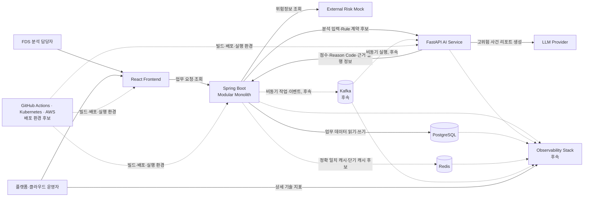
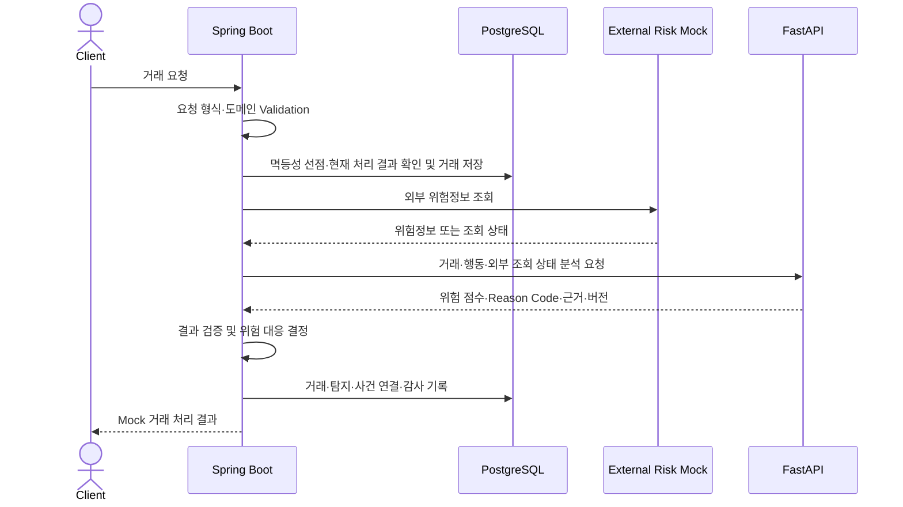
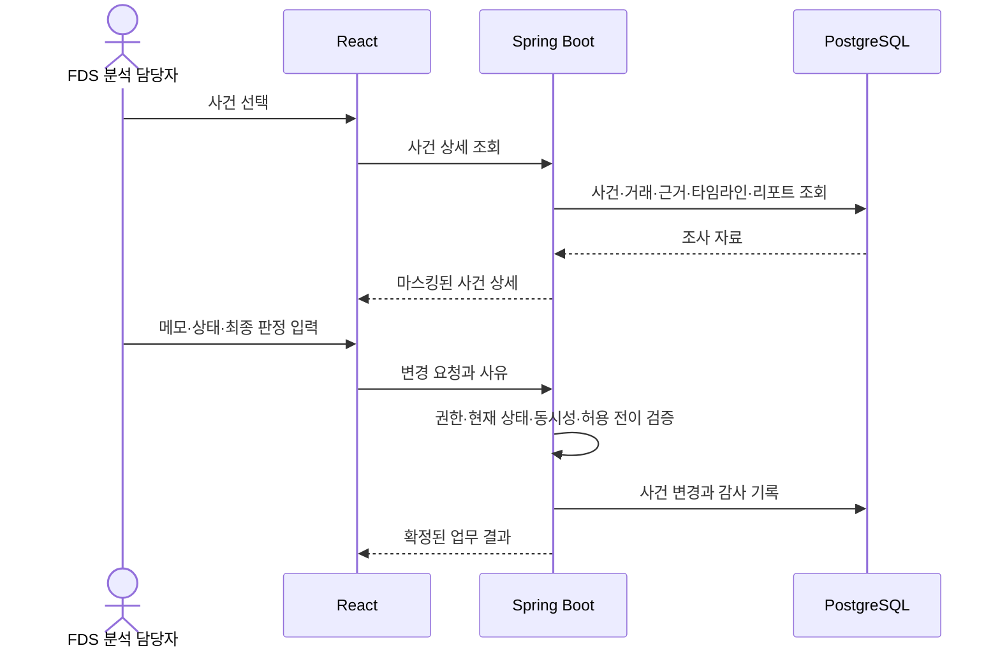
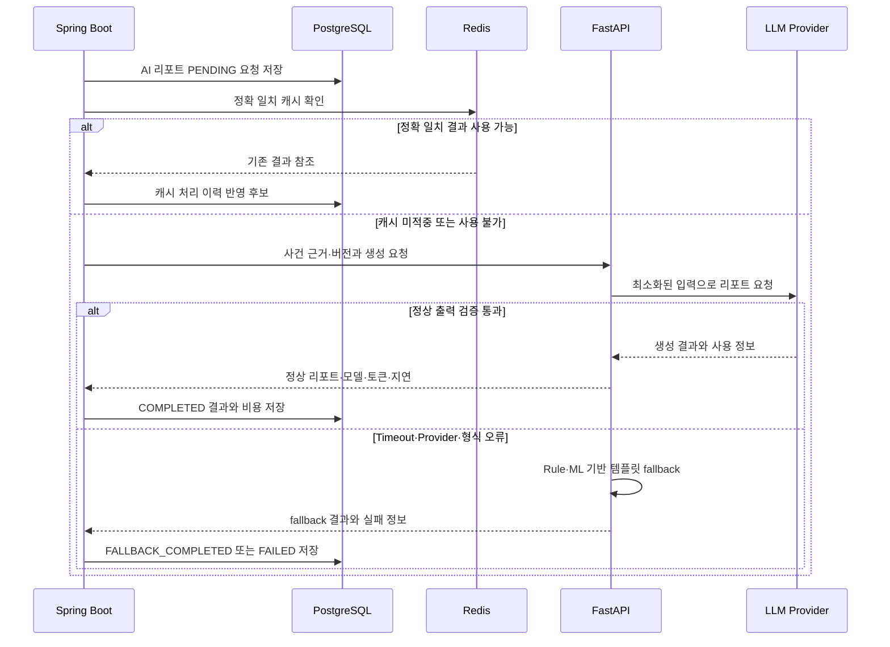

# FinGuardOps 시스템 아키텍처

## 1. 문서 목적

이 문서는 FinGuardOps의 주요 구성요소, 책임, 데이터 소유권, 통신 방식, 장애 경계, 주요 업무 흐름과 기술 도입 순서를 정의한다.

기술 이름을 나열하는 대신 다음 질문에 답하는 것을 목적으로 한다.

- 왜 이 아키텍처를 선택하는가
- 각 구성요소는 무엇을 책임지고 무엇을 책임지지 않는가
- 계산, 업무 적용, 영속화와 캐시의 소유권은 누구에게 있는가
- 서비스 사이에서 어떤 성격의 데이터를 전달하는가
- 의존성 장애가 어떤 기능까지 영향을 주는가
- 어떤 기술을 현재 사용하고 어떤 조건에서 나중에 도입하는가
- 후속 ERD·API·이벤트·메트릭 설계에서 무엇을 결정해야 하는가

이 문서는 시스템 수준의 책임과 경계를 정의한다. Entity, DB 테이블·컬럼·관계, REST API 경로·DTO·상태 코드, Kafka Topic·Partition·Consumer Group, Kubernetes 리소스, AWS 상세 구성, Prometheus 물리 메트릭 이름과 대부분의 Timeout·Retry·Circuit Breaker 수치는 확정하지 않는다. 예외로 Rule v1 Spring Boot Client의 connect timeout `1s`, response timeout `3s`, 자동 retry `0회`와 AI 리포트의 Timeout·연결 실패 최대 1회 자동 재시도는 최신 API 계약에 따라 확정되어 있다.

## 2. 현재 프로젝트 상태

이 절은 목표 아키텍처가 아니라 현재 저장소에서 확인한 구현 상태를 기록한다.

### 2.1 현재 구현됨

- Java 17 Toolchain
- Gradle Wrapper 8.14.5
- Spring Boot 3.5.16 초기 설정
- Spring Web, Validation, Actuator 의존성
- Spring Boot 실행 진입점
- 백엔드 Health Check Controller·Service·DTO
- Health Controller 통합 테스트와 Health Service 단위 테스트
- Health Check API 문서
- 거래 접수·목록·상세 조회 API와 거래 멱등성 처리
- Flyway 기반 금융거래·거래 멱등성·행동 이벤트 PostgreSQL 스키마
- 9개 유형의 행동 이벤트 접수, 거래 정합성 검증과 `eventId` 자연 멱등성
- 공통 오류 응답과 `TraceIdFilter`
- Issue 및 Pull Request 템플릿
- FastAPI AI Service의 Python 3.12·uv 프로젝트, 애플리케이션 진입점과 Health API
- Backend와 AI Service 전용 GitHub Actions 테스트 Workflow

현재 백엔드는 Health Check, 거래 접수·조회, 행동 이벤트 접수와 내부 Rule
평가용 조회를 구현한다. 거래·멱등·행동 이벤트,
DetectionResult·DetectionEvidence와 FraudRule·RuleVersion의 PostgreSQL
애플리케이션 연동도 구현되어 있지만 운영 배포 환경은 없다. 현재 거래
접수는 단계적 구현 응답인 `RECEIVED`와 탐지 관련 null 값을 반환한다.
AI Service에는 RuleVersion snapshot 입력 모델, ExecutionPlan Builder,
Orchestrator, Runner, R001~R004 evaluator, Scoring Calculator, Rule Evidence
Transformer와 Rule 분석 결과 조합의 내부 경로에 더해 Pydantic 요청·응답
DTO와 FastAPI `POST /api/v1/rule-analysis` HTTP 경계가 구현되어 있다.
Spring Boot Client, 탐지 결과 자동 생성·검증·채택·영속화, 전체 서비스 연동,
사건, 감사와 AI 운영 도메인은 아직 구현되지 않았다.

### 2.2 문서로 정의됨

- FinGuardOps 제품 범위와 포지셔닝
- 8개 FDS 핵심 이상거래 사용자 시나리오
- 플랫폼 운영 요구사항
- FDS 분석 화면과 플랫폼 운영 화면 와이어프레임
- 거래 상태 전이
- 사건 상태와 최종 판정의 분리 및 상태 전이
- AI 리포트 상태 전이와 정확 일치 캐시 원칙
- Rule v1 탐지 계약과 초기 평가 정책
- 저장소명을 FinGuardOps로 변경한 후속 결정

문서에 등장하는 구성요소와 기술은 목표 또는 계획 범위를 포함한다. 문서에 정의되었다는 이유로 구현 완료로 간주하지 않는다.

### 2.3 구현되지 않음

- `ai-service/`: Rule v1 실행·scoring·Evidence 변환과 분석 결과 조합,
  Pydantic 요청·응답 DTO와 분석 HTTP 경계까지 구현되었으며 ML·AI 리포트와
  Spring Boot Client 연동 없음
- `frontend/`: 역할 규칙과 자리표시자만 있으며 React 구현 없음
- `infra/`: 자리표시자만 있으며 Docker Compose 등 인프라 구현 없음
- `.github/`: Issue·PR 템플릿과 Backend·AI Service 테스트 Workflow가 있으며 이미지 빌드·배포 자동화 없음
- 운영 PostgreSQL 배포 환경, Redis와 Kafka 연동
- External Risk Mock과 LLM Provider 연동
- Prometheus, Grafana, Loki와 분산 추적 구성
- Kubernetes와 AWS 배포 구성

## 3. 아키텍처 목표

FinGuardOps의 아키텍처 목표는 다음과 같다.

1. 거래 접수부터 탐지 결과, 위험 대응, 사건, 최종 판정과 감사 이력까지 업무 정합성을 유지한다.
2. Rule·ML 계산과 생성형 AI 처리를 금융 업무 상태의 최종 결정으로부터 분리한다.
3. 외부 위험정보, FastAPI, Redis와 LLM의 장애 범위를 구분하고 핵심 데이터 유실을 방지한다.
4. 거래·사건 업무 화면과 기술 관측 화면의 책임을 구분한다.
5. 핵심 기능을 먼저 검증하고 Kafka, Kubernetes, AWS와 Observability를 실제 필요가 확인될 때 단계적으로 도입한다.
6. 개인 프로젝트 범위에서 정상 흐름뿐 아니라 중복 요청, 동시성, 장애, 복구, 관측과 AI 비용을 직접 검증할 수 있게 한다.

## 4. 아키텍처 선정 기준

### 4.1 금융 업무 정합성

거래, 탐지 결과, 위험 대응, 사건, 최종 판정과 감사 로그는 중복되거나 일부만 반영되어서는 안 된다. 상태 전이, 멱등성, 동시성 충돌과 실패 후 재시도는 Spring Boot가 중앙에서 검증한다.

특히 HIGH·CRITICAL 거래의 상태 변경과 사건 생성, 사건 종료와 최종 판정, AI 리포트 상태와 사용량·비용 저장은 일부 결과만 성공했을 때 정합성을 확인할 수 있어야 한다. 구체적인 트랜잭션 및 보상 경계는 후속 설계에서 결정한다.

### 4.2 장애 격리

FastAPI, External Risk Mock, Redis와 LLM Provider의 장애를 동일한 장애로 취급하지 않는다.

- LLM 장애는 Rule·ML 위험 판단과 거래·사건 처리 결과를 변경하지 않는다.
- AI 리포트 실패는 거래·탐지·사건 처리 실패와 구분한다.
- Redis 장애는 캐시와 재생성 가능한 데이터의 이용 장애이지 업무 원본 데이터 유실이 아니다.
- PostgreSQL 장애는 거래·사건·감사 데이터의 기록과 조회에 영향을 주는 핵심 업무 장애이다.
- FastAPI와 External Risk 장애 시 거래 처리 정책은 각각 별도 `TBD`로 관리한다.

### 4.3 변경 주기와 기술 특성

Spring Boot 업무 로직과 Python AI 로직은 변경 이유와 배포 주기가 다르다.

- Spring Boot는 거래·사건 상태, 멱등성, 위험 대응, 감사와 같은 금융 업무 규칙을 중심으로 변경된다.
- FastAPI는 Feature, Rule 실행기, ML 모델, 모델 라우팅, 프롬프트와 fallback을 중심으로 변경된다.

두 영역을 별도 프로세스로 두어 Python AI 생태계를 활용하면서도 AI 변경이 금융 업무 상태를 직접 변경하지 못하게 한다.

### 4.4 데이터 소유권

계산 책임, 업무 적용 책임, 영속화 책임과 캐시 책임을 분리한다.

- FastAPI는 분석 결과를 계산한다.
- Spring Boot는 결과를 검증하고 업무 정책에 적용한다.
- PostgreSQL은 영속 업무 데이터의 원본이다.
- Redis는 원본에서 다시 만들거나 다시 조회할 수 있는 캐시만 보관한다.

소유권이 불명확한 공유 데이터베이스나 여러 서비스의 직접 쓰기를 피한다.

### 4.5 단계적 확장

Kafka·Kubernetes·AWS를 핵심 거래·탐지·사건 기능보다 먼저 도입하지 않는다. 초기에는 Spring Boot Modular Monolith, FastAPI와 필요한 Mock을 중심으로 업무 흐름을 검증한다.

서비스 연결과 컨테이너 실행은 Docker Compose로 먼저 재현한다. 비동기 적체, 독립 확장, 복구와 배포 요구가 실제로 확인된 뒤 Kafka와 Kubernetes를 도입한다.

### 4.6 구현·검증 가능성

사용자가 개인 프로젝트 범위에서 다음을 직접 수행할 수 있어야 한다.

- 정상·경계·실패 흐름 테스트
- 중복 요청과 동시 수정 검증
- 외부 의존성 지연·오류·Timeout 주입
- fallback과 복구 결과 확인
- 처리량·지연시간·오류율 관측
- LLM 호출량·토큰·비용 측정
- 배포 전후 동작 비교

검증하기 어려운 구성요소를 기술 시연만을 위해 추가하지 않는다.

### 4.7 포트폴리오 설명 가능성

기술 사용 사실보다 해결하려는 문제와 선택 기준을 설명할 수 있어야 한다. 각 기술은 업무 정합성, 장애 격리, 변경 주기, 운영 복잡도와 검증 가능성 중 어떤 문제를 해결하는지 명확해야 한다.

## 5. 핵심 아키텍처 결정

1. 처음부터 전체 시스템을 MSA로 분리하지 않는다.
2. 핵심 금융 업무는 Spring Boot Modular Monolith로 시작한다.
3. Spring Boot는 거래·사건 상태와 업무 정합성의 최종 소유자이다.
4. FastAPI는 Feature 계산, Rule 실행, ML 추론, AI 리포트와 템플릿 fallback을 담당한다.
5. 생성형 AI는 위험 점수, 위험 등급, 최종 판정, 거래 승인·보류·차단, 고객 제재와 사건 상태를 결정하지 않는다.
6. PostgreSQL은 영속 업무 데이터의 원본이다.
7. Redis는 정확 일치 캐시, 외부 위험정보 단기 캐시와 재생성 가능한 집계의 후보이며 업무 정합성의 최종 저장소가 아니다.
8. Kafka는 핵심 기능 안정화 후 비동기 처리 필요가 확인될 때 도입한다.
9. Docker Compose로 서비스 연결과 실행 환경을 먼저 검증한 뒤 Kubernetes를 도입한다.
10. React는 업무 상태와 운영 조치 요약을, Grafana는 상세 기술 메트릭 시계열을 담당한다.
11. 현재 구현, 다음 구현과 후속 도입을 문서와 화면에서 구분한다.

## 6. 시스템 컨텍스트

다음 다이어그램은 현재 구현도가 아니라 단계적 도입을 포함한 목표 컨텍스트이다. 점선 연결과 `후속` 표시는 아직 필수 경로가 아니거나 향후 도입할 구성이다.



React가 업무 요청의 진입점을 제공하더라도 금융 업무 상태의 최종 소유자는 Spring Boot이다. Observability Stack은 상태를 관찰하지만 업무 원본을 소유하거나 거래·사건 상태를 변경하지 않는다.

## 7. 구성요소별 책임과 선정 이유

### 7.1 React Frontend

#### 선정 이유

- FDS 분석 담당자와 플랫폼 운영자의 역할별 업무 흐름을 분리해 제공한다.
- 거래·사건·조사·판정처럼 상호작용이 필요한 업무 화면에 적합하다.
- 서비스 상태, AI 비용과 장애 이력을 기술 메트릭 원본이 아닌 업무 영향 관점으로 요약할 수 있다.

#### 책임

- 거래·사건 조회와 조사 입력
- 사건 상태·최종 판정 입력
- 조사 메모와 감사 이력 조회
- 서비스 상태, AI 비용, 장애와 배포 이력 요약
- 로딩·빈 데이터·오류·권한·동시 수정 충돌 상태 표현
- 사용자 입력과 일시적인 화면 상태 관리

React는 API 계약을 임의로 만들거나 금융 업무 상태를 자체 확정하지 않는다.

### 7.2 Spring Boot Modular Monolith

#### 선정 이유

- 거래·탐지·사건·감사 데이터를 하나의 업무 트랜잭션 경계에서 관리할 수 있다.
- 멱등성, 상태 전이와 동시성 검증을 중앙 통제할 수 있다.
- 전체 MSA 도입에 따른 분산 트랜잭션, 데이터 소유권 조정과 운영 복잡도를 피할 수 있다.
- 개인 프로젝트 규모에서 인프라 분리보다 금융 업무 완성도를 우선할 수 있다.
- Java·Spring 기반 백엔드의 트랜잭션, 계층 분리, 테스트와 운영 역량을 검증할 수 있다.

#### 책임

- 거래 접수와 입력 검증
- 행동 이벤트 관리
- 거래 요청 멱등성
- 거래 상태 전이
- External Risk 조회와 탐지 오케스트레이션
- FastAPI 결과 검증
- 위험 대응 결정과 적용
- 탐지 결과와 근거 영속화
- 사건 생성·연결·관리
- 조사 메모
- 최종 판정
- 감사 로그
- AI 리포트 요청과 상태 관리
- AI 리포트, 사용량, 토큰, 지연시간과 비용 저장

Spring Boot는 FastAPI 응답을 그대로 업무 상태로 적용하지 않는다. 현재 상태, 요청의 중복 여부, 결과 버전과 승인된 위험 대응 정책을 검증한 뒤 상태를 변경한다.

### 7.3 FastAPI AI Service

#### 선정 이유

- Python의 AI·데이터 처리 및 모델 생태계를 활용할 수 있다.
- Feature, Rule 실행, ML 모델과 프롬프트의 변경을 Spring Boot 업무 배포와 분리할 수 있다.
- AI 연산 부하와 장애를 핵심 업무 프로세스에서 격리할 수 있다.
- 모델 버전, 추론시간, 라우팅과 LLM 호출 결과를 독립적으로 관리할 수 있다.

#### 책임

- Feature 계산
- Rule 실행
- ML 추론
- 위험 점수 계산
- Reason Code와 탐지 근거 생성
- 모델 라우팅
- AI 사건 리포트 생성
- Rule·ML 기반 템플릿 fallback
- 사용 모델, 입력·출력 토큰, 지연시간, 오류와 fallback 정보 반환

#### 금지 책임

- 거래 상태 변경
- 사건 직접 생성
- 사건 상태 변경
- 최종 판정
- 거래 승인·추가 인증·보류·차단 결정
- Spring Boot가 소유하는 업무 데이터 직접 영속화
- Rule 가중치와 활성 상태의 원본을 임의 변경

### 7.4 External Risk Mock

#### 선정 이유

- 실제 금융 위험정보 API와 데이터를 사용할 수 없는 제약을 보완한다.
- 위험계좌, 위험 IP와 위험 기기 정보를 모의 제공한다.
- 지연, 오류, 부분 응답과 Timeout을 재현한다.
- 외부 의존성 장애 격리와 호출 추적을 검증한다.

초기 기본안은 Spring Boot가 External Risk Mock 호출을 오케스트레이션하고 조회 결과와 조회 상태를 FastAPI 분석 입력에 포함하는 방식이다.

이 기본안은 다음 이유로 선택한다.

- 외부 장애와 fallback 처리를 Spring Boot에서 중앙 통제한다.
- 사용한 외부 정보, 기준 시각과 조회 상태를 거래·사건에 연결해 감사할 수 있다.
- FastAPI가 외부 연동과 금융 업무 조정까지 맡아 책임이 과도하게 확대되는 것을 방지한다.

조회 실패를 위험정보 없음으로 해석하지 않는다. 유효한 캐시가 있으면 기준 시각과 함께 사용할 수 있고, 캐시가 없으면 조회 불가 상태를 분석 입력과 감사 근거에 남긴다. 이 상태가 최종 위험 대응에 미치는 영향은 `TBD`이다.

### 7.5 PostgreSQL

#### 선정 이유

- 거래·사건·감사와 같은 관계형 업무 데이터에 적합하다.
- ACID 트랜잭션으로 일부 반영을 방지할 수 있다.
- 외래 키와 Unique Constraint 후보로 관계와 중복 방지를 보조할 수 있다.
- 상태 전이와 감사 이력을 영속화할 수 있다.
- 거래·사건 검색과 초기 계좌 관계 집계를 인덱스 및 쿼리로 검증할 수 있다.

#### 영속 데이터 후보

- 거래
- 행동 이벤트
- 탐지 결과
- 탐지 근거
- Rule 정의·버전·활성 상태
- 사건과 연관 거래
- 조사 메모
- 감사 로그
- AI 리포트
- AI 사용량·토큰·지연시간·비용

테이블, 컬럼, 제약조건, 관계와 인덱스는 후속 ERD에서 확정한다.

### 7.6 Redis

#### 선정 이유

- 동일 사건·동일 분석 조건의 정확 일치 AI 리포트 캐시에 적합하다.
- External Risk Mock 결과의 단기 캐시 후보로 사용할 수 있다.
- 원본에서 다시 계산할 수 있는 집계 데이터를 빠르게 제공할 수 있다.

AI 리포트 정확 일치 키의 논리 구성은 다음과 같다.

```text
caseId
+ detectionResultVersion
+ promptVersion
+ modelVersion
```

Reason Code 또는 시맨틱 유사도만으로 다른 사건의 리포트를 재사용하지 않는다. Redis 장애 시 캐시를 사용하지 못할 수 있지만 PostgreSQL의 업무 원본이 유실되어서는 안 된다. 캐시와 영속 결과가 불일치할 때 PostgreSQL을 정합성 기준으로 삼는 구체적인 복구 방식은 후속 설계에서 확정한다.

### 7.7 Kafka

#### 선정 이유

Kafka는 후속 단계에서 다음 작업을 거래 응답 경로와 분리하고 재처리하기 위한 후보이다.

- AI 리포트 요청
- 사건 관련 이벤트
- 통계 집계
- 운영 이벤트

#### 초기 필수 경로에서 제외하는 이유

Kafka를 도입하면 다음 문제를 함께 설계하고 검증해야 한다.

- Producer·Consumer 실패 처리
- Consumer 멱등성
- 중복 이벤트
- 이벤트 순서
- Consumer Lag
- 재시도
- DLQ
- 스키마 버전

이 문제들이 핵심 거래·탐지·사건 기능 구현보다 먼저 프로젝트의 중심이 되지 않도록 초기 필수 경로에서 제외한다.

#### 도입 기준

- 동기 방식의 AI 리포트 실행이 요청 처리나 사용자 응답을 지연할 때
- 통계 집계 부하를 핵심 업무 쓰기 경로에서 분리해야 할 때
- 동일 사건·운영 이벤트를 여러 Consumer가 독립적으로 사용해야 할 때
- 실패한 비동기 작업을 추적하고 재처리해야 할 때

Kafka 도입 후에도 동기 핵심 거래 판단을 Kafka에 의존하도록 자동 확대하지 않는다.

### 7.8 LLM Provider

#### 선정 이유

- HIGH·CRITICAL 사건의 탐지 근거와 행동 타임라인을 사람이 검토하기 쉬운 리포트로 정리한다.
- 모델별 비용·지연·품질을 비교하는 AI 운영 실험 대상을 제공한다.

LLM Provider는 외부 생성 서비스이며 FinGuardOps 업무 데이터 저장소가 아니다. 필요한 최소 데이터만 전달하고 결과는 검증한 뒤 사용한다. 실패하거나 형식 검증을 통과하지 못하면 템플릿 fallback을 사용하며 Rule·ML 결과는 변경하지 않는다.

### 7.9 Observability Stack

#### 선정 이유

- 거래 접수부터 외부 조회, AI 분석과 리포트 생성까지 서비스 간 흐름을 추적한다.
- 지연시간, 오류율, 처리량, 자원 상태와 비동기 적체를 구분한다.
- 장애 주입과 배포 전후 차이를 근거로 검증한다.

후속 후보는 Prometheus, Grafana, Loki와 OpenTelemetry 기반 추적이다. 제품별 상세 구성과 메트릭 이름은 확정하지 않는다.

### 7.10 GitHub Actions·Kubernetes·AWS 배포 환경 후보

GitHub Actions는 반복 가능한 빌드·테스트·이미지 생성과 배포 이력 연결을 위한 후보이다. Kubernetes는 복구, Rolling Update, 리소스 제한, Config·Secret 분리와 서비스별 확장이 필요할 때 도입한다. AWS는 로컬·컨테이너 환경에서 검증된 구성을 클라우드에서 운영하기 위한 후속 배포 대상이다.

현재 `.github`에는 Issue·PR 템플릿과 Backend·AI Service 테스트 Workflow가 있다. 이미지 빌드·배포 자동화, Kubernetes와 AWS 구성은 구현되지 않았다.

## 8. Spring Boot 논리 모듈

다음은 Java package 구조가 아니라 Modular Monolith 내부의 논리적 책임 후보이다.

| 논리 모듈 | 책임 |
| --- | --- |
| transaction | 거래 접수, 검증, 멱등성, 거래 상태와 Mock 처리 결과 |
| behavior | 로그인·기기·보안 변경 등 행동 이벤트 관리와 조회 |
| detection | External Risk 및 FastAPI 호출 조정, 분석 결과 검증과 탐지 근거 관리 |
| risk response | 승인된 위험 등급별 Mock 대응 정책 적용 |
| case management | 사건 생성·연결, 담당자 조사, 메모, 상태와 최종 판정 |
| rule management | Rule 정의, 버전과 활성 상태의 원본 관리 |
| audit | 거래·사건·Rule·AI 처리의 주요 변경 이력 |
| AI operations | AI 리포트 요청·상태, 결과, 모델·토큰·지연시간·비용 관리 |

모듈 사이의 구체적인 호출 방향, 공개 인터페이스와 트랜잭션 경계는 후속 상세 설계에서 결정한다.

### 향후 서비스 분리 기준

다음 조건이 실제로 발생할 때만 특정 논리 모듈의 서비스 분리를 검토한다.

- 독립 배포 요구가 반복적으로 발생한다.
- 특정 모듈만 독립적으로 확장해야 한다.
- 분리했을 때 명확한 장애 격리 효과가 있다.
- 데이터 소유권을 독립적으로 분리할 수 있다.
- 독립 팀이 해당 영역을 운영한다.
- 분산 트랜잭션, 이벤트 일관성과 운영 비용을 감수할 근거가 있다.

이 조건 일부가 문서상 예상된다는 이유만으로 전체 MSA 전환을 결정하지 않는다.

## 9. Spring Boot·FastAPI 책임 경계

핵심 책임 경계는 다음과 같다.

```text
FastAPI
→ 분석 결과 계산

Spring Boot
→ 결과 검증·업무 적용·상태 변경·영속화
```

Spring Boot는 거래·행동 및 사용할 수 있는 외부 위험정보 상태를 분석 입력으로 준비한다. FastAPI는 입력을 기반으로 Feature, Rule·ML 결과, 위험 점수, Reason Code와 탐지 근거를 반환한다.

Spring Boot는 반환된 결과의 요청 연결, 완전성, 버전과 처리 가능 여부를 검증한다. 그 뒤 승인된 위험 대응 정책에 따라 거래 처리 상태와 사건 생성 또는 기존 사건 연결 여부를 결정하고 PostgreSQL에 저장한다.

FastAPI Timeout 시 Spring Boot가 임의의 위험 점수를 생성하거나 무위험으로
간주하지 않는다. Rule v1 Client 자체의 자동 retry는 `0회`로 확정하며, 이때
허용할 거래 상태, 수동 재개와 재처리 정책은 `TBD`이다.

Rule v1에서 Spring Boot는 거래·행동 이벤트 조회와 Snapshot 구성, Rule
정의·버전·활성 상태, 호출 오케스트레이션과 결과 영속화를 맡고
FastAPI는 Feature, R001~R004, 점수·등급·Reason Code·Evidence 계산을
맡는다. 상세 계약은
[`../01-requirements/rule-v1-detection-contract.md`](../01-requirements/rule-v1-detection-contract.md)를
따른다. DetectionResult·DetectionEvidence 물리 영속 모델은
구현되었지만 Spring Boot Client와 실행 결과 자동 생성·검증·채택·영속화
흐름은 아직 구현되지 않았다.

현재 FastAPI에는 RuleVersion snapshot을 받는 Python 입력 모델부터
ExecutionPlan Builder → Orchestrator → Runner → R001~R004 evaluator → Scoring
Calculator → RuleEvidenceTransformer → RuleAnalysisResult까지의 실행 경로와
Pydantic 요청·응답 DTO, `POST /api/v1/rule-analysis` HTTP 경계가 구현되어 있다.
이는 Spring Boot Client나 전체 서비스 연동, 결과 자동 채택·영속화가
구현되었다는 뜻이 아니다. 내부 HTTP와 Spring Boot Client의 상세 계약은
[`../03-api/rule-v1-analysis-api.md`](../03-api/rule-v1-analysis-api.md#13-spring-boot-client-연동-계약)를
따른다.

Rule v1 호출에서는 읽기 트랜잭션으로 거래·행동 이벤트·활성 RuleVersion
Snapshot을 고정하고 요청 DTO를 구성한 뒤 해당 트랜잭션을 종료한다. DB 쓰기
트랜잭션을 유지하지 않은 상태에서 FastAPI를 호출하고 응답을 검증한 다음,
후속 별도 쓰기 트랜잭션에서 결과를 채택·영속화한다. 마지막 채택·영속화
단계는 아직 구현되지 않았다.

후속 Rule Evidence 경계에서 FastAPI는 RuleVersion metadata, Reason Code,
원래 contribution, typed observation, Evidence 시각과 plan 기반 출력 순서를
계산한다. Spring Boot는 DetectionResult·Evidence 업무 ID, 분석 상태·시각·trace,
표시 설명과 0-based 연속 영속 순서를 생성하고 결과를 검증·채택·저장한다.
Spring Boot는 방어 검증을 위해 evaluator 조건, 행동 이벤트 선택, scoring
그룹 상한과 위험 등급 알고리즘을 재구현하지 않는다.

## 10. Rule 관리·실행 책임

권장 기본안은 다음과 같다.

```text
Rule 정의·버전·활성 상태의 원본
→ Spring Boot·PostgreSQL

Rule 실행
→ FastAPI

탐지 결과 저장
→ Spring Boot
```

Spring Boot는 승인된 Rule 정의와 변경 이력의 업무 원본을 관리한다. Rule v1
분석에서는 평가마다 전체 RuleVersion Snapshot을 FastAPI 요청으로 전달한다.
FastAPI는 전달받은 Rule을 재검증해 실행하지만 가중치, 버전과 활성 상태를
임의로 변경하지 않는다.

FastAPI가 실행한 결과에는 어떤 Rule과 버전을 사용했는지 추적할 수 있는 정보가 필요하다. Spring Boot는 해당 결과를 거래와 탐지 결과에 연결해 저장한다.

Rule v1에서는 별도 동기화나 배포 산출물 방식을 도입하지 않는다. 요청·응답과
배포 불일치 처리 방식은
[Rule v1 내부 분석 API](../03-api/rule-v1-analysis-api.md)를 따른다. 후속 Rule
계약이 다른 전달 방식을 요구하면 별도 승인한다.

Rule v1은 `ruleCode`별 활성 버전을 하나만 허용하고 평가 시작 시 활성 Rule 집합을 고정하며, 조건·가중치 변경 시 새 불변 버전을 생성한다. R001~R004의 단일 기준은 [Rule v1 탐지 계약](../01-requirements/rule-v1-detection-contract.md)이다.

## 11. 데이터 소유권

| 구성요소 | 소유하는 책임 | 소유하지 않는 책임 |
| --- | --- | --- |
| Spring Boot | 거래·사건·상태·최종 판정·감사·AI 비용의 업무 정합성, 분석 결과의 업무 적용 | Feature·ML·LLM 계산 구현 |
| FastAPI | Feature, Rule·ML, 모델 라우팅, 리포트와 fallback 계산 | 거래·사건 상태 확정과 업무 데이터 직접 영속화 |
| PostgreSQL | 영속 업무 데이터의 원본 | 임시 캐시와 기술 메트릭 시계열 |
| Redis | 재생성 가능한 정확 일치 캐시·단기 캐시·집계 후보 | 거래·사건·감사 데이터의 최종 원본 |
| React | 사용자 입력과 일시적 화면 상태 | 업무 상태의 최종 확정과 서버 원본 |
| Grafana | 기술 관측 데이터 시각화 | 업무 데이터 원본과 상태 변경 |
| LLM Provider | 외부 리포트 생성 처리 | FinGuardOps 업무 데이터 저장과 금융 판단 |

FastAPI의 계산 결과와 LLM Provider의 생성 결과는 업무 원본이 아니다. Spring Boot가 검증하고 PostgreSQL에 연결해 저장한 결과가 FinGuardOps에서 감사 가능한 기록이 된다.

## 12. 통신 방식과 동기·비동기 경계

### 12.1 초기 동기 경계

최종 거래 처리 목표에서 다음 흐름은 결과를 반환하기 전에 일관된 위험 대응을 결정해야 하므로 동기 호출 경계이다.

- React에서 Spring Boot로 거래·사건 업무 요청
- Spring Boot에서 External Risk Mock으로 위험정보 조회
- Spring Boot에서 FastAPI로 Rule·ML 분석 요청
- Spring Boot에서 PostgreSQL로 핵심 업무 결과 저장

서비스 간 계약에는 전체 업무 Entity가 아니라 목적에 필요한 입력, 결과, 버전과 추적 정보를 전달해야 한다. 구체적인 API 경로와 DTO는 후속 API 설계에서 확정한다.

현재 구현은 이 최종 경계에 도달하지 않았다. 거래 접수는 PostgreSQL에 저장한 뒤 `RECEIVED`와 탐지 관련 null 값을 반환하며 External Risk, FastAPI, DetectionResult, 위험 대응과 사건 연결은 수행하지 않는다. 이 단계적 구현 상태는 ADR-003의 최종 동기 처리 결정을 변경하지 않는다.

### 12.2 논리적 비동기 경계

AI 사건 리포트는 거래 승인 여부를 결정하는 필수 경로가 아니다. HIGH·CRITICAL 사건 생성 후 별도의 요청 상태를 만들고 논리적으로 비동기 처리한다.

초기 구현에서 사용할 실행 메커니즘은 `TBD`이다. 애플리케이션 내부 작업, 별도 작업 실행기 또는 다른 방식 중 개인 프로젝트에서 실패·재시도·멱등성을 검증할 수 있는 방식을 선택한다.

Kafka는 다음 조건이 확인된 뒤 이 논리적 비동기 경계를 구현하는 후보이다.

- 요청과 실행을 시간적으로 분리해야 한다.
- 실패 작업을 적체·재처리해야 한다.
- 여러 Consumer가 같은 이벤트를 사용한다.
- 처리량과 독립 확장이 필요하다.

### 12.3 결과 일관성

- 동기 Timeout과 실제 처리 완료가 경합할 수 있으므로 재시도 전에 기존 결과를 확인한다.
- 비동기 중복 실행이 사건, 리포트, 사용량과 비용을 중복 생성하지 않아야 한다.
- 늦은 LLM 응답이 이미 확정된 fallback 결과를 이력 없이 덮어쓰지 않아야 한다.
- 이벤트 기반으로 전환하더라도 Spring Boot의 업무 소유권은 유지한다.

## 13. 주요 업무 흐름

### 13.1 거래 접수·탐지

다음 흐름은 ADR-003이 유지하는 최종 동기 분석 목표이다. 현재 구현은 입력 검증·멱등성 확인·거래 저장과 `RECEIVED` 응답까지이며, 이후 탐지·위험 대응·사건 단계는 미구현이다.

```text
Client
→ Spring Boot 거래 접수
→ 입력 검증·멱등성 확인
→ 거래·행동 데이터 준비
→ External Risk 조회
→ FastAPI Rule·ML 분석
→ 위험 점수·Reason Code·탐지 근거 반환
→ Spring Boot 위험 대응 결정
→ 거래·탐지 결과 저장
→ 필요 시 사건 생성 또는 기존 사건 연결
→ 감사 로그
```



거래 상태는 기존 상태 전이 문서의 `RECEIVED`, `ANALYZING`, `ANALYZED`와 최종 처리 상태를 따른다. 요청 형식과 도메인 Validation 실패는 거래로 저장하지 않으며 오류 응답, `traceId`, 로그와 운영 메트릭으로 관측한다. MEDIUM의 모니터링은 별도 위험 대응 결과로 표현하고 AI 리포트 실패로 거래를 `FAILED` 처리하지 않는다.

현재 `RECEIVED`/null 완료 응답을 저장하는 멱등 `response_snapshot`은 최종 동기 응답과 구조·의미가 달라질 수 있다. 최종 흐름 구현 전에 기존 snapshot의 재생 호환과 전환 방식을 결정해야 하며 아직 해결된 상태가 아니다.

### 13.2 사건 조사

```text
FDS 분석 담당자
→ 사건 조회
→ 거래·Rule·ML 근거 검토
→ 행동 타임라인과 연관 거래 확인
→ AI 리포트 참고
→ 조사 메모
→ 사건 상태 변경
→ 최종 판정
→ 감사 로그
```



`caseStatus`와 `finalDisposition`은 분리한다. 생성형 AI는 조사 참고 자료만 제공하며 담당자의 최종 판정을 대신하지 않는다.

### 13.3 AI 리포트

```text
HIGH·CRITICAL 사건
→ AI 리포트 요청 상태 생성
→ 정확 일치 캐시 확인
→ FastAPI 모델 라우팅·LLM 호출
→ 정상 완료 또는 템플릿 fallback
→ Spring Boot가 리포트·토큰·비용 저장
```



AI 리포트는 논리적으로 비동기이다. 초기 실행 메커니즘과 Kafka 적용 시점은 후속 설계에서 확정한다. 상태는 기존 문서의 `PENDING`, `GENERATING`, `COMPLETED`, `FALLBACK_COMPLETED`, `FAILED`를 유지한다.

### 13.4 플랫폼 운영

```text
플랫폼·클라우드 운영자
→ React에서 운영 요약 확인
→ Grafana에서 상세 메트릭 확인
→ 공통 식별자로 장애 흐름 추적
→ 영향 범위와 대응 이력 기록
```

React는 서비스 상태, 배포 버전, 업무 영향, AI 비용과 장애·대응 이력을 요약한다. Grafana는 지연시간, 오류율, 처리량, DB Connection Pool, Kafka 도입 이후 Consumer Lag과 런타임·인프라 시계열을 상세 분석한다.

## 14. 장애·fallback 경계

| 장애 | 직접 영향 | 유지해야 할 원칙 | 미확정 사항 |
| --- | --- | --- | --- |
| FastAPI Timeout | Rule·ML 분석과 후속 위험 대응 지연 또는 실패 | Spring Boot가 거래 접수와 마지막 확정 상태를 보존하고 임의 점수를 만들지 않음. Rule v1 Client 자동 retry는 0회 | 거래 실패 상태, 수동 재개·재처리 정책 `TBD` |
| External Risk Timeout | 외부 위험계좌·IP·기기 근거 사용 불가 가능 | 실패를 위험정보 없음으로 해석하지 않고 유효 캐시 또는 조회 불가 상태를 기록하며 내부 분석을 계속함 | 최종 위험 대응 정책 `TBD` |
| LLM Timeout·연결 실패 | AI 사건 리포트 지연·실패 | 같은 `executionId`에서 최대 한 번 자동 재시도한 뒤 Rule·ML 결과 기반 템플릿 fallback. 거래·사건 처리 결과는 변경하지 않음 | 재시도 간격·Timeout 값 `TBD` |
| 비일시적 LLM Provider 오류 | AI 리포트 생성 실패 | 자동 재시도 없이 템플릿 fallback과 오류·사용량 기록 | 다른 모델 전환 조건은 별도 승인 |
| LLM 출력 형식 오류 | 리포트 품질 검증 실패 | 오류 출력을 정상 리포트로 표시하거나 자동 재시도하지 않고 템플릿 fallback | 품질 검증 기준 `TBD` |
| Redis 장애 | 캐시 미사용, 원본 호출과 비용 증가 가능 | 업무 원본은 PostgreSQL에 유지하고 정확 일치 조건을 우회하지 않음 | 캐시 우회·복구 정책 `TBD` |
| PostgreSQL 장애 | 거래·탐지·사건·감사·AI 비용 저장 및 조회 장애 | 저장 성공이 불명확한 요청을 성공으로 처리하지 않음 | 복구 목표와 운영 절차 `TBD` |
| Kafka Consumer 중단 | 도입 이후 AI 리포트·사건 이벤트·통계 등 비동기 적체 | 핵심 거래 결과를 유지하고 재처리 시 멱등성 보장 | 재개·DLQ·재처리 정책 `TBD` |
| Observability Stack 장애 | 로그·메트릭·트레이스 수집 또는 조회 불가 | 관측 장애와 실제 서비스 장애를 구분하고 업무 원본을 변경하지 않음 | 수집 경로 복구·보존 정책 `TBD` |

장애 격리의 핵심은 모든 의존성 실패를 정상 처리로 숨기는 것이 아니다. 마지막으로 확정된 업무 상태, 사용하지 못한 정보와 fallback 결과를 구분해 기록하고, 정책 근거가 없는 경우 `TBD` 상태로 사용자 결정을 요구하는 것이다.

## 15. 공통 식별자와 추적

| 식별자 | 전파 및 추적 목적 |
| --- | --- |
| `transactionId` | 거래 접수, 행동·외부 조회·탐지 결과·위험 대응·사건 연결과 오류를 추적한다. |
| `caseId` | 사건, 연관 거래, 조사·판정·감사와 AI 리포트를 연결한다. |
| `eventId` | Kafka 도입 이후 이벤트 발행·소비·중복·재처리 결과를 연결한다. |
| `aiRequestId` | 외부 AI 리포트 요청, 요청자, 멱등 처리와 요청 상태를 연결한다. |
| `executionId` | 실제 AI 논리 실행, 모델 라우팅 결과, 재시도, fallback과 Provider 호출들을 연결한다. |
| `attemptId` | 개별 실제 Provider 호출의 토큰·비용·지연·오류를 식별한다. |
| `traceId` | React 진입 이후 Spring Boot, External Risk Mock, FastAPI와 LLM Provider의 호출 흐름을 연결한다. |

식별자는 로그, 메트릭, 트레이스와 업무 감사 이력을 서로 탐색하는 연결점이다. 모든 요청에 모든 식별자가 항상 존재하는 것은 아니다. 예를 들어 사건 생성 전에는 `caseId`가 없을 수 있고 Kafka 도입 전에는 `eventId`가 없을 수 있다.

데이터 타입, 생성 주체, 전파 헤더, 저장 위치, 외부 노출과 보존 기간은 후속 API·이벤트·Observability 설계에서 확정한다. 식별자 자체에 고객·계좌 원문이나 인증정보를 포함하지 않는다.

## 16. 보안·개인정보 기본 원칙

- 고객·계좌 식별 정보는 화면과 로그에서 마스킹한다.
- LLM 입력은 사건 설명에 필요한 최소 데이터로 제한한다.
- 불필요한 개인정보와 인증정보를 LLM Provider에 전달하지 않는다.
- 로그, 메트릭 레이블과 감사 이력에 민감정보 원문을 기록하지 않는다.
- 프롬프트와 LLM 입출력 원문을 무분별하게 저장하지 않는다.
- API Key, Token, Password와 DB 접속정보를 코드나 문서에 직접 작성하지 않는다.
- 실제 인증·인가, CORS, Secret 관리와 외부 API 보안 방식은 사용자 승인 후 후속 설계에서 확정한다.
- 실제 금융거래, 본인인증, 거래 차단과 고객 제재는 Mock으로 한정한다.

## 17. Observability 경계

Observability는 시스템 상태를 설명하는 수단이며 업무 상태의 원본이 아니다.

### 17.1 관측 대상

- Spring Boot·FastAPI·External Risk Mock과 LLM 호출 상태
- API 지연시간·오류율·처리량
- Rule 실행시간과 ML 추론시간
- AI 리포트 생성시간
- DB Connection Pool
- Redis 캐시 사용과 오류
- Kafka 도입 이후 Consumer Lag과 처리 상태
- 모델별 호출량·입력 토큰·출력 토큰·비용
- 정확 일치 캐시 적중과 템플릿 fallback
- 배포 버전과 장애 발생 전후 변화

### 17.2 React와 Grafana의 경계

React는 다음을 제공한다.

- 거래·사건의 업무 상태
- 조사와 최종 판정
- 서비스 상태와 업무 영향 요약
- AI 비용과 fallback 요약
- 장애·배포·운영 조치 이력

Grafana는 다음을 제공한다.

- 기술 메트릭 시계열
- 서비스별 지연시간, 오류율과 처리량
- DB Connection Pool
- Kafka 도입 이후 Consumer Lag
- 런타임과 인프라 상세 상태
- 배포 전후 기술 지표 비교

React에서 Grafana의 상세 기술 대시보드를 전부 중복 구현하지 않는다. Observability Stack 장애 시 React가 오래된 수집 결과를 현재 정상 상태처럼 표시하지 않도록 `상태 확인 불가`, `수집 전`, `미도입`과 `데이터 없음`을 구분해야 한다.

구체적인 메트릭 이름, 레이블, 수집 주기, 보존 기간, 경보 임계값과 알림 채널은 후속 메트릭·운영 설계에서 확정한다.

## 18. 단계별 도입 계획

### 18.1 현재 구현됨

- Java 17
- Gradle Wrapper
- Spring Boot 초기 설정
- Health Check API
- Health Controller 통합 테스트
- Health Service 단위 테스트
- Health Check API 문서
- 거래 접수·목록·상세 조회와 거래 멱등성
- 9개 행동 이벤트 접수와 `eventId` 자연 멱등성
- 거래·멱등·행동 이벤트의 PostgreSQL 애플리케이션 연동과 Flyway 스키마
- 단계적 거래 접수 `RECEIVED`/null 응답
- 저장소 역할 규칙과 GitHub Issue·PR 템플릿
- FastAPI AI Service 초기 실행·설정·Health API와 테스트 기반
- RuleVersion snapshot 입력 모델, ExecutionPlan Builder, Orchestrator, Runner,
  R001~R004 evaluator, Scoring Calculator, Rule Evidence Transformer와
  RuleAnalysisResult
- Rule v1 Pydantic 요청·응답 DTO와 FastAPI `POST /api/v1/rule-analysis` HTTP
  경계
- Backend와 AI Service 전용 GitHub Actions 테스트 Workflow

### 18.2 문서로 정의됨

- FDS 서비스 범위와 8개 사용자 시나리오
- 플랫폼 운영 요구사항
- FDS·플랫폼 화면 와이어프레임
- 거래·사건·AI 리포트 상태 전이
- 제품 포지셔닝과 저장소명 변경 ADR
- 본 시스템 아키텍처
- Rule v1 탐지 계약과 초기 평가 정책
- Rule Evidence 변환과 Rule 분석 결과 조합 계약
- Spring Boot → FastAPI Rule v1 내부 분석 HTTP API 계약

### 18.3 다음 구현 예정

- 문서로 정의된 Spring Boot Rule v1 Client와 전체 분석 연동
- DetectionResult 자동 영속화·채택과 위험 대응·사건·감사 도메인
- External Risk Mock
- Docker 및 Docker Compose 통합 환경

Redis의 최초 적용 시점은 실제 캐시 필요와 원본 호출 부하를 확인해 사용자가 결정한다.

### 18.4 후속 도입 예정

- Redis 캐시와 재생성 가능한 집계
- Kafka 비동기 처리
- React 전체 업무·운영 화면
- 이미지 빌드·배포를 포함한 GitHub Actions CI/CD 확장
- Kubernetes
- AWS
- Prometheus·Grafana·Loki·Tracing

후속 기술은 앞 단계의 완료만으로 자동 도입하지 않고 다음 절의 도입 기준을 확인한다.

## 19. 기술별 향후 분리·도입 기준

### 19.1 Docker Compose와 Kubernetes

Docker Compose를 먼저 사용하는 이유는 다음과 같다.

- 로컬에서 Spring Boot, FastAPI, PostgreSQL과 Mock 서비스 연결 검증
- 컨테이너 실행 재현
- 환경 변수와 Health Check 검증
- Kubernetes 도입 전 통합 환경 확인

Kubernetes는 다음 조건이 검증된 뒤 도입한다.

- 컨테이너 실행 안정화
- Docker Compose 통합 검증
- Health·Readiness 판단 기준
- 환경 변수와 Secret 분리
- CI 안정화
- 배포·복구 실험 준비

Kubernetes 도입 후 검증할 목표는 Rolling Update, 복구, 리소스 제한, Config·Secret, 서비스별 확장과 배포 상태 관측이다. 구체적인 리소스 종류와 값은 확정하지 않는다.

### 19.2 Redis

다음 중 하나 이상의 필요가 측정될 때 도입한다.

- 동일 정확 일치 AI 리포트의 불필요한 재호출이 발생한다.
- External Risk Mock의 반복 조회와 지연을 단기 캐시로 줄일 근거가 있다.
- 재생성 가능한 집계 조회가 PostgreSQL 핵심 업무 부하와 경쟁한다.

캐시 없이 먼저 정합한 원본 흐름을 검증하고, Redis 장애 시 동작과 비용 증가를 함께 시험한다.

### 19.3 Kafka

12절과 7.7절의 도입 기준을 적용한다. 비동기 필요, 여러 Consumer, 적체·재처리와 독립 확장 요구가 확인되어야 한다. 도입 전 이벤트 소유권, 멱등성, 순서, 실패와 스키마 버전 정책을 먼저 설계한다.

### 19.4 Observability Stack

초기에는 Health와 구조화된 애플리케이션 관측 정보부터 시작한다. 서비스 간 연동과 장애 실험이 가능해지면 메트릭, 로그와 추적을 단계적으로 연결한다.

첫 적용 범위, 수집 제품, 보존 기간과 비용은 `TBD`이다. 업무 식별자와 민감정보 보호가 준비되지 않은 상태에서 무분별하게 로그·레이블을 확대하지 않는다.

### 19.5 GitHub Actions

로컬에서 재현 가능한 빌드와 테스트가 안정된 뒤 CI를 도입한다. 배포 자동화는 테스트, 이미지 생성, Secret 처리, 실패 시 복구와 승인 경계가 정리된 후 확장한다.

### 19.6 AWS

Docker Compose와 필요 시 Kubernetes 환경에서 기능·장애·관측 기준을 검증한 뒤 도입한다. 관리형 서비스 또는 직접 운영 구성, 네트워크, Secret, 비용 한도와 배포 방식은 `TBD`이다.

### 19.7 Modular Monolith의 서비스 분리

8절의 실제 분리 조건을 적용한다. 독립 배포·확장·장애 격리·데이터 소유권·팀 경계가 확인되지 않으면 논리 모듈로 유지한다. 향후 MSA 전환은 전체 시스템에 대한 일괄 결정이 아니라 모듈별 근거와 비용을 평가하는 결정이다.

## 20. 제외 범위

- 실제 금융기관 계좌와 실제 고객 거래
- 실제 본인인증, 거래 승인·차단과 고객 제재
- 처음부터 전체 시스템을 MSA로 분리하는 구성
- 핵심 거래·탐지·사건 기능보다 앞선 Kafka·Kubernetes 도입
- 구체적인 Java package 구조 확정
- Entity, DB 테이블·컬럼·관계·인덱스 확정
- REST API 경로·DTO·상태 코드 확정
- Kafka Topic·Partition·Consumer Group 확정
- Kubernetes 리소스와 AWS 상세 구성 확정
- Prometheus 메트릭 이름과 경보 임계값 확정
- Rule v1 Client와 AI 리포트의 위 명시적 예외를 제외한 Timeout·Retry·Circuit
  Breaker 수치 확정
- 시맨틱 캐시와 범용 FDS 챗봇
- Investigation Copilot
- Reason Code만을 기준으로 한 다른 사건의 AI 리포트 재사용
- 생성형 AI를 통한 위험 점수·최종 판정·거래 대응·사건 상태 결정
- Redis를 영속 업무 데이터 원본으로 사용하는 구성
- 측정하지 않은 성능 향상과 비용 절감률 주장

## 21. 사용자 결정 필요 항목

다음 항목은 후속 설계와 검증 결과를 근거로 사용자가 결정한다.

| 결정 항목 | 현재 상태 | 결정에 필요한 근거 |
| --- | --- | --- |
| External Risk 조회 실패 시 위험 대응 정책 | `TBD` | 캐시 유효성, 내부 Rule·ML 결과, 거래 상태와 시나리오별 업무 위험 |
| FastAPI Timeout 시 거래 처리 정책 | `TBD` | Rule v1 Client 자동 retry 0회 이후의 거래 실패 상태, 수동 재개·재처리, 사용자 응답과 미탐·오탐 위험 |
| 현재 멱등 응답 snapshot의 최종 동기 응답 호환 | `TBD` | 기존 `RECEIVED`/null snapshot의 스키마·재생 의미·만료 데이터와 전환 방식 |
| 초기 AI 리포트 비동기 실행 방식 | `TBD` | 실패·재시도·멱등성 검증 가능성, 개인 프로젝트 운영 복잡도 |
| Redis 최초 도입 시점 | `TBD` | 정확 일치 중복 호출, External Risk 조회 부하와 집계 성능 측정 |
| Kafka 최초 도입 조건 충족 여부 | `TBD` | 비동기 적체, 다중 Consumer, 재처리와 독립 확장 요구 |
| Observability 최초 적용 범위 | `TBD` | 핵심 사용자 흐름, 장애 실험, 보존·운영 비용과 민감정보 보호 |
| AWS 배포 방식 | `TBD` | Docker·Kubernetes 검증 결과, 관리 복잡도, 비용과 포트폴리오 목표 |
| 논리 모듈별 분리 기준 충족 여부 | `TBD` | 독립 배포·확장·장애·데이터·팀 경계 |
| 향후 MSA 전환 판단 | `TBD` | 분산 트랜잭션과 운영 비용을 감수할 실제 근거 |

상태 전이 문서에 남아 있는 추가 인증 후 거래 전이, 종료 사건 재개·판정 정정, AI 리포트 재생성 한도·품질 검증과 캐시 복구 방식은 후속 구현 전에 함께 결정해야 한다. AI 리포트의 무실행 캐시와 Timeout·연결 실패 최대 1회 재시도 정책은 이미 확정되어 있다.

## 22. 후속 설계 문서

### 22.1 ERD·데이터 설계

- 거래 처리 상태, 위험 등급, 위험 대응과 사건 연결의 분리
- 거래·행동·탐지 결과·근거·Rule·사건·메모·감사 관계
- 사건과 여러 거래의 관계
- AI 리포트 요청·버전·상태·사용량·비용 관계
- 멱등성, Unique Constraint 후보와 변경 이력
- 상태 전이와 동시성 제어를 지원할 데이터 구조
- 캐시 원본과 무효화·복구 기준

### 22.2 API·서비스 간 계약

- React와 Spring Boot의 업무 요청·조회 계약
- Spring Boot와 External Risk Mock의 조회 상태 표현
- Spring Boot와 FastAPI의 분석 입력·결과·버전·오류 계약
- Rule 정의 전달 또는 동기화 계약
- Timeout, 중복 요청, 재시도와 늦은 응답 처리
- 공통 식별자 생성·전파와 민감정보 마스킹
- AI 리포트 요청·상태 조회·재생성 계약

### 22.3 이벤트 설계

- Kafka 도입 대상 업무와 동기 경계에서 분리할 이유
- 이벤트 소유자와 발행 시점
- 이벤트 식별자와 멱등성
- 순서, 중복, 재시도, DLQ와 재처리
- 스키마 버전과 호환성
- Consumer 장애가 업무 상태에 미치는 범위

Kafka Topic, Partition과 Consumer Group은 이벤트 요구가 확정된 뒤 결정한다.

### 22.4 메트릭·로그·추적 설계

- 사용자 흐름별 지연시간·오류율·처리량
- Rule·ML·External Risk·LLM 단계별 관측 경계
- DB Connection Pool과 Kafka 도입 이후 Consumer Lag
- AI 호출량·토큰·비용·라우팅·캐시·fallback
- 공통 식별자의 로그·메트릭·트레이스 연결
- 개인정보 마스킹과 레이블 카디널리티 제한
- 수집 주기, 보존 기간, 경보와 React·Grafana 표시 경계

### 22.5 장애·배포 설계

- FastAPI와 External Risk 실패 시 확정 정책
- AI 리포트 재시도 간격·Timeout 값, 별도 모델 전환 조건과 품질 검증 기준
- PostgreSQL·Redis·Kafka·Observability 복구 절차
- Docker Compose 통합 검증 기준
- Health·Readiness와 배포 성공·복구 기준
- GitHub Actions, Kubernetes와 AWS 단계별 승인 및 검증 범위

후속 문서는 본 문서의 책임과 데이터 소유권을 변경하지 않는 범위에서 구체화한다. 변경이 필요하면 사용자 승인과 ADR을 통해 근거를 기록한다.
