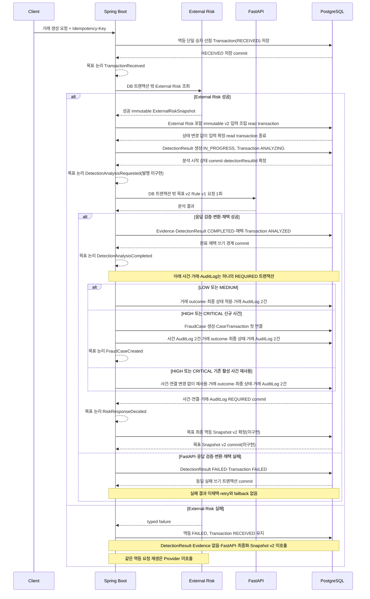
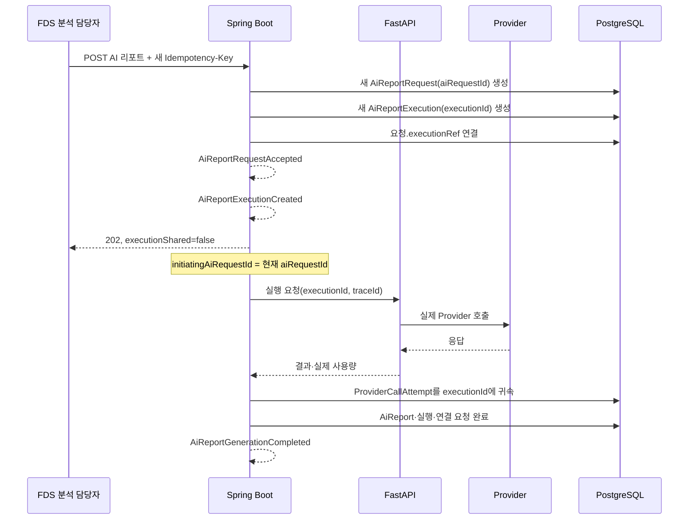
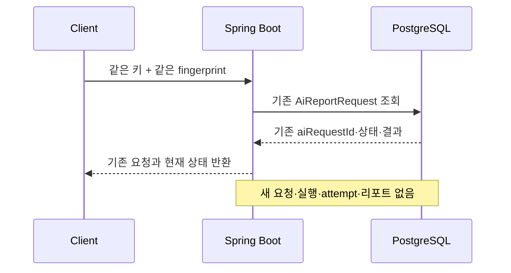
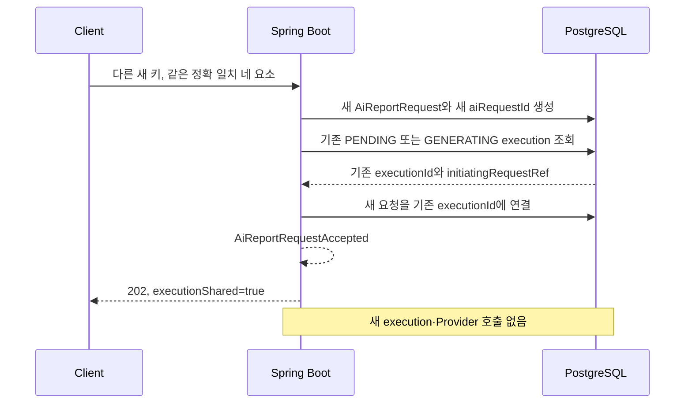
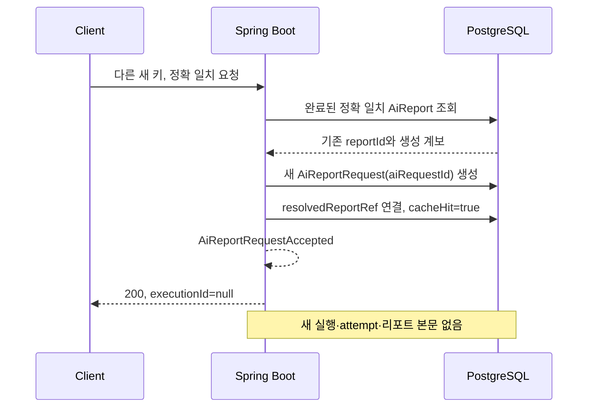
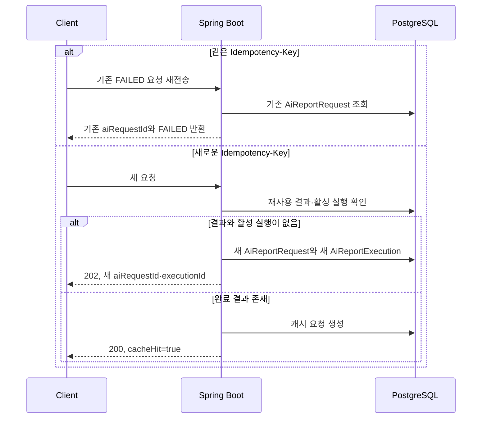

# FinGuardOps 도메인 이벤트 계약

## 1. 문서 목적

이 문서는 FinGuardOps의 기존 논리 ERD와 REST API 계약을 연결하는 전송 방식 독립적인 도메인 이벤트 계약을 정의한다.

목적은 다음과 같다.

- 거래 접수부터 행동 이벤트, 탐지, 위험 대응, 사건 생성과 AI 리포트 생성까지의 논리적 이벤트를 정의한다.
- 각 이벤트가 발생하는 업무 조건을 정의한다.
- 이벤트 생산자와 처리 주체의 책임을 정의한다.
- 이벤트 중복 전달과 동일 업무 결과의 중복 생성을 구분하고 멱등 처리 기준을 정의한다.
- 외부 `AiReportRequest` 흐름과 실제 `AiReportExecution`·`ProviderCallAttempt` 흐름을 구분한다.
- 현재 동기 처리와 비동기 AI 리포트 처리, 향후 메시지 기반 처리의 경계를 정의한다.

이 문서는 Kafka 구현 문서가 아니다. 현재 단계에서 Kafka Topic, Producer, Consumer, Consumer Group, DLQ 또는 Outbox를 구현하거나 확정하지 않는다.

## 2. 적용 범위와 전송 방식

이벤트는 Kafka 메시지에 한정하지 않는 업무 계약이다. 같은 의미와 멱등성 원칙을 다음 전달 방식에 적용할 수 있다.

- Spring Boot Modular Monolith 내부 애플리케이션 이벤트
- Spring Boot와 FastAPI AI Service 사이의 REST 요청·응답 처리
- 향후 Kafka 메시지

전달 방식이 달라져도 이벤트 발생 조건, 식별자 의미, 생산자 책임과 중복 방지 기준을 바꾸지 않는다. 다만 현재 REST 응답이나 내부 메서드 호출이 이 문서의 Envelope JSON을 그대로 사용해야 한다는 뜻은 아니다. 물리 DTO, 직렬화 Schema와 저장 구조는 후속 구현 계약이다.

### 2.1 현재 책임 경계

```text
Spring Boot Modular Monolith
→ 거래 접수와 검증
→ 탐지 호출 오케스트레이션
→ 탐지 결과 검증·저장·채택
→ 위험 대응 결정
→ 사건 생성·상태·최종 판정
→ AI 외부 요청, 실행 연결과 업무 상태
→ 멱등성·동시성·감사 정합성

FastAPI AI Service
→ Feature 계산
→ Rule 실행과 ML 추론
→ AI 리포트 입력 처리, 모델 라우팅과 Prompt 구성
→ LLM Provider 호출
→ LLM 출력 검증과 템플릿 fallback 생성
```

FastAPI와 생성형 AI는 거래 상태, 위험 등급, 위험 대응, 사건 상태와 최종 판정을 확정하지 않는다. Spring Boot가 FastAPI 응답을 검증하고 영속 업무 데이터에 반영한 뒤 발생시킨 이벤트가 업무 상태 변화의 기준이다.

### 2.2 제외 범위

- Java 또는 Python 코드
- JPA Entity와 PostgreSQL DDL·Migration
- Redis 중복 제거 자료구조
- Kafka Topic·Consumer·DLQ
- Outbox와 CDC
- OpenAPI 변경
- Docker, Kubernetes와 AWS 설정
- 인증·인가 구현
- 실제 Provider와 Prompt 전문
- 물리적인 이벤트 중복 제거 테이블

## 3. 기준 문서와 용어

이 계약은 다음 문서를 대조해 작성했다.

- `docs/02-architecture/domain-erd.md`
- `docs/02-architecture/system-architecture.md`
- `docs/03-api/api-conventions.md`
- `docs/03-api/transaction-detection-api.md`
- `docs/03-api/case-audit-api.md`
- `docs/03-api/ai-report-usage-api.md`
- `docs/01-requirements/transaction-state-transition.md`
- `docs/01-requirements/case-state-transition.md`
- `docs/01-requirements/ai-report-state-transition.md`
- `docs/01-requirements/platform-operation-requirements.md`
- `docs/07-decisions/ADR-003-transaction-processing-boundary.md`

주요 엔티티 관계는 다음과 같다.

```text
Transaction 1 ── N DetectionResult
DetectionResult 1 ── N DetectionEvidence

FraudCase N ── N Transaction
             via CaseTransaction

FraudCase 1 ── N AiReportRequest
FraudCase 1 ── N AiReportExecution
AiReportExecution 1 ── N AiReportRequest
AiReportExecution 1 ── N ProviderCallAttempt
AiReportExecution 1 ── 0..1 AiReport
AiReport 1 ── N AiReportRequest
```

식별자의 기본 의미는 다음과 같다.

| 식별자 | 의미 |
| --- | --- |
| `transactionId` | 거래 업무 식별자 |
| `detectionResultId` | 저장·검증된 개별 탐지 결과 식별자 |
| `detectionResultVersion` | 같은 거래 안에서 탐지 분석 버전을 구분하는 값 |
| `caseId` | 사건 업무 식별자 |
| `aiRequestId` | 외부 `AiReportRequest` 식별자 |
| `executionId` | 실제 논리 실행인 `AiReportExecution` 식별자 |
| `initiatingAiRequestId` | 실행을 최초 생성한 요청 식별자 |
| `sourceAiRequestId` | 캐시로 재사용한 `AiReport`의 최초 생성 요청 식별자 |
| `reportId` | 검증을 통과한 `AiReport` 결과 식별자 |
| `attemptId` | 실제 Provider 호출 한 번의 식별자 |
| `traceId` | 서비스와 Provider 호출 구간을 연결하는 기술 추적 식별자 |

`aiRequestId`, `executionId`, `reportId`와 `attemptId`는 서로 대체하지 않는다. 특히 `ProviderCallAttempt`는 `AiReportRequest`가 아니라 정확히 하나의 `AiReportExecution`에 속한다.

## 4. 공통 이벤트 Envelope

### 4.1 논리 구조

모든 논리적 도메인 이벤트는 다음 공통 Envelope를 사용한다.

```json
{
  "eventId": "devent_demo_20260726_0001",
  "eventType": "TransactionReceived",
  "eventVersion": 1,
  "occurredAt": "2026-07-26T02:10:00Z",
  "producer": "SPRING_BOOT",
  "traceId": "trace_demo_0001",
  "correlationId": "corr_demo_0001",
  "causationId": "cmd_demo_0001",
  "aggregateType": "Transaction",
  "aggregateId": "7b8d9e10-4f2a-4c61-8b3d-5e6f70819002",
  "payload": {}
}
```

JSON은 논리 표현 예시이다. 현재 내부 이벤트 클래스, REST DTO 또는 향후 메시지 Schema의 물리 형식을 확정하지 않는다.

### 4.2 필드 계약

| 필드 | 생성 주체 | 필수 여부 | 의미 | 중복·추적 사용 |
| --- | --- | --- | --- | --- |
| `eventId` | 논리 이벤트를 처음 확정하는 생산자 | 필수 | 이벤트 자체의 전역 고유 식별자 | 동일 이벤트 재전달의 중복 제거 기준 |
| `eventType` | 계약 정의자와 생산자 | 필수 | 과거형으로 표현한 업무 변화 종류 | Handler 라우팅과 Schema 선택 |
| `eventVersion` | 계약 정의자 | 필수 | `eventType` payload Schema의 버전 | 호환 가능한 역직렬화와 변경 관리 |
| `occurredAt` | 업무 변화를 확정한 생산자 | 필수 | 업무 변화가 영속적으로 확정된 UTC 시각 | 업무 순서 판단의 보조 정보이며 단독 중복 키가 아님 |
| `producer` | 실제 이벤트 생산자 | 필수 | 업무 변화를 확정해 이벤트를 만든 서비스 또는 모듈 | 소유권과 장애 구간 식별 |
| `traceId` | 진입 경계의 Spring Boot, 또는 유효한 기존 추적 문맥 | 필수 | Spring Boot, FastAPI와 Provider 호출 흐름 추적 | 기술 호출 추적용이며 업무 중복 키가 아님 |
| `correlationId` | 업무 흐름 최초 진입 주체 | 필수 | 동일 업무 흐름의 여러 요청·이벤트를 묶는 불변 식별자 | 거래 처리 또는 AI 요청 흐름의 전체 상관관계 조회 |
| `causationId` | 현재 이벤트 생산자 | 조건부 필수 | 현재 이벤트를 직접 발생시킨 요청·명령 또는 선행 이벤트 식별자 | 원인 사슬과 재처리 경로 추적 |
| `aggregateType` | 계약 정의자 | 필수 | 이벤트가 책임지는 핵심 업무 엔티티 유형 | Aggregate별 처리와 업무 제약 선택 |
| `aggregateId` | 생산자가 업무 엔티티에서 가져옴 | 필수 | 이벤트가 책임지는 핵심 업무 엔티티 식별자 | Aggregate 고유 제약과 버전 검증에 사용 |
| `payload` | 생산자 | 필수 | 소비자가 변화 사실을 처리하는 데 필요한 최소 업무 데이터 | 업무 결과 중복 확인에 사용하되 원문·민감정보는 제외 |

### 4.3 식별자 생성과 전파 원칙

- `eventId`는 동일한 논리 이벤트를 재전달할 때 바꾸지 않는다.
- 같은 업무 결과를 다시 요구하는 별도 이벤트는 서로 다른 `eventId`를 가질 수 있다. 이 경우 도메인 고유 제약과 버전으로 중복 결과를 막는다.
- `traceId`는 현재 HTTP·서비스 호출 흐름을 추적한다. 같은 `Idempotency-Key` 재전송은 새로운 HTTP `traceId`를 가질 수 있지만 기존 업무 요청을 새로 만들지 않는다.
- `correlationId`는 하나의 업무 흐름 동안 유지한다. 기술 Trace가 재시도나 비동기 경계에서 달라져도 같은 업무 흐름을 묶는다.
- `correlationId`는 `transactionId`, `caseId`, `aiRequestId`를 대신하지 않는 별도 불투명 식별자를 권장한다.
- `causationId`는 선행 이벤트의 `eventId` 또는 이벤트를 직접 발생시킨 명령·요청 식별자를 사용한다.
- 외부 입력을 최초 접수해 선행 이벤트가 없는 루트 이벤트에서는 `causationId`를 요청 식별자로 기록할 수 있다. 사용할 승인된 요청 식별자가 전혀 없는 경우에만 null 허용을 후속 Schema에서 검토한다.
- `aggregateId`는 해당 이벤트가 변경 사실을 책임지는 엔티티를 가리킨다. 관련 엔티티 식별자는 payload에 최소한으로 추가한다.
- 모든 시간은 API 공통 규칙에 따라 UTC ISO-8601과 `Z` 접미사를 사용한다.
- Envelope `occurredAt`은 도메인 이벤트가 업무적으로 확정된 시각이다. 금융 거래가 실제 발생한 `transactionOccurredAt`, 사용자 행동이 실제 발생한 `behaviorOccurredAt`과 구분한다.
- `transactionOccurredAt`과 `behaviorOccurredAt`은 기존 REST API 필드명을 변경하는 것이 아니라 논리적 이벤트 payload에서 시간의 의미를 명확히 구분하기 위한 이름이다.
- 식별자에 고객번호, 계좌번호, 인증정보 또는 비밀키를 포함하지 않는다.

### 4.4 `eventVersion`과 업무 버전의 구분

```text
eventVersion
= 이벤트 payload Schema 버전

detectionResultVersion
= 탐지 업무 결과 버전

concurrencyVersion
= 사건 등 Aggregate의 동시 수정 충돌 탐지 버전
```

세 값은 목적이 다르므로 서로 대체하지 않는다. 이벤트 순서와 오래된 변경 방지를 위해 `aggregateVersion`이 추가로 필요한지는 사용자 결정 사항이다.

### 4.5 payload 금지 정보

다음 정보는 payload에 포함하지 않는다.

- 실제 고객번호와 실제 계좌번호
- 원문 IP, 비밀번호, OTP, 인증 토큰과 API Key
- Prompt 원문
- LLM 또는 Provider 응답 원문
- Provider 원본 오류 메시지와 내부 스택 트레이스
- Feature 전체 벡터와 불필요한 행동 이벤트 원문

payload에는 비식별 참조값, 승인된 Reason Code, 버전, 안전한 실패 분류와 업무 처리에 필요한 최소 요약만 포함한다.

## 5. 이벤트 명명과 발생 원칙

- `eventType`은 이미 발생해 확정된 사실을 과거형으로 표현한다.
- 계산 요청과 완료를 구분한다.
- 외부 요청 접수와 실제 실행 생성을 구분한다.
- 이벤트는 업무 트랜잭션이 성공적으로 확정된 뒤에만 발생한 것으로 본다.
- 동일 트랜잭션에서 여러 사실이 함께 확정되면 서로 다른 이벤트로 표현할 수 있으나 같은 업무 정합성 경계를 공유했다는 점을 causation·correlation 관계로 추적한다.
- 거부된 요청과 검증 실패는 업무 상태 변화가 없으면 성공 이벤트를 만들지 않는다. 필요한 감사 기록이나 실패 관측은 별도 계약으로 처리한다.
- FastAPI 계산 완료 자체가 Spring Boot 업무 결과 확정을 의미하지 않는다. Spring Boot가 결과를 검증·저장한 후 탐지 완료 이벤트를 생산한다.

## 6. 거래·행동·탐지·사건 이벤트

### 6.1 `TransactionReceived`

| 항목 | 계약 |
| --- | --- |
| 발생 조건 | 기본 요청 검증을 통과한 Transaction이 최초로 저장되고 `RECEIVED`로 접수된 때 |
| 생산자 | Spring Boot |
| 처리 주체·예상 소비자 | 거래 오케스트레이션, 탐지 요청 준비, 감사·관측 모듈 |
| Aggregate | `Transaction` / `transactionId` |
| 필수 식별자 | `transactionId`, `traceId`, `correlationId`; 관련 HTTP 멱등성 문맥 |
| 최소 payload | `transactionType`, `transactionOccurredAt`, `createdAt`, `processingStatus=RECEIVED` |
| 중복 처리 | 같은 `Idempotency-Key`+fingerprint 재전송과 같은 `transactionId`는 새 Transaction과 이벤트를 만들지 않음 |
| 원거래 판단 영향 | 이 이벤트만으로 위험 등급이나 대응을 정하지 않음 |
| 처리 범위 | 현재 내부 동기 흐름 가능. 향후 비동기 전달 가능하나 접수 영속화가 선행 |

JSON 파싱, 필수 헤더, 기본 필드 형식 또는 거래 유형별 도메인 Validation에 실패하면 Transaction과 IdempotencyRecord를 생성하지 않고 이 이벤트도 발생시키지 않는다. `VALIDATION_FAILED`는 현재 거래 접수의 영속 상태가 아니다.

### 6.2 `BehaviorEventReceived`

| 항목 | 계약 |
| --- | --- |
| 발생 조건 | 지원되는 행동 이벤트가 검증되어 최초 저장된 때 |
| 생산자 | Spring Boot |
| 처리 주체·예상 소비자 | 행동 타임라인, Feature·탐지 준비, 감사·관측 모듈 |
| Aggregate | `BehaviorEvent` / 기존 API의 `BehaviorEvent.eventId` |
| 필수 식별자 | Envelope `eventId`, Aggregate 식별자인 행동 이벤트 `eventId`, 선택적 `transactionId` |
| 최소 payload | `behaviorEventType`, `behaviorOccurredAt`, `externalCustomerRef`, 선택적 `accountRef`, `deviceRef`, `transactionId`, `beneficiaryRef` |
| 중복 처리 | 같은 행동 이벤트 `eventId`+같은 정규화 요청은 기존 결과 반환, 다른 내용이면 `DUPLICATE_EVENT` |
| 원거래 판단 영향 | 관측 신호이며 위험 등급·대응을 직접 확정하지 않음 |
| 처리 범위 | 현재 저장과 내부 전달. 향후 메시지 전달 가능 |

Envelope `eventId`와 REST 행동 엔티티의 `eventId`가 같은 이름을 사용하므로 직렬화 시 두 의미를 혼합하지 않는다. Envelope `eventId`는 논리 도메인 이벤트의 전달·재처리를 식별하고 REST `BehaviorEvent.eventId`는 호출자가 생성한 UUID v4 행동 Aggregate 식별자이다. 이 문서에서는 행동 엔티티 식별자를 `aggregateId`로 전달한다.

Envelope `eventType=BehaviorEventReceived`는 발생한 도메인 이벤트의 종류이고, payload의 `behaviorEventType`은 로그인·인증·기기 변경 등 사용자 행동의 업무 유형이다. 기존 행동 이벤트 REST API가 `eventType`을 사용하더라도 논리적 이벤트 payload로 매핑할 때는 `behaviorEventType`으로 구분하며, REST API 필드명을 변경하는 의미가 아니다. 현재 REST 접수 범위는 저장까지이며 도메인 이벤트 발행·Kafka 구현을 포함하지 않는다.

### 6.3 `DetectionAnalysisRequested`

| 항목 | 계약 |
| --- | --- |
| 발생 조건 | External Risk 성공 뒤 immutable v2 입력을 고정하고 분석 시작 트랜잭션에서 DetectionResult 생성·`IN_PROGRESS`, 거래 `ANALYZING`을 함께 commit한 때 |
| 생산자 | Spring Boot |
| 처리 주체·예상 소비자 | FastAPI AI Service의 Rule·ML 분석 처리 |
| Aggregate | `DetectionResult` / `detectionResultId` |
| 필수 식별자 | `detectionResultId`, `transactionId`, `detectionResultVersion`, `traceId`, `correlationId` |
| 최소 payload | `detectionResultId`, `transactionId`, `detectionResultVersion`, 승인된 feature 입력 버전, 분석 요청 시각 |
| 중복 처리 | 같은 `transactionId+detectionResultVersion`의 완료·진행 상태를 확인하고 중복 분석 시작 방지 |
| 원거래 판단 영향 | 요청 사실만으로 거래 상태를 최종 확정하지 않음 |
| 처리 범위 | 현재 v1 Spring Boot→FastAPI REST 내부 경계는 구현됨. 이 이벤트 DTO·Producer·발행 경로와 External Risk 포함 v2 전체 연결은 미구현 |

`detectionResultId`와 `detectionResultVersion`은 분석 시작 트랜잭션에서 생성되고
FastAPI 호출 전에 `IN_PROGRESS` 상태와 함께 commit된다. 이 commit 이후 실패한
분석도 해당 ID와 버전을 유지한 채 `FAILED`로 확정한다. 이는 목표 논리 이벤트
계약이며 이벤트 DTO·Producer·실제 발행 경로가 구현되었다는 의미는 아니다.

### 6.4 `DetectionAnalysisCompleted`

| 항목 | 계약 |
| --- | --- |
| 발생 조건 | FastAPI 결과가 도착한 뒤 Spring Boot가 요청 연결·완전성·버전을 검증하고 Evidence 저장, 기존 `IN_PROGRESS` DetectionResult의 `COMPLETED`, 결과 채택과 거래 `ANALYZED`를 하나의 쓰기 경계에서 commit한 때 |
| 생산자 | Spring Boot. FastAPI는 계산 원천이지만 업무 이벤트 최종 생산자는 아님 |
| 처리 주체·예상 소비자 | 탐지 결과 채택, 위험 대응 결정, 사건 생성 판단, 감사·관측 모듈 |
| Aggregate | `DetectionResult` / `detectionResultId` |
| 필수 식별자 | `detectionResultId`, `transactionId`, `detectionResultVersion`, `traceId` |
| 최소 payload | `transactionId`, `detectionResultVersion`, `analysisStatus=COMPLETED`, `riskScore`, `riskLevel`, `reasonCodes`, `modelVersion`, `featureVersion`, `analysisCompletedAt` |
| 중복 처리 | `transactionId+detectionResultVersion`과 `detectionResultId`로 한 결과만 확정. 늦은·중복 응답은 기존 완료 결과를 덮어쓰지 않음 |
| 원거래 판단 영향 | 위험 대응의 근거가 되지만 자체가 거래 처리 상태나 최종 판정은 아님 |
| 처리 범위 | 현재 REST 응답 검증 후 내부 처리. 향후 완료 메시지 가능 |

### 6.5 `RiskResponseDecided`

| 항목 | 계약 |
| --- | --- |
| 발생 조건 | Spring Boot가 채택할 DetectionResult를 확정하고 Transaction의 `adoptedDetectionResultId`, `riskLevel`, `riskResponseOutcome`, 최종 처리 상태를 같은 업무 정합성 경계에서 반영한 때 |
| 생산자 | Spring Boot |
| 처리 주체·예상 소비자 | 사건 생성·연결 오케스트레이션, 감사·관측 모듈 |
| Aggregate | `Transaction` / `transactionId` |
| 필수 식별자 | `transactionId`, `detectionResultId`, `detectionResultVersion`, `traceId` |
| 최소 payload | `detectionResultId`, `detectionResultVersion`, `riskLevel`, `riskResponseOutcome`, `processingStatus`, `decidedAt` |
| 중복 처리 | 동일 채택 결과와 상태 전이를 반복 적용하지 않음. 현재 상태와 채택 결과를 검증 |
| 원거래 판단 영향 | Spring Boot가 확정한 거래 위험 대응 사실. 생성형 AI는 생산할 수 없음 |
| 처리 범위 | 핵심 정합성은 현재 동기 트랜잭션 우선. 후속 반응은 비동기화 가능 |

HIGH는 `ADDITIONAL_AUTH_REQUIRED`, CRITICAL은 `HELD`의 Mock 처리와 사건 생성 대상이 될 수 있다. 실제 거래 차단이나 고객 제재를 의미하지 않는다.

### 6.6 `FraudCaseCreated`

| 항목 | 계약 |
| --- | --- |
| 발생 조건 | 새 FraudCase와 최초 CaseTransaction 연결이 정합성 있게 생성되고 사건 생성 감사 기록이 확정된 때 |
| 생산자 | Spring Boot |
| 처리 주체·예상 소비자 | 사건 대기열, AI 리포트 대상 준비, 감사·알림·관측 모듈 |
| Aggregate | `FraudCase` / `caseId` |
| 필수 식별자 | `caseId`, 원인 `transactionId`, `detectionResultId`, `traceId` |
| 최소 payload | `caseStatus=OPEN`, `transactionId`, `detectionResultId`, `representativeRiskLevel`, `createdAt` |
| 중복 처리 | 기존 활성 사건과 CaseTransaction을 확인하고 같은 `caseId+transactionId` 연결 중복 방지 |
| 원거래 판단 영향 | 이미 확정된 위험 대응을 변경하지 않음 |
| 처리 범위 | 사건과 첫 거래 연결의 현재 정합성은 동기 트랜잭션 우선. 알림은 후속 비동기 가능 |

같은 탐지 결과나 중복 이벤트가 새 사건을 다시 만들지 않아야 한다. 중복 활성 사건을 막는 물리 제약과 사건 병합·분리 기준은 후속 결정이다.

### 6.7 `FraudCaseStatusChanged`

| 항목 | 계약 |
| --- | --- |
| 발생 조건 | 허용 전이 검증, `expectedVersion` 검증, 사건 현재값·시각·`concurrencyVersion`과 AuditLog가 함께 확정된 때 |
| 생산자 | Spring Boot |
| 처리 주체·예상 소비자 | 사건 조회, 감사·관측 모듈, 승인된 후속 업무 |
| Aggregate | `FraudCase` / `caseId` |
| 필수 식별자 | `caseId`, 변경 전·후 `concurrencyVersion`, `traceId` |
| 최소 payload | `previousStatus`, `caseStatus`, `reasonCode` 또는 안전한 사유 요약, `changedAt`, `concurrencyVersion`; 담당자가 실제 변경된 경우에만 선택적 `assigneeRef` |
| 중복 처리 | `expectedVersion`과 현재 상태 검증. 같은 상태 요청이나 오래된 요청은 변경 이벤트를 만들지 않음 |
| 원거래 판단 영향 | 거래 위험 판단과 상태를 변경하지 않음 |
| 처리 범위 | 현재 동기 업무 트랜잭션. 후속 조회·알림은 비동기 가능 |

허용되지 않은 전이와 동시성 충돌은 이 성공 이벤트를 만들지 않는다. 기존 사건 API에 따라 거부 감사 기록 대상이 될 수 있다.

사건 상태 변경과 담당자 변경은 항상 같은 업무 변화가 아니다. `assigneeRef`는 상태 전이와 함께 담당자가 실제 변경된 경우에만 포함한다.

### 6.8 `FraudCaseDispositionFinalized`

| 항목 | 계약 |
| --- | --- |
| 발생 조건 | `IN_REVIEW` 사건의 `finalDisposition`, `caseStatus=CLOSED`, `closedAt`, `concurrencyVersion`과 AuditLog가 하나의 업무 트랜잭션에서 확정된 때 |
| 생산자 | Spring Boot |
| 처리 주체·예상 소비자 | 사건 조회·통계, 감사·관측 모듈 |
| Aggregate | `FraudCase` / `caseId` |
| 필수 식별자 | `caseId`, `traceId`, 변경 전·후 `concurrencyVersion` |
| 최소 payload | `finalDisposition`, `previousStatus`, `caseStatus=CLOSED`, `closedAt`, `reasonCode` 또는 안전한 사유 요약, `concurrencyVersion` |
| 중복 처리 | `Idempotency-Key`+fingerprint와 `expectedVersion`으로 같은 종료·판정·AuditLog 중복 방지 |
| 원거래 판단 영향 | 담당자 조사 결과이며 과거 거래 위험 판단을 자동 변경하지 않음 |
| 처리 범위 | 현재 동기 업무 트랜잭션. 후속 통계는 비동기 가능 |

최종 판정은 FDS 분석 담당자의 서버 사용자 문맥에서 확정한다. FastAPI, 생성형 AI와 플랫폼·클라우드 운영자는 이 이벤트를 생산할 권한이 없다.

## 7. AI 리포트 이벤트

AI 영역에서는 외부 요청, 논리 실행, 실제 Provider 호출과 결과를 분리한다.

```text
AiReportRequest
→ 외부 요청·멱등성·요청자 이력

AiReportExecution
→ 실제 논리 실행과 최종 실행 상태

ProviderCallAttempt
→ 실행에 귀속된 실제 Provider 호출

AiReport
→ 검증된 LLM 또는 TEMPLATE_FALLBACK 결과
```

### 7.1 `AiReportRequestAccepted`

| 항목 | 계약 |
| --- | --- |
| 발생 조건 | 새 `Idempotency-Key`의 유효한 외부 요청에 새 `AiReportRequest`와 `aiRequestId`가 생성되고 신규 실행·공유·캐시 경로가 확정된 때 |
| 생산자 | Spring Boot |
| 처리 주체·예상 소비자 | AI 실행 오케스트레이션, 요청 상태 조회, 감사·관측 모듈 |
| Aggregate | `AiReportRequest` / `aiRequestId` |
| 필수 식별자 | `aiRequestId`, `caseId`, `detectionResultVersion`, `promptVersion`, `modelVersion`, `traceId` |
| 최소 payload | `caseId`, 정확 일치 네 요소, `reportStatus`, `executionId`, `executionShared`, `cacheHit`, `reportId`, `initiatingAiRequestId`, `sourceAiRequestId`, `requestedAt` |
| 중복 처리 | 같은 키+fingerprint 재전송은 기존 요청을 반환하고 이 이벤트를 새로 만들지 않음 |
| 원거래 판단 영향 | 거래·탐지·사건 상태와 최종 판정을 변경하지 않음 |
| 처리 범위 | 외부 API는 비동기 `202`/상태 조회. 내부 라우팅은 현재 구현 방식에 따라 동기 가능 |

경로별 nullable 필드는 다음과 같다.

| 경로 | `executionId` | `reportId` | `executionShared` | `cacheHit` | `initiatingAiRequestId` | `sourceAiRequestId` |
| --- | --- | --- | --- | --- | --- | --- |
| 신규 실행 | 새 실행 ID | null | false | false | 현재 `aiRequestId` | null |
| 진행 중 실행 공유 | 기존 활성 실행 ID | null | true | false | 실행을 처음 생성한 요청 ID | null |
| 완료 리포트 캐시 적중 | null | 기존 완료 리포트 ID | false | true | null | 기존 리포트의 원본 요청에서 파생한 ID |

따라서 실행이 존재하는 신규 실행·진행 중 실행 공유에는 `executionId`와 해당 실행의 `initiatingAiRequestId`가 있고, 완료 리포트 캐시 적중에는 `reportId`와 `sourceAiRequestId`가 있다.

### 7.2 `AiReportExecutionCreated`

| 항목 | 계약 |
| --- | --- |
| 발생 조건 | 재사용 가능한 완료 결과와 활성 실행이 없어 새 `AiReportExecution`이 생성되고 최초 요청과 상호 연결된 때 |
| 생산자 | Spring Boot |
| 처리 주체·예상 소비자 | FastAPI AI 리포트 실행, 운영 관측 모듈 |
| Aggregate | `AiReportExecution` / `executionId` |
| 필수 식별자 | `executionId`, `initiatingAiRequestId`, `caseId`, 정확 일치 네 요소, `traceId` |
| 최소 payload | `initiatingAiRequestId`, `caseId`, `detectionResultVersion`, `promptVersion`, `modelVersion`, `executionStatus=PENDING`, `createdAt` |
| 중복 처리 | 활성 정확 일치 조건의 실행을 하나만 허용. 충돌 시 기존 실행을 재조회해 요청 연결 |
| 원거래 판단 영향 | 없음 |
| 처리 범위 | 현재 비동기 실행 모델의 논리 경계. REST·내부 Worker·향후 메시지 모두 가능 |

진행 중 실행 공유와 캐시 재사용에는 이 이벤트가 발생하지 않는다.

### 7.3 `AiReportGenerationCompleted`

| 항목 | 계약 |
| --- | --- |
| 발생 조건 | LLM 출력이 검증을 통과하고 `AiReport(reportSource=LLM)`가 저장되며 실행과 연결 요청들이 `COMPLETED`로 확정된 때 |
| 생산자 | Spring Boot. FastAPI는 생성 결과와 사용량을 반환 |
| 처리 주체·예상 소비자 | 사건 리포트 조회, AI 운영 집계, 감사·관측 모듈 |
| Aggregate | `AiReportExecution` / `executionId` |
| 필수 식별자 | `executionId`, `initiatingAiRequestId`, `reportId`, `caseId`, `traceId` |
| 최소 payload | `reportId`, `caseId`, 정확 일치 네 요소, `reportStatus=COMPLETED`, `reportSource=LLM`, `completedAt` |
| 중복 처리 | 실행당 결과 최대 한 건과 정확 일치 완료 결과 고유 제약. 늦은 중복 완료는 기존 결과를 변경하지 않음 |
| 원거래 판단 영향 | 거래 위험 판단·사건 상태·최종 판정에 영향 없음 |
| 처리 범위 | 현재 FastAPI 결과 검증 후 Spring Boot 확정. 향후 완료 메시지 가능 |

Provider 사용량은 payload에 복제하지 않고 `executionId` 아래 실제 `ProviderCallAttempt`에서 조회·집계한다.

진행 중 실행을 공유했던 다른 `AiReportRequest`들의 `aiRequestId` 집합은 이벤트 payload에 복제하지 않는다. 해당 요청들은 `executionId` 관계를 통해 조회한다.

### 7.4 `AiReportTemplateFallbackCompleted`

| 항목 | 계약 |
| --- | --- |
| 발생 조건 | LLM 호출·Provider 오류·출력 검증 실패 후 템플릿이 사용 가능한 리포트를 만들고 `FALLBACK_COMPLETED`가 확정된 때 |
| 생산자 | Spring Boot. FastAPI는 fallback 결과를 반환 |
| 처리 주체·예상 소비자 | 사건 리포트 조회, 운영·감사·관측 모듈 |
| Aggregate | `AiReportExecution` / `executionId` |
| 필수 식별자 | `executionId`, `initiatingAiRequestId`, `reportId`, `caseId`, `traceId` |
| 최소 payload | `reportId`, 정확 일치 네 요소, `reportStatus=FALLBACK_COMPLETED`, `reportSource=TEMPLATE_FALLBACK`, 안전한 `failureCode`, `completedAt` |
| 중복 처리 | 실행당 결과 최대 한 건. 이미 종료된 실행에 늦은 LLM 응답이 와도 fallback 결과를 덮어쓰지 않음 |
| 원거래 판단 영향 | 거래·탐지·사건 처리를 중단하거나 변경하지 않음 |
| 처리 범위 | 현재 FastAPI fallback 결과 검증 후 Spring Boot 확정. 향후 완료 메시지 가능 |

템플릿 fallback 자체는 Provider 호출이 아니므로 가상 `ProviderCallAttempt`, 0 토큰 행 또는 0 비용 행을 만들지 않는다.

### 7.5 `AiReportExecutionFailed`

| 항목 | 계약 |
| --- | --- |
| 발생 조건 | 승인된 자동 재시도와 템플릿 fallback이 모두 사용 가능한 결과를 만들지 못하고 실행·연결 요청이 `FAILED`로 최종 확정된 때 |
| 생산자 | Spring Boot |
| 처리 주체·예상 소비자 | 운영·감사·알림 모듈, 요청 상태 조회 |
| Aggregate | `AiReportExecution` / `executionId` |
| 필수 식별자 | `executionId`, `initiatingAiRequestId`, `caseId`, `traceId` |
| 최소 payload | 정확 일치 네 요소, `executionStatus=FAILED`, 안전한 `failureCode`, `completedAt` |
| 중복 처리 | 종료 상태 조건과 동시성 버전으로 한 최종 상태만 확정. 같은 키 재전송은 새 실패 이벤트·attempt를 만들지 않음 |
| 원거래 판단 영향 | 거래 위험 판단과 사건 처리를 중단시키지 않음. 기존 유효 리포트도 유지 |
| 처리 범위 | 현재 비동기 상태 결과. 향후 실패 메시지 가능 |

실제 실패 Provider 호출에서 확인된 토큰과 비용은 `ProviderCallAttempt`에 남긴다. 알 수 없는 값을 0으로 만들지 않는다.

`AiReportGenerationCompleted`, `AiReportTemplateFallbackCompleted`와 `AiReportExecutionFailed` 모두 실행을 공유한 요청들의 `aiRequestId` 집합을 payload에 복제하지 않고 `executionId` 관계로 조회한다.

## 8. 이벤트 흐름

### 8.1 거래부터 사건 생성



External Risk 선행 실패는 Rule 분석 시작 전 경계다. 거래는 `RECEIVED`를 유지하고
DetectionResult·Evidence를 생성하지 않으며 FastAPI와 위험 대응 최종화를 호출하지
않는다. 멱등 실패를 확정한 같은 요청 재생은 Provider를 다시 호출하지 않는다.

분석 시작 commit 이후 FastAPI 호출·응답 검증·변환·채택이 실패하면 거래는 이미
`ANALYZING`, 해당 DetectionResult는 이미 `IN_PROGRESS`다. 실패 기록 경계는 같은
쓰기 트랜잭션에서 거래와 DetectionResult를 모두 `FAILED`로 확정하고 실패 결과를
채택하지 않는다. 원래 오류를 성공이나 fallback으로 바꾸지 않으며 자동 retry와
fallback은 없다. 공개 오류 매핑과 도메인 이벤트 발행 경로는 아직 구현되지 않았다.

내부 위험 대응 최종화는 LOW·MEDIUM에서 사건 없이 거래 AuditLog 2건을 기록하고,
HIGH·CRITICAL 신규 사건에서는 사건·첫 연결을 먼저 만든 뒤 사건 AuditLog 2건과
거래 AuditLog 2건을 기록한다. 기존 활성 사건 재사용 시 사건·연결을 변경하거나
사건 AuditLog를 중복 생성하지 않고 거래 AuditLog 2건만 기록한다. 어느 단계에서든
실패하면 사건·연결·거래·AuditLog의 REQUIRED 트랜잭션 전체를 rollback한다.

거래 위험 판단은 AI 리포트 생성 완료를 기다리지 않는다.

### 8.2 AI 신규 실행



신규 실행 불변식:

- 새 `aiRequestId`
- 새 `executionId`
- `executionShared=false`
- `initiatingAiRequestId=현재 aiRequestId`
- `sourceAiRequestId=null`
- 실제 Provider 호출은 실행에 귀속

### 8.3 같은 `Idempotency-Key` 재전송



- `PENDING`·`GENERATING`이면 기존 요청을 `202 Accepted`로 반환한다.
- `COMPLETED`·`FALLBACK_COMPLETED`·`FAILED`이면 기존 요청을 `200 OK`로 반환한다.
- 기존 `aiRequestId`, `executionId`, `requestedAt`, `executionShared`를 유지한다.
- 같은 키의 `FAILED` 요청도 다시 실행하지 않는다.
- 같은 키에 다른 fingerprint가 오면 `IDEMPOTENCY_KEY_CONFLICT`이며 새 이벤트와 업무 결과를 만들지 않는다.

### 8.4 진행 중 실행 공유



- 새 `aiRequestId`
- 기존 `executionId`
- `executionShared=true`
- `initiatingAiRequestId`는 실행을 처음 만든 요청
- `cacheHit=false`
- `sourceAiRequestId=null`
- 요청별 Provider attempt, 토큰과 비용을 복제하지 않음

### 8.5 완료 리포트 캐시 재사용

정확 일치 기준은 다음 네 요소를 모두 사용한다.

```text
caseId
+ detectionResultVersion
+ promptVersion
+ modelVersion
```



캐시 적중 불변식:

- 새 `aiRequestId`
- `executionId=null`
- `executionShared=false`
- `initiatingAiRequestId=null`
- `cacheHit=true`
- `sourceAiRequestId`는 `resolvedReportRef → AiReport.executionRef → AiReportExecution.initiatingRequestRef → AiReportRequest.aiRequestId`로 파생
- 새로운 `AiReportExecution`, `ProviderCallAttempt`와 리포트 본문을 생성하지 않음
- 토큰과 비용을 0으로 기록하는 가상 attempt를 생성하지 않음
- 운영 응답의 토큰 0은 빈 attempt 집합의 계산 결과일 뿐 저장된 사용량 행이 아님

정상 데이터에서는 같은 정확 일치 네 요소에 재사용 가능한 완료 결과와 활성 실행이 동시에 존재하지 않아야 한다. 정상 경로에서는 완료 결과를 먼저 확인하고 없을 때 활성 실행을 확인한다. 두 상태가 함께 조회되면 어느 쪽을 임의로 선택하지 않고 정합성 오류로 격리·관측한 뒤 승인된 복구 절차를 적용한다.

### 8.6 최종 실패 이후 새 요청



새 실행에도 기존 자동 재시도 정책을 적용한다. AI 리포트 실패는 거래 위험 판단, 위험 대응과 사건 조사를 중단시키지 않는다.

## 9. 중복과 멱등 처리

### 9.1 중복 계층

| 중복 상황 | 식별 기준 | 처리 기준 |
| --- | --- | --- |
| 같은 HTTP 요청 재전송 | 작업 범위의 `Idempotency-Key` + 정규화 fingerprint | 기존 요청·처리 상태·완료 결과 반환. 다른 fingerprint는 충돌 |
| 같은 논리 이벤트 재전달 | Envelope `eventId` | 이미 성공 처리한 event이면 Ack 또는 기존 처리 결과 반환 |
| 다른 `eventId`, 같은 업무 결과 요구 | Aggregate 식별자, 업무 버전과 도메인 고유 제약 | 결과 생성 전 현재 업무 상태 확인, Unique 후보와 동시성 검증 |
| 같은 사건의 동시 AI 요청 | 정확 일치 네 요소 + 활성 실행 상태 | 서로 다른 요청 이력은 보존하되 진행 실행 공유 |
| 완료된 탐지 결과 재처리 | `transactionId+detectionResultVersion`, `detectionResultId` | 새 DetectionResult·채택·감사 중복 생성 금지 |
| 동일 탐지 결과의 사건 생성 재처리 | 기존 활성 사건, `caseId+transactionId`, 사건 생성 기준 | 새 사건 또는 CaseTransaction 중복 생성 금지 |
| Provider 응답 처리 재시도·중복 완료 | `executionId+attemptNumber`, `attemptId`, 실행 종료 상태 | attempt·AiReport·토큰·비용 중복 기록 금지 |

### 9.2 HTTP 멱등성과 이벤트 멱등성

```text
HTTP 중복
→ Idempotency-Key + fingerprint

이벤트 전달 중복
→ eventId

업무 결과 중복
→ 도메인 식별자 + 업무 버전 + 현재 상태 + 고유 제약
```

세 기준은 서로 대체하지 않는다.

- 이벤트 중복 제거 기록만으로 Transaction, DetectionResult, FraudCase, AiReportExecution, AiReport와 ProviderCallAttempt의 고유 제약을 대신하지 않는다.
- 업무 엔티티의 Unique Constraint만으로 Consumer가 같은 부수 효과를 반복 수행하는 문제를 모두 해결할 수 없다.
- 같은 `eventId`가 아니어도 동일 업무 결과를 요구할 수 있으므로 Aggregate 현재 상태와 업무 버전을 다시 검증한다.
- 중복 이벤트는 중복 사건, 실행, 리포트, Provider attempt, 토큰과 비용 기록을 만들지 않아야 한다.

### 9.3 상황별 처리

#### 같은 HTTP 요청 재전송

- 동일 키와 같은 fingerprint는 기존 업무 요청을 반환한다.
- 진행 중이면 새 실행을 시작하지 않는다.
- 종료되었으면 기존 결과를 반환한다.
- `FAILED`도 같은 키로 다시 실행하지 않는다.

#### 같은 `eventId` 재전달

- 소비자는 `eventId`의 처리 완료 여부를 확인한다.
- 이미 완료한 이벤트이면 업무 Handler와 외부 호출을 다시 수행하지 않는다.
- 이전 시도가 업무 트랜잭션 전에 실패했다면 같은 이벤트를 안전하게 다시 처리할 수 있어야 한다.
- 처리 완료 기록과 업무 커밋의 원자성 방식은 후속 구현 결정이다.

#### 다른 `eventId`이지만 동일 업무 결과

- `transactionId+detectionResultVersion`, 활성 사건 연결, 정확 일치 AI 실행, `executionId+attemptNumber` 같은 도메인 키를 확인한다.
- 기존 결과가 있으면 새 결과를 만들지 않고 기존 결과에 연결하거나 멱등 성공으로 처리한다.

#### 같은 사건의 동시 AI 리포트 요청

- 같은 키이면 기존 `AiReportRequest`.
- 다른 키이며 완료 결과가 있으면 새 요청 + 캐시 재사용.
- 다른 키이며 활성 실행이 있으면 새 요청 + 실행 공유.
- 둘 다 없을 때만 새 실행.

#### 이미 완료된 탐지 결과

- 같은 버전의 늦은 FastAPI 응답과 재시도 응답은 기존 DetectionResult를 덮어쓰지 않는다.
- 새 분석 입력·Rule·Feature·모델 조건이면 승인된 새 `detectionResultVersion`을 사용한다.

#### 동일 탐지 결과로 인한 사건 생성

- 기존 활성 사건과 CaseTransaction 연결을 먼저 확인한다.
- 사건 생성과 최초 거래 연결을 같은 정합성 경계로 처리한다.
- 중복 생성 시도는 기존 사건 연결 또는 승인된 거부 결과로 끝나야 한다.

#### Provider 중복 완료

- 실제 새 호출만 새 `ProviderCallAttempt`가 된다.
- 동일 실제 호출의 재처리 응답은 같은 `attemptId` 또는 `executionId+attemptNumber`로 한 번만 반영한다.
- 이미 종료된 실행의 늦은 응답은 기존 `COMPLETED`, `FALLBACK_COMPLETED` 또는 `FAILED`를 덮어쓰지 않는다.

### 9.4 구현 후보와 미확정 사항

다음은 구현 후보이며 현재 확정하지 않는다.

- PostgreSQL 이벤트 처리 기록 테이블
- 기존 `IdempotencyRecord` 확장
- Redis 중복 제거 키와 TTL
- Consumer 로컬 저장소
- Outbox와 Consumer Inbox 조합
- CDC

어떤 후보를 선택해도 업무 엔티티 고유 제약과 상태 검증은 유지한다.

## 10. 실패·재시도·fallback

### 10.1 실패 분류

| 상황 | 요청·실행 식별자 변화 | 이벤트와 업무 처리 |
| --- | --- | --- |
| 요청 검증 실패 | 기본 검증 전이면 새 업무 엔티티 없음 | 성공 이벤트 없음. `400/422 VALIDATION_ERROR` |
| 상태 전이 불가 | 기존 Aggregate 유지 | 성공 변경 이벤트 없음. 거부 감사 기록 후보 |
| 중복 요청·이벤트 | 기존 결과 사용 | 새 업무 결과 이벤트 없음. 중복 처리 관측·감사 후보 |
| Spring Boot→FastAPI Timeout·연결 실패 | 접수된 AI 요청의 `aiRequestId`와 `executionId` 유지 | 같은 실행 안에서 승인된 재시도 또는 fallback/실패 |
| Provider Timeout·연결 실패 | 같은 `executionId`, 실제 호출마다 새 attempt | 자동 재시도 최대 1회, 최초 포함 최대 2 attempts |
| Provider 비재시도 오류 | 같은 `aiRequestId`·`executionId` | 자동 재시도하지 않고 템플릿 fallback |
| LLM 출력 검증 실패 | 같은 `aiRequestId`·`executionId`; 실제 호출 attempt는 `OUTPUT_REJECTED` 후보 | 자동 재시도하지 않고 템플릿 fallback |
| `TEMPLATE_FALLBACK` 완료 | 새 요청·실행 없음 | 같은 실행을 `FALLBACK_COMPLETED`로 종료, 가상 attempt 없음 |
| 최종 실행 실패 | 새 요청·실행 없음 | 같은 실행과 연결 요청을 `FAILED`로 종료 |

### 10.2 자동 재시도

현재 AI API 계약을 따른다.

- Timeout과 연결 실패처럼 일시적인 오류에만 자동 재시도한다.
- 최초 호출을 포함해 최대 2회 시도하므로 자동 재시도는 최대 1회이다.
- 자동 재시도는 새 `aiRequestId` 또는 새 `executionId`를 만들지 않는다.
- 실제 Provider를 다시 호출한 경우 같은 `executionId` 아래 새로운 `attemptNumber`를 기록한다.
- FastAPI 연결 단계에서 Provider 호출이 시작되지 않았다면 가상 `ProviderCallAttempt`를 만들지 않는다.
- 출력 검증 실패와 비일시적 Provider 오류는 자동 재시도하지 않고 템플릿 fallback으로 전환한다.
- 같은 `Idempotency-Key`의 `FAILED` 요청은 자동·수동 재실행하지 않는다.
- 새로운 키의 실패 후 재요청이 새 실행을 만들면 새 실행에 같은 자동 재시도 정책을 적용한다.

### 10.3 fallback

- fallback은 같은 `AiReportExecution` 안에서 수행한다.
- fallback은 새 `AiReportRequest`, 새 `AiReportExecution` 또는 Provider attempt를 만들지 않는다.
- fallback 전에 발생한 실제 Provider 호출은 성공·실패와 무관하게 실제 확인된 토큰·지연·비용을 보존한다.
- 템플릿이 사용 가능한 결과를 만들면 `AiReportTemplateFallbackCompleted`.
- 템플릿도 실패하면 `AiReportExecutionFailed`.
- fallback과 최종 실패는 거래 위험 점수, 거래 대응, 사건 상태와 최종 판정을 변경하지 않는다.

### 10.4 늦은 응답과 종료 경합

- LLM 정상 응답, Timeout, fallback과 실패가 경합해도 실행은 하나의 종료 상태만 확정한다.
- 이미 종료된 실행의 늦은 Provider 응답은 결과를 덮어쓰지 않는다.
- 실제 호출 사실과 측정 가능한 비용을 보존할 필요가 있더라도 종료된 업무 결과 변경과 분리한다.
- 구체적인 늦은 attempt 저장·거부 방식과 트랜잭션 격리 수준은 후속 결정이다.

## 11. 감사 로그 생성 조건

도메인 이벤트와 `AuditLog`는 서로 대체하지 않는다.

| 업무 변화·결과 | AuditLog 기준 |
| --- | --- |
| 거래 접수와 검증 결과 | Validation 통과 후 영속 업무 결과만 감사 후보. Validation 거절은 영속 AuditLog가 아니라 민감정보 없는 로그·저카디널리티 metric으로 관측 |
| 탐지 결과 저장·채택 | 사용한 DetectionResult 버전, 위험 점수·등급 확정과 채택 기록 |
| 위험 대응 결정 | 이전·이후 상태와 대응 결과 기록 |
| 사건 생성·기존 사건 연결 | 원인 거래·탐지 결과와 생성·연결 결과 기록 |
| 사건 상태 변경 | 성공한 변경과 허용되지 않은 전이 기록 |
| 사건 최종 판정·종료 | 이전·이후 상태, 판정, 주체와 사유 기록 |
| 동시성 충돌 | 업무 현재값을 바꾸지 않고 거부 결과를 별도 커밋 가능한 감사 경계에 기록 |
| AI 요청 접수·중복·캐시 | 요청자, 요청·결과 식별자와 처리 경로 기록 |
| AI 실행 상태·재시도·fallback·실패 | 안전한 상태·실패 분류와 실행 식별자 기록 |
| Provider 실제 호출 | 원본은 `ProviderCallAttempt`; AuditLog에 전체 attempt 필드를 복제하지 않음 |

감사 로그에는 Prompt 원문, Provider 응답 원문, 인증정보, 고객·계좌 원문과 내부 예외 원문을 기록하지 않는다.

## 12. 현재 처리와 향후 Kafka 경계

### 12.1 현재 기준

- Spring Boot Modular Monolith가 거래, 상태, 사건과 AI 요청을 오케스트레이션한다.
- FastAPI AI Service는 Rule, ML과 AI 리포트 관련 계산을 담당한다.
- 핵심 기능 안정화 전에는 REST와 내부 애플리케이션 흐름을 우선한다.
- 거래 위험 판단은 AI 리포트 완료를 기다리지 않는다.
- AI 리포트는 외부 API에서 비동기 실행·상태 조회 모델을 유지한다.
- 내부 구현이 REST 호출과 내부 실행을 사용해도 Kafka를 전제로 하지 않는다.
- PostgreSQL의 검증된 영속 업무 데이터가 정합성 기준이다.
- Redis가 도입되더라도 정확 일치 조회를 보조하며 업무 원본을 대신하지 않는다.

### 12.2 현재 동기 경계

다음은 핵심 정합성을 위해 현재 동기 업무 트랜잭션을 우선한다.

- 거래 접수와 멱등성 선점
- DetectionResult 채택과 Transaction 위험 현재값 반영
- 위험 대응 결정과 AuditLog
- 사건 생성과 최초 CaseTransaction 연결
- 사건 상태·최종 판정·동시성 버전과 AuditLog
- 새 AiReportRequest와 AiReportExecution의 최초 상호 연결
- AiReport 결과 생성과 실행·연결 요청 종료

알림, 운영 통계, 기술 메트릭과 후속 조회 projection은 업무 원본 확정 후 비동기로 분리할 수 있다.

### 12.3 향후 Kafka 도입 시 검토 사항

다음 항목은 후속 검토 대상이며 현재 구현 완료나 확정 구성으로 표현하지 않는다.

| 항목 | 후속 검토 내용 |
| --- | --- |
| Topic 구성 | 도메인·업무 중요도·보존 요구별 분리 여부 |
| Partition Key | `transactionId`, `caseId`, `executionId` 등 Aggregate 순서를 유지할 키 |
| Consumer Group | 업무 Handler와 관측·통계 Consumer의 독립 처리 범위 |
| 처리 완료 이벤트 | 요청 이벤트와 결과 이벤트의 명칭·책임·실패 의미 |
| Consumer 재처리 | `eventId` 중복 제거, 업무 고유 제약과 수동 재처리 절차 |
| DLQ | 이동 조건, 원문 보호, 재투입 승인과 정합성 검증 |
| Consumer Lag | 허용 지연, 영향 기능, 경보와 복구 기준 |
| 메시지 Schema 호환성 | `eventVersion` 변경 규칙, 하위 호환과 배포 순서 |
| Outbox 또는 CDC | DB 커밋과 이벤트 발행의 원자성 필요성, 운영 복잡도와 대안 |

Kafka 도입 이후에도 중복 이벤트가 거래 상태를 역행시키거나 사건·실행·리포트·attempt·비용을 중복 생성해서는 안 된다.

## 13. 보안과 관측성

### 13.1 보안

- Prompt 원문과 Provider 응답 원문을 이벤트 payload와 이벤트 로그에 포함하지 않는다.
- 고객 개인정보와 계좌·기기·IP 정보는 비식별 참조값과 최소 요약으로 제한한다.
- 이벤트 로그에 API Key, 인증 토큰, 비밀번호와 비밀키를 기록하지 않는다.
- `failureCode`는 승인된 안전한 분류만 사용한다.
- 이벤트 payload의 자유 형식 확장을 허용하지 않고 버전별 허용 필드를 정의한다.
- 운영자에게도 금융 개인정보 원문을 불필요하게 노출하지 않는다.

### 13.2 추적 식별자

| 식별자 | 사용 목적 |
| --- | --- |
| Envelope `eventId` | 같은 논리 이벤트의 전달·재처리 추적 |
| `transactionId` | 거래 접수·탐지·위험 대응 연결 |
| `detectionResultId` | 개별 탐지 결과·근거·채택 연결 |
| `caseId` | 사건·연관 거래·리포트 연결 |
| `aiRequestId` | 외부 리포트 요청과 요청자·멱등 처리 연결 |
| `executionId` | 실제 실행·Provider attempts·결과 연결 |
| `traceId` | Spring Boot→FastAPI→Provider 호출 구간 연결 |
| `correlationId` | Trace 경계를 넘어 동일 업무 흐름 연결 |
| `causationId` | 직접 원인 요청 또는 선행 이벤트 연결 |

Spring Boot는 유효한 추적 문맥이 없으면 새 `traceId`를 만들고 FastAPI 호출에 전파한다. FastAPI는 Provider 호출을 같은 추적 흐름에 연결한다. 비동기 경계에서 새 Trace가 시작되면 원래 업무의 `correlationId`와 causation 관계를 유지한다.

### 13.3 사용자별 노출

- FDS 분석 담당자는 거래·탐지 근거, 사건 상태, 안전한 AI 리포트 상태와 본문을 조회한다.
- FDS 분석 담당자에게 Provider, 모델, `ProviderCallAttempt`, attempts, 토큰과 비용 상세를 노출하지 않는다.
- 플랫폼·클라우드 운영자는 Provider 상세, 모델, 실제 호출, 토큰·지연·추정 비용과 장애 분류를 조회할 수 있다.
- 토큰과 비용의 원본 집계 기준은 중복 제거된 실제 `ProviderCallAttempt`이다.
- `AiReportExecution`은 해당 `ProviderCallAttempt`들을 묶는 실행 단위이며, 실행 자체를 attempt와 별개의 비용 사실로 합산하지 않는다.
- 요청별 화면에 공유 실행의 같은 attempts가 보이더라도 실행을 공유한 `AiReportRequest`별로 토큰과 비용을 다시 합산하지 않는다.
- 캐시 요청에는 `ProviderCallAttempt`가 없으므로 새 토큰 사용량이나 비용이 발생하지 않는다.

## 14. 정합성 정비 판정과 남은 문서 차이

구현 전 정합성 정비에서 AI 완료 결과 조회 순서, 현재 유효 리포트 선택, 자동 재시도,
무실행 캐시와 요청·실행 식별자 표현을 API·ERD·상태 전이·아키텍처·운영 요구사항과
통일했다. 다음 표는 남은 차이와 Issue #160에서 이미 확정한 장애 경계를 함께
구분한다. 추가 사용자 결정이 필요한 항목은 15절에만 둔다.

| 항목 | 기존 문서 표현 또는 발생 조건 | 이 문서의 확정·처리 |
| --- | --- | --- |
| `eventId` 의미 | `api-conventions.md`는 행동 이벤트 식별자로 정의. `system-architecture.md`와 `platform-operation-requirements.md`는 향후 Kafka 이벤트 발행·소비 식별자로 표현 | Envelope `eventId`와 BehaviorEvent 업무 식별자의 이름 충돌로 기록. 논리 Envelope에서는 이벤트 자체 ID, 행동 엔티티 ID는 `aggregateId`로 표현. 물리 필드 매핑은 후속 결정 |
| External Risk 선행 실패 | timeout·unavailable·invalid response는 Rule 분석을 시작하지 않고 typed failure로 전파. 실패를 `UNMATCHED`나 정상 결과로 이벤트화하지 않음 | 목표 거래 연결은 거래 `RECEIVED` 유지, DetectionResult·Evidence 미생성, FastAPI 미호출과 멱등 `FAILED`를 적용한다. 같은 요청 재생은 Provider를 다시 호출하지 않으며 이번 Issue는 External Risk 도메인 이벤트를 추가·발행하지 않음 |
| Rule 분석 시작 commit 이후 실패 | FastAPI·응답 검증·변환·채택 실패 시 거래는 이미 `ANALYZING`, DetectionResult는 `IN_PROGRESS` | 동일 쓰기 트랜잭션에서 거래와 DetectionResult를 `FAILED`로 확정하고 실패 결과를 채택하지 않는다. 원래 오류를 성공·fallback으로 바꾸지 않고 자동 retry·fallback을 사용하지 않으며 공개 오류 매핑과 이벤트 발행은 미구현 |

## 15. 사용자 결정 필요 사항

이미 확정된 요청·실행 분리, `parentAiRequestId` 제거, 진행 실행 공유, 캐시 무실행, 정확 일치 네 요소, `FAILED` 이후 새 키 재요청, 실제 ProviderCallAttempt 비용 집계와 Kafka 도입 순서는 결정 사항으로 다시 올리지 않는다.

| 결정 항목 | 선택 가능한 안 | 권장안 | 권장 이유 | API·데이터 모델·구현 영향 | 차단 여부 |
| --- | --- | --- | --- | --- | --- |
| Envelope `eventId`와 BehaviorEvent `eventId` 물리 명명 | A. 중첩 구조로 문맥 분리 / B. 도메인 이벤트를 `domainEventId`로 물리 명명 / C. 둘 다 `eventId` 유지 | B | 로그·Schema에서 의미 충돌을 줄이면서 API의 BehaviorEvent 필드를 보존하기 쉬움 | 이벤트 DTO·Schema·로그 필드와 운영 검색에 영향 | 논리 계약은 비차단, 물리 Schema 전 결정 |
| `eventType` 명명과 Version Registry | A. 문서 수동 관리 / B. 중앙 Registry / C. 코드별 독립 관리 | B | 중복 이름과 호환되지 않는 payload 변경을 예방하기 쉬움 | Schema 검증, 배포·호환성 테스트에 영향 | 후속 결정 |
| `producer` 값 체계 | A. 서비스명 / B. 서비스+모듈명 / C. 배포 인스턴스명 | B | 업무 소유권과 처리 모듈을 구분하면서 인스턴스 변동을 계약에 넣지 않음 | Envelope Enum·로그·메트릭에 영향 | 물리 Schema 전 결정 |
| `correlationId` 생성 경계 | A. HTTP 요청마다 새 값 / B. 거래·AI 업무 흐름마다 새 값 / C. `transactionId`·`aiRequestId` 재사용 | B | 기술 Trace 재시도와 업무 흐름을 분리하고 기존 업무 ID 의미를 보존 | 추적 헤더, DB·로그 저장과 비동기 전파에 영향 | 구현 전 결정 |
| `causationId` 루트 요청 표현 | A. null 허용 / B. 별도 commandId 필수 / C. `Idempotency-Key` 직접 사용 | B | 비밀·클라이언트 키 노출 없이 원인 사슬을 안정적으로 추적 | 요청 컨텍스트와 이벤트 생성 API에 영향 | 후속 구현 결정 |
| Aggregate 순서·오래된 이벤트 방지 | A. 현재 상태만 검증 / B. Envelope에 `aggregateVersion` 추가 / C. payload별 버전 사용 | B | `eventVersion`과 업무 버전을 혼합하지 않고 순서 역행을 탐지하기 쉬움 | Envelope Schema, Aggregate 저장·Consumer 로직에 영향 | Kafka/비동기 구현 전 결정 |
| 이벤트 중복 처리 기록 저장 | A. PostgreSQL / B. Redis / C. Consumer별 저장소 / D. 혼합 | 초기에는 A 검토 | 영속 업무 결과와 장애 복구를 함께 검증하기 쉬움. 다만 실제 부하 측정 필요 | 테이블·보존 기간·트랜잭션 경계에 영향 | 현재 문서 비차단 |
| 중복 처리 기록 보존 기간 | A. 업무 데이터와 동일 / B. 전달 재시도 기간 기준 / C. 계층별 차등 | C | HTTP·내부 이벤트·향후 Kafka의 재전달 기간이 다를 수 있음 | 재처리 안전 기간과 저장 비용에 영향 | 후속 결정 |
| 동일 거래의 중복 활성 사건 기준 | A. Service 트랜잭션 검증 / B. 별도 활성 관계 / C. 중복 상태+DB 제약 / D. Trigger | A 우선 | 현재 모델 변경을 최소화하면서 업무 규칙을 Service에 명시 가능 | 사건 생성 Handler, 격리·잠금·동시성 테스트에 영향 | 사건 구현 전 결정 |
| AI 완료 결과·활성 실행 동시 존재 시 복구 | A. 완료 결과 유지 후 활성 실행 격리 / B. 전체 오류 격리 후 수동 복구 / C. 상태별 자동 복구 | B 검토 | 정상 조회는 완료 결과 → 활성 실행 순서로 확정되어 있으나 두 상태의 공존은 정합성 위반이므로 업무 결과를 임의 선택하지 않는 복구 절차가 필요 | 복구 작업, 관측·알림과 동시성 테스트에 영향 | AI 실행 구현 전 결정 |
| External Risk cache·fallback 이벤트 | 현재 도입하지 않음 / 향후 별도 계약으로 도입 | 현재 도입하지 않음 | 현재 경계는 no retry·no cache·no stale data·no fallback·no Circuit Breaker이며 실패 시 Rule 분석을 시작하지 않음 | 향후 도입 시 event type·payload·순서·중복·거래 상태 영향에 별도 승인 필요 | 현재 비차단, 별도 Issue·ADR 승인 필요 |
| AI 리포트 생성 가능 `caseStatus` | A. 모든 상태 / B. 활성 조사 상태 / C. `IN_REVIEW`만 | B | 조사 지원 목적과 `CLOSED` 읽기 전용 원칙을 함께 유지하기 쉬움 | 생성 Validation과 테스트에 영향 | AI 생성 구현 전 결정 |
| AI `failureCode`·attempt `outcome` 목록 | A. Provider 자유 문자열 / B. 공통 Enum / C. 외부 공통 Enum+보호된 내부 코드 | C | 외부 계약 안정성과 운영 진단을 분리 | DTO·DB·Provider 매핑과 관측 지표에 영향 | Provider 연동 전 결정 |
| 늦은 Provider 응답 기록 방식 | A. 폐기·메트릭만 / B. 종료 실행의 별도 진단 기록 / C. attempt에 저장하되 결과 변경 금지 | C 검토 | 실제 비용 보존과 업무 결과 불변성을 함께 만족할 가능성 | attempt 상태, 비용 집계와 동시성 로직에 영향 | Provider 구현 전 결정 |
| 이벤트·감사·AI 이력 보존 기간 | A. 동일 / B. 엔티티별 차등 / C. 상세 단기+비식별 집계 장기 | C | 감사·비용 검증과 개인정보 최소 보존의 균형 | 조회 가능 기간, 삭제·비식별화와 참조 무결성에 영향 | 후속 결정 |

## 16. 구현·검증 체크리스트

이 문서는 목표 event catalog를 포함하지만 Issue #150에서는 External Risk 이벤트
DTO, Producer 또는 발행 경로를 구현하지 않았다. cache·fallback 관련 이벤트도
향후 별도 계약 대상이며 현재 구현 상태로 해석하지 않는다.

Issue #160은 External Risk 선행 조회와 목표 `/api/v2/rule-analysis` 입력 계약을
문서로 확정했을 뿐 이벤트 DTO나 실행 경로를 구현하지 않았다. v1은 현재 Endpoint,
v2는 필수 `externalRisk`를 받는 목표 Endpoint다.

- [ ] 이벤트가 Kafka 전용 계약으로 구현되지 않는가
- [ ] Envelope `eventId`와 BehaviorEvent 업무 식별자를 혼합하지 않는가
- [ ] `traceId`, `correlationId`, `causationId`의 목적을 구분하는가
- [ ] `eventVersion`을 `detectionResultVersion`이나 `concurrencyVersion`으로 사용하지 않는가
- [ ] 같은 `Idempotency-Key` 재전송이 새 요청·실행을 생성하지 않는가
- [ ] 다른 키의 진행 중 정확 일치 요청이 새 요청만 만들고 기존 실행을 공유하는가
- [ ] 캐시 요청이 새 요청만 만들고 `executionId=null`을 유지하는가
- [ ] 캐시 요청에 가상 attempt·토큰·비용 행이 없는가
- [ ] ProviderCallAttempt가 요청이 아닌 실행에 귀속되는가
- [ ] 실행 공유 요청의 attempts를 운영 집계에서 중복 합산하지 않는가
- [ ] 중복 이벤트가 중복 사건·실행·리포트·attempt·비용을 만들지 않는가
- [ ] 완료된 DetectionResult의 중복 응답이 기존 결과를 덮어쓰지 않는가
- [ ] External Risk 실패가 거래 `RECEIVED`·DetectionResult 없음으로 끝나고
      FastAPI·최종화·성공 이벤트를 호출하지 않는가
- [ ] 늦은 Provider 응답이 종료된 실행 결과를 덮어쓰지 않는가
- [ ] fallback 자체가 Provider attempt를 만들지 않는가
- [ ] AI 리포트 실패가 거래 판단과 사건 처리를 중단시키지 않는가
- [ ] FDS 분석 담당자에게 Provider attempt·토큰·비용 상세를 노출하지 않는가
- [ ] Prompt 원문, Provider 응답 원문, 인증정보와 개인정보를 payload·로그에 넣지 않는가
- [ ] 미확정 Kafka Topic·Partition·Consumer·DLQ·Outbox가 구현 완료처럼 표현되지 않는가
- [ ] 남은 문서 차이와 사용자 결정 사항을 확정된 정책처럼 표현하지 않는가
